<font face = "Times New Roman">
<br><br><br><br><br><br><br><br><br><br><br><br><br><br><br><br><br><br><br><center><font size = 6>Project 2:  Shortest Path Algorithm with Heaps</font></center>
<br>
<center><font size = 4>Group Member <font face= "song">张祎迪 刘展鹏 周龙 谢艺漫</font>: </font></center>
<br>

<center><font size = 5>Date:2024-04-06</center></font>

<div STYLE="page-break-after: always;"></div>

## $Chapter 1: Introduction$

<font face=Times New Roman>

$Dijkstra's$  $algorithm$, a renowned greedy algorithm devised by computer scientist $Edsger$ $W. Dijkstra$，stands as a pivotal solution for the single-source shortest path problem. It efficiently computes the shortest paths from a designated source vertex to all other vertices within a given graph. 

To implement the algorithm , we need to consider the implementation of **min heaps** to efficiently extract the minimum distance vertex from the set of vertices not yet processed. 

In this project , we have implemented four heap structures plus a bruteforce method to solve the single-source shortest path problem. The four heap structures are **binary heap**, **binomial heap**, **Fibonacci heap**, and **pairing heap**. We have also implemented the **Dijkstra's algorithm** to find the shortest path from a source vertex to all other vertices in the graph.

In the following sections, we will present the algorithm specifications, the implementation of the algorithm, and the testing results. We will also provide an analysis of the algorithm's time and space complexity.

## $Chapter 2:  Algorithm Specification$

#### Graph
graph is a data structure that consists of a finite set of nodes or vertices, together with a set of edges connecting these vertices. Graphs are widely used in computer science for modeling and solving various problems, such as representing networks, social connections, and dependencies.
Some terminology:
* Undirected garph: $(v_{i},v_{j})=(v_{j},v_{i})$
* Directed graph: $<v_{i},v_{j}>\neq<v_{j},v_{i}>$
* Connected: An undirected graph G is connected if every pair of distinct $v_{i}$ and $v_{j}$ are connected
* Degree($v$)$::=$number of egdes incident to $v$. For a directed G, we have in-degree and out-degree.
##### Representation
**Adjacency Matrix**
$adj\_mat[n][n]$ is defied for $G(V,E)$ with $n$ vertices, $n\geq1$: if there is an edge between $v_{i}$ and $v_{j}$, then $adj\_mat[i][j]$ is 1. 0 otherwise.
For weighted Edges, $adj\_mat[i][j]$=weight


**Adjacency Lists**
Replace each row by a linked list.
If G is directed, we need to find in-degree(v) as well
* Inverse adjacency lists: Add another list for each vertex showing which vertices are pointing to it.
* Multilst : In adjacency list, for each $(i,j)$ we have two nodes. In Multilist, we combine the two nodes into one.

**Space Compleixty**
Adjacency Matrix takes $O(V^{2})$ space.
Adjacent List takes $O(V+E)$ space

**Struct Definition**
We use adjacent list to store graph
```c
typedef struct AdjVNode* AdjV;

struct AdjVNode{              // marks which vertex it is and points to next
    int vertex;
    int dist;
    AdjV next;
};

typedef struct VNode{     // points to the adjacent vertex of the given vertex
    AdjV FirstAdjV;
}* AdjList ;         // AdjList[i] means the adjacent list for the ith vertex


typedef struct GRAPH_NODE* Graph;

struct GRAPH_NODE{
    int nv;                         // number of vertice
    int ne;                         // number of edges
    AdjList List;                   // Adjacent list
};
```

### Dijkstra Algorithm
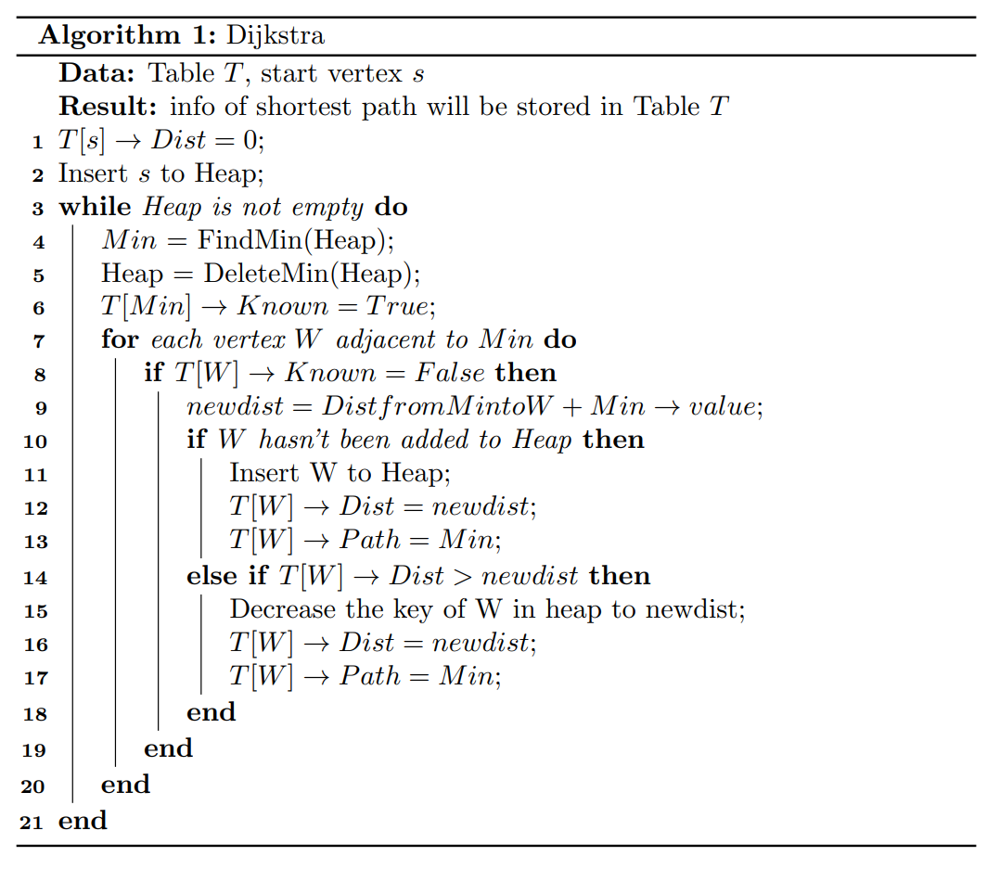

In dijkstra algorithm, we maintain a set $S$ containing all vertice whose shortest distance has been found. For and vertex $u\notin S$, we define $distance[u]=\text{minimal length of path}\{s\rightarrow (v_{i}\in S)\rightarrow u\}$. Moreover, we also use a $Table$ $T$ to store some infomation about the vertex in the graph, including $Dist$, $Known$, $Path$ and $Vpointer$. $Known$ shows whether the vertex is in $S$. $Path$ stores which vertex find it. $Vpointer$ pointers to its position in heap which helps do decreasekey efficiently.

In every loop, we first extract the vertex from the heap, which is unknown and has shortest distance to the target, and mark it as known. Then for each unknown adjacent vertex $w$, add it to the heap if it hasn't been there. Otherwise we decrease its key in that heap if its new distance to the target is less than before. After insert or decreasekey, we also need to update $Dist$ and $Path$ in $Table$. The program ends when thers's no vertex in heap.

**Time Complexity**
The algorithm have to do $O(V)$ times Insert, $O(V)$ times DeleteMin and $O(E)$ times DecreaseKey. If we denote Insert takes $T_{i}$ time, DeleteMin takes $T_{DM}$ time and DecreaseKey takes $T_{DK}$ time, then the overall complexity is $O(VT_{i}+VT_{DM}+ET_{DK})$
We always implement a brute force dijkstra by traversing the table to find the vertex $V$ which has the shortest path to the set $S$. But it don't need additional manipulation to maintain the heap. The complexity is $O(V^{2}+E)$

**Space Complexity**
In this algorithm, we need a $Table$ $T$ to store information for each vertex, which takes $O(V)$ memory. Additional memory for heap is also needed, which also takes $O(V)$ memory. So the overall Space Complexity is $O(V)$.


### Binomial Heap

* **BinomialNode Structure**: Each node contains an integer value referring to the distance to destination, an integer vertex, an integer degree, a pointer to the parent node, a pointer to the child node, and a pointer to the sibling node.
```C
typedef struct BinomialNode *BinNode;
struct BinomialNode {
    int value;
    int vertex;
    int degree;
    BinNode parent;
    BinNode child;
    BinNode sibling;};
```
#### Initialization
* **InitialBinNode**: Initialize a new BinomialNode with the given value and vertex.
```C
BinNode newBinNode(int value, int vertex){
    BinNode node = (BinNode)malloc(sizeof(struct BinomialNode));
    node->value = value;
    node->vertex = vertex;
    node->degree = 0;
    node->parent = NULL;
    node->child = NULL;
    node->sibling = NULL;
    return node;}
```
#### Merge Algorithm

* **Helper Function** BinomialLink : The function will link two binomial trees of the same degree together.
  <center>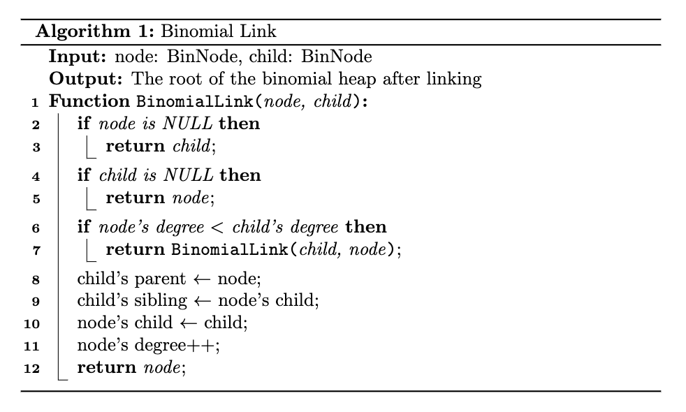</center>

* **Merge Function** BinomialMerge : The function will merge two binomial queues into one queue.

  <center>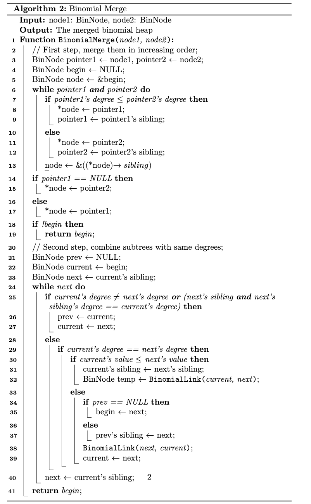</center>


##### Algorithm Specification

**Input**
* node1: The first root node of the first binomial heap.
* node2: The first root node of the second binomial heap.


**Output:**
The root node of the merged binomial heap.


**Algorithm Steps:**

* Initialize pointers `pointer1` and `pointer2` to the root nodes of the two input binomial heaps, initialize a new empty node `begin`, and a pointer `node` pointing to `begin`.
* Iterate through a while loop comparing the degrees of nodes pointed by `pointer1` and `pointer2`, linking the node with the smaller degree to the new binomial heap, and updating `pointer1` or `pointer2`.
* If one of the binomial heaps is exhausted, append the remaining nodes to the end of the new binomial heap.
* If the new binomial heap is empty, return.
* Initialize pointers `prev`, `current`, and `next` to the first, second, and third nodes of the new binomial heap, respectively.
* Iterate through a while loop comparing the degrees of adjacent nodes, and merge or move nodes accordingly.
> If the degrees of the current node and the next node are different, or the degree of the next node is the same as that of the subsequent node, move to the next node.
If the degrees of the current node and the next node are the same, merge the nodes and link the merged node to the new binomial heap.

* Continue looping until all nodes are traversed.
Return the root node of the merged binomial heap.


**Complexity Analysis:**

**Time Complexity:** Depends on the number of nodes and the distribution of degrees in the two input binomial heaps. In the worst-case scenario, the time complexity is $O(logN)$, where N is the number of nodes in the binomial heap.
**Space Complexity:** The space complexity of the merge operation is $O(1)$​, as the function only requires a constant amount of additional space to perform the merge.

<div STYLE="page-break-after: always;"></div>

#### GetMin Algorithm

<center>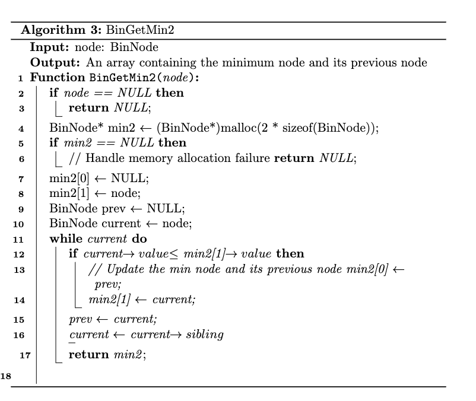</center>

**Input:**
`node`: The root node of the binomial heap.
**Output:**
An array of two BinNode pointers:

* The first pointer points to the previous node of the minimum value node.
* The second pointer points to the minimum value node.

**Algorithm Steps:**
* Check if the input node is `NULL`. If so, return `NULL`.
* Allocate memory for an array of two BinNode pointers, `min2`, using dynamic memory allocation.
* Check if memory allocation was successful. If not, handle the memory allocation failure and return NULL
* Initialize the first pointer of `min2` to NULL and the second pointer to the input node.
* Initialize two BinNode pointers, prev and current, to NULL and the input node, respectively.
* Iterate through a while loop while current is not NULL:
>Inside the loop, compare the value of the current node with the value of the second pointer of min2.
If the value of the current node is less than the value of the second pointer of min2, update both pointers of min2 to point to the current node and its previous node.
Move prev to current and advance current to its sibling.

* Return the array `min2` containing pointers to the minimum value node and its previous node.

<div STYLE="page-break-after: always;"></div>

**Complexity Analysis:**

**Time Complexity:** The time complexity is $O(m)$, where 
m is the number of root nodes in the binomial heap.Therefore time complexity is $O(logN)$.
**Space Complexity:** The space complexity is $O(1)$ for additional variables and $O(1)$ for the array min2, which has a constant size of two pointers.
#### DeleteMin Algorithm
<center>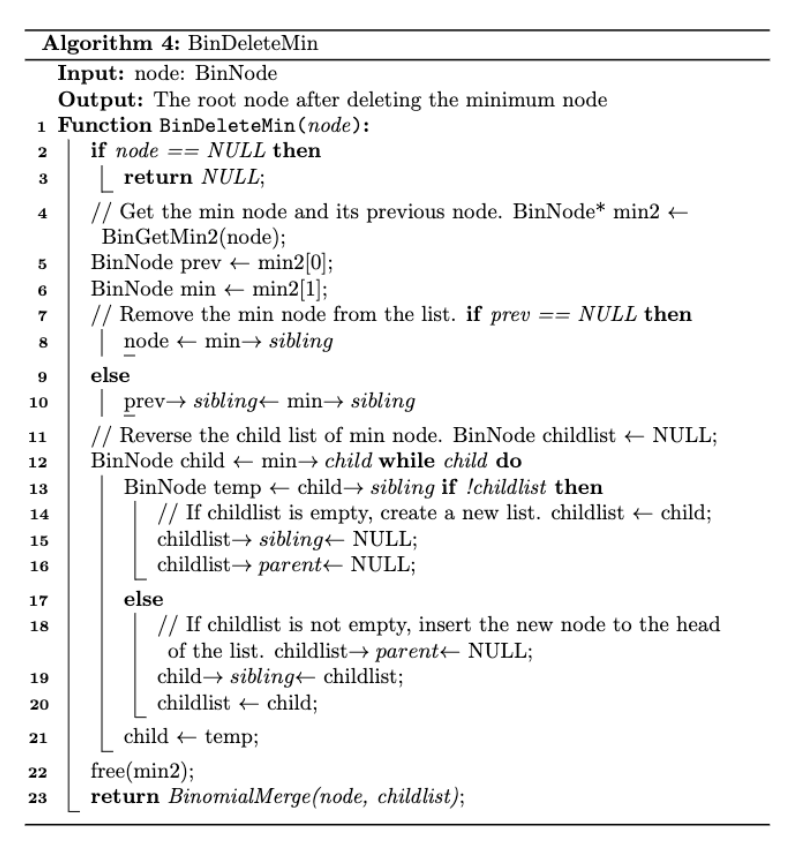</center>

**Input:**
`node`: The root node of the binomial heap.
**Output:**
The root node of the binomial heap after deleting the minimum value node.

**Algorithm Steps:**

* Check if the input node is NULL. If so, return NULL as the heap is empty.
* Call the BinGetMin2 function to get the minimum value node and its previous node in the binomial heap. Store the result in the array min2, where `min2[0]` points to the previous node and `min2[1]` points to the minimum value node.
* Extract the previous node and the minimum value node from min2.
* Remove the minimum value node from the list:
>If the previous node is NULL, update the root node of the heap to point to the sibling of the minimum value node.
Otherwise, set the sibling of the previous node to the sibling of the minimum value node.
* Reverse the child list of the minimum value node:
> Initialize a pointer childlist to NULL to store the reversed child list.
> Iterate through the child list of the minimum value node using a while loop:
> * Inside the loop, extract the next child node and store its sibling in a temporary variable.
> * If childlist is NULL, set it to the current child node and update its sibling and parent pointers to NULL
> * Otherwise, insert the current child node at the head of the childlist by updating its sibling pointer and setting its parent pointer to NULL.
> * Move to the next child node.

* Free the memory allocated for the array min2 to avoid memory leaks.
* Return the result of merging the original heap (with the minimum value node removed) and the reversed child list using the BinomialMerge function.

**Complexity Analysis:**
**Time Complexity:** 
1.For the `find min` part : $O(m)$ where $m$ is the number of root nodes in the binomial heap, and therefore time complexity is $O(logN)$.
2.For the `reverse` part : $O(M)$ where $M$ is the number of children of the minimum value node.
3.For the `merge` part: Worst case $O(logN)$. See details in the BinomialMerge part.
* So overall worst case time complexity is $O(logN)$ 

**Space Complexity:** The space complexity is $O(1)$ for additional variables and $O(1)$ for the array min2, which has a constant size of two pointers.

#### Insert Algorithm
```C
BinNode BinInsert(BinNode node, BinNode binnode){
    return BinomialMerge(node, binnode);
}
```
* The function BinInsert inserts a new node into the binomial heap by merging the heap with a new node.
* Algorithm analysis can be found in the BinomialMerge part.

**Complexity Analysis:**
**Time Complexity:** 
* Worst case is $O(logN)$
* $T_{amotized}=O(1)$ as analysed in the lecture slides.

**Space Complexity:** The space complexity is $O(1)$ for additional variables and $O(1)$ for the array min2, which has a constant size of two pointers.
#### DecreaseKey Algorithm
<center>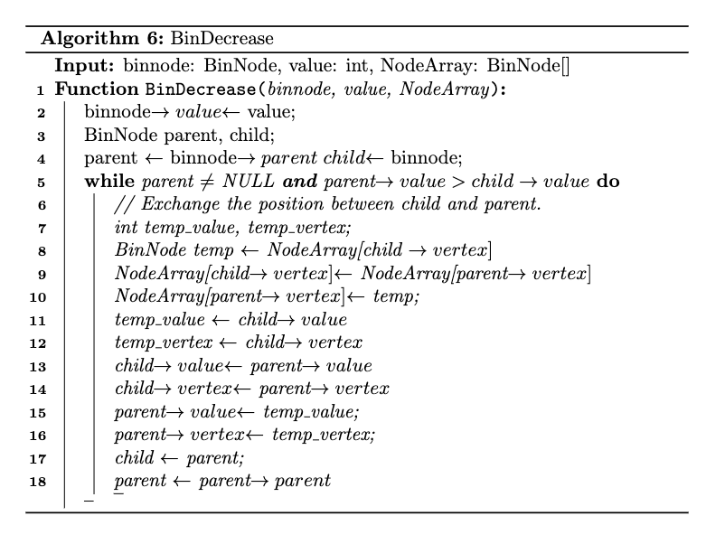</center>

<div STYLE="page-break-after: always;"></div>

**Input:**

* binnode: The node whose value needs to be decreased.
value: The new value to assign to the node.
* NodeArray: An array of pointers to nodes in the binomial heap.
  

**Output:**
None
**Algorithm Steps:**
* Assign the new value to the value field of the binnode.
Initialize variables parent and child to point to the parent and current node, respectively.
* While the parent is not NULL and the value of the parent node is greater than the value of the child node, perform the following steps:
a. Swap the values and indices of the child and parent nodes:
Exchange the values and indices of the nodes in the NodeArray to maintain consistency with the binomial heap.
b. Update the child and parent pointers to traverse up the heap:
Set child to point to the parent.

* Update parent to point to the parent of the current parent.
Repeat step 3 until either the parent becomes NULL or the value of the parent node is less than or equal to the value of the child node.

Basically, the function is percolate up the node to maintain the heap property.
Complexity Analysis:

**Time Complexity:** The time complexity of BinDecrease depends on the depth of the node in the heap. In the worst case, the function performs a constant number of operations per level traversed up the heap, resulting in a time complexity of $O(logn)$, where n is the number of nodes in the heap.

**Space Complexity:** The space complexity is $O(1)$ as the function uses a constant amount of additional memory regardless of the size of the input.

#### Dijkstra with Binomial Heap
+ Assuming that a connected graph has $V$ vertex and $E$ edges
+ we need *V* insertions, which takes $O(V)(amortized)$
  While worst case is $O(VlogV)$
+ we need *V* deletemin, which takes $O(VlogV)$
+ we need *E* decrease, which takes $O(ElogV)$
+ In conclusion,the time complexity of Dijkstra with Binomial Heap is $O((V+E)logV)$ 

### Pairing Heap
#### Pairing Heap Date Structure Definition

+ We use the child-sibling representation to store a pair heap , where all the son nodes of a node form a singly linked list. Each node stores a pointer to the first son, which is the head of the linked list, and a pointer to his right sibling

```c
typedef struct PairingNode* PairNode;
typedef struct PairingNode* PairHeap;

// The PairingNode structure represents a single node in the pairing heap.
struct PairingNode {
    int vertex;      // The vertex 
    int value;       // The value 
    struct PairingNode* Prev;     // Pointer to the previous node 
    struct PairingNode* child;  // Pointer to the child node, 
    struct PairingNode* sibling; // Pointer to the sibling node, 
};
```
#### Pairing Heap node initialization
```c
PairNode InitialPairHeap(int value, int vertex){
    PairNode pairnode = (PairNode)malloc(sizeof(struct PairingNode));
    // Check if the memory allocation was successful.
    if(pairnode == NULL){
        printf("Memory allocation failed\n");
        exit(1);
    }
    // Initialize the PairNode with the given value and vertex.
    pairnode->value = value;
    pairnode->vertex = vertex;
    pairnode->Prev = NULL;
    pairnode->child = NULL;
    pairnode->sibling = NULL;
    
    return pairnode;
}
```
#### PairInsert Algorithm
>The function PairInsert inserts a node X into the PairHeap H, it returns the merged heap if H is not null, otherwise it returns X.

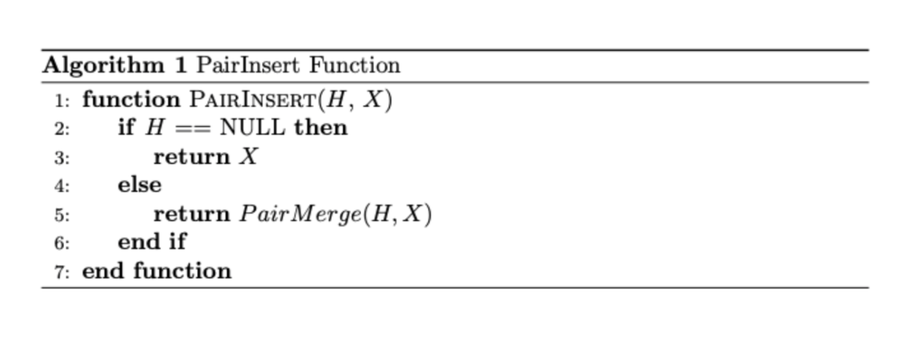

#### PairMerge Algorithm
>First, let the smaller of the two root nodes be the new root node, and then insert the larger root node as its child.

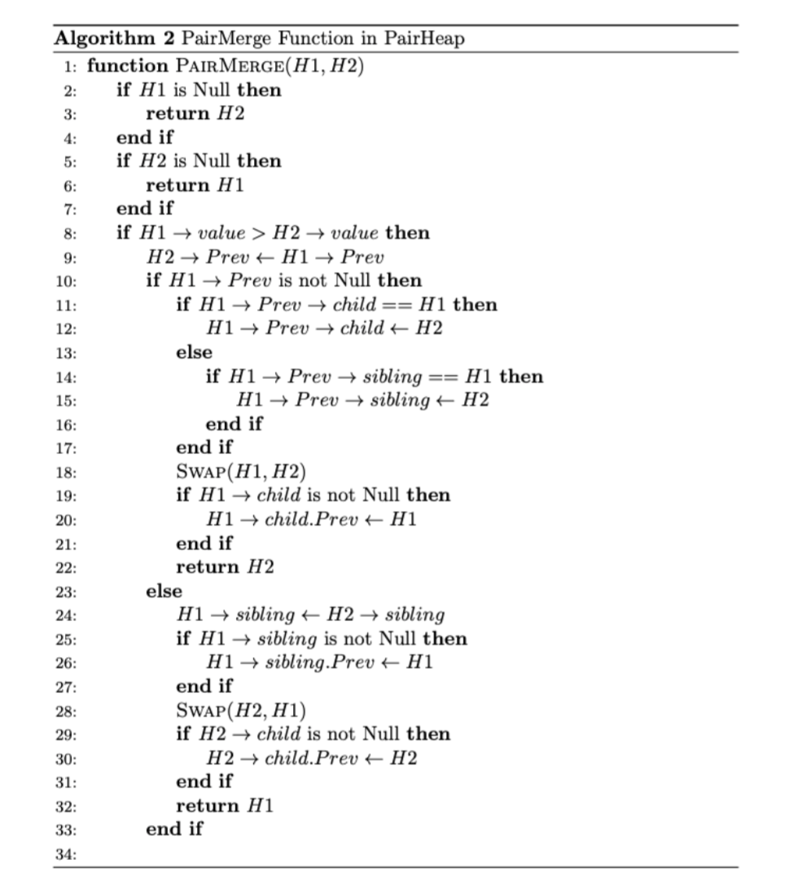

##### Algorithm Specification
**input**:
+ PairHeap H: The PairHeap into which a new node is to be inserted.
+ PairNode X: The node that is to be inserted into the PairHeap.

**output**:
+ void

**Algorithm Steps**:
+ If PairHeap H is NULL, create a new heap with X as the sole node.
+ If H is not NULL, merge X into H using PairMerge.

**Time Complexity**:
+ The time complexity of the PairInsert operation is O(1), since the operation primarily involves adding a new node to the root list of the PairHeap without the need for any extensive computation or traversal.

**Space Complexity**:
+ The space complexity of the PairInsert operation is O(1), as the function requires a constant amount of space to perform the insertion. 

#### PairDeleteMin Algorithm


##### Help function: CombineSiblings
>The child trees of the root, denoted as $T_1$ to $T_N$, are first traversed from left to right and paired for merging, that is, $T_1$ is merged with $T_2$, $T_3$ is merged with $T_4$, and so on. If $N$ is an odd number, after $T_{N-2}$ is merged with $T_{N-1}$, it is merged again with $T_N$. In this way, only half of the trees remain in the queue, which we denote as $D_1$, $D_2$, ……, $D_M$. Afterwards, we merge from right to left, letting $D_M$ merge with $D_{M-1}$, and then the result of the merge is merged with $D_{M-2}$, and so on, until only one tree remains.
1. Pair the children two by two, and use the meld operation to merge the two sons in the same pair together .
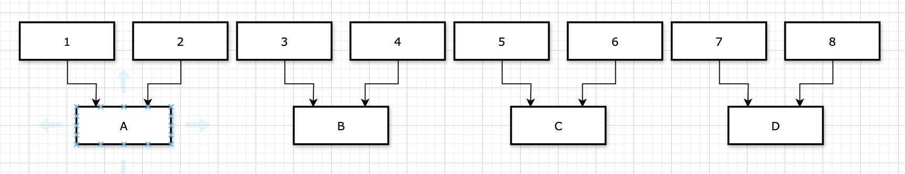
2. Merge the newly generated heaps from right to left (i.e., from the old sons to the new ones) one by one.
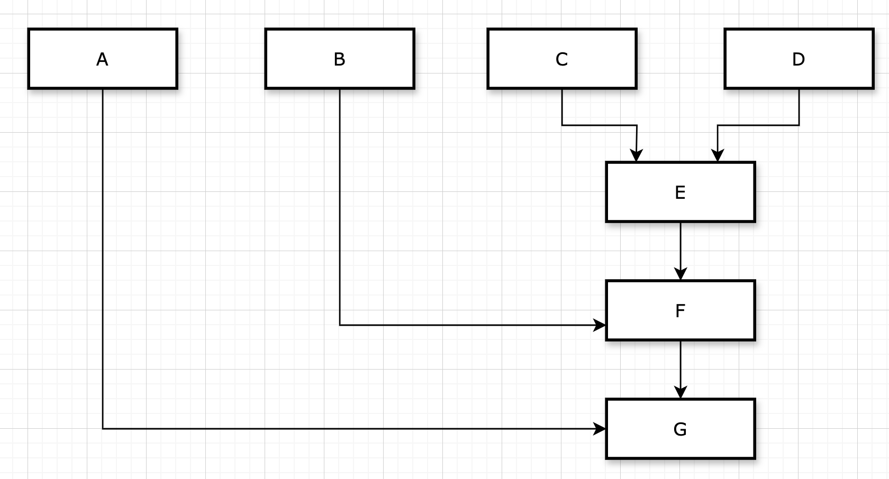

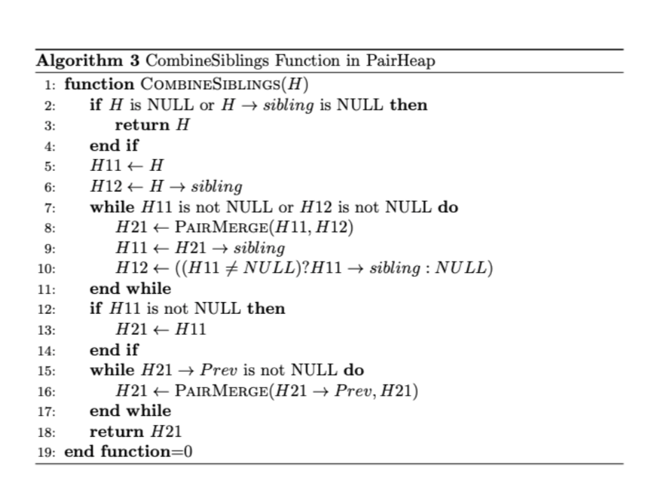
##### PairDeleteMin function
>the PairDeleteMin function, which deletes the minimum element from a PairHeap, restructures the remaining children into a new heap by calling CombineSiblings, and returns the root of the newly formed heap.

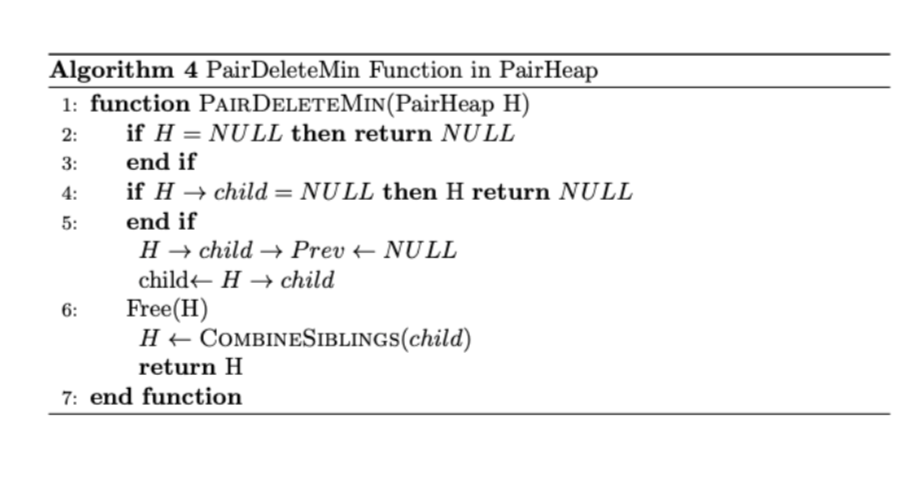

##### Algorithm Specification of PairDeleteMin Algorithm
**input:**

+ PairHeap H: A pointer to the root node of the PairHeap from which the minimum element is to be deleted.


**output:**
+ PairHeap H: the PairHeap whose minimum element has been deleted 

**Algorithm Steps**:

**Algorithm Steps for CombineSiblings:**

+ If node H is NULL or has no siblings, return H.
+ Initialize H11 and H12 for the first pair of siblings.
+ While both H11 and H12 exist, merge them into H21 and update pointers accordingly.
+ Continue merging until no siblings remain, then return the last merged node H21.

**Algorithm Steps for PairDeleteMin:**

+ If H is NULL, return NULL.
+ If the root node has no children, free it and return NULL.
+ Set the 'Prev' pointer of the root's child to NULL and save the child in a variable.
+ Free the root node and pass the child to CombineSiblings.
+ Return the new root from CombineSiblings.

**Time Complexity**:

+ The amortized time complexity of the delete_min algorithm is $O(logN)$, as detailed in the following amortized analysis section.

**Space Complexity**:

+ The space complexity of the PairDeleteMin operation is $O(1)$ since the function only requires a constant amount of additional space to perform the deletion and restructuring. 
  
#### PairDecrease Algorithm  
>After we reduce the weight of node x, the subtree with x as the root still satisfies the pairing heap property, but the father of x and x may no longer satisfy the heap property. Therefore, we cut out the entire subtree with x as the root. Now both trees satisfy the pair heap properties. Then we merge them together, completing the entire operation.

> The delete_min operation simply involves setting the 'prev' of the root node's 'child' to NULL, freeing the root node, and then using the CombineSiblings function to merge all the children of the root node.

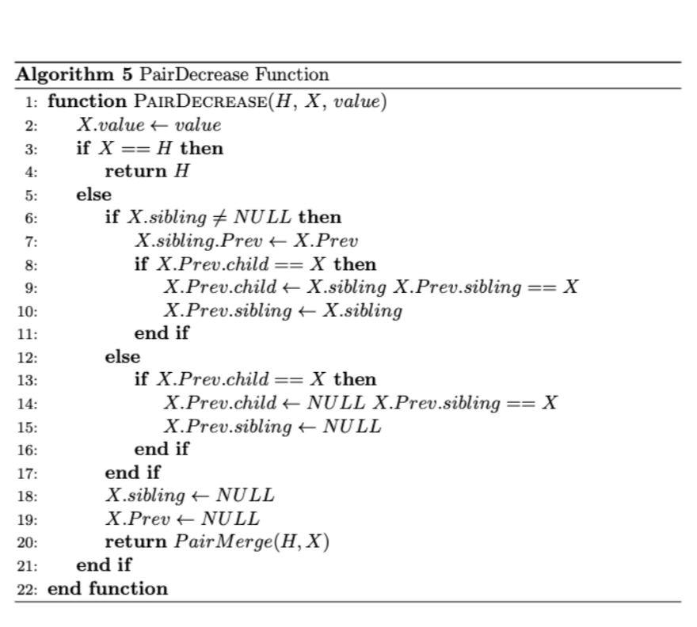

##### Algorithm Specification

**input:**

+ PairHeap H: A pointer to a PairHeap structure, representing the heap in which the operation is to be performed.
+ PairNode X: A pointer to the specific node within the heap whose value is to be decreased.
+ int value: The new integer value to which the node's key should be decreased.

**output:**
+ PairHeap: The updated heap after the value decrease 

**Algorithm Steps**:

+ Decrease the value of node X to the specified new value.
+ If X is the root, return the heap H without further action.

+ If X has a sibling, update the sibling's previous pointer to skip X and adjust the child/sibling pointers of X's previous node accordingly.
+ If X has no sibling, update the previous node's child/sibling pointers to remove X.
+ Detach X from its previous position by setting its sibling and previous pointers to NULL.
+ Merge X into the heap using the PairMerge function with the current heap H.

**Time Complexity**:
+ The real time complexity of the Pair decrease algorithm is $O(1)$. The amortized time complexity of the Pair decrease algorithm is $O(logN)$, as detailed in the following amortized analysis section.
  

**Space Complexity**:
+ The space complexity of the operation is O(1), as it involves only updates to existing node pointers and a single merge operation, without requiring additional space.


#### Amortized analysis


+ We define the size $s(x)$ of a node $x$ in a binary tree to be the number of nodes in its subtree including $x$, the **rank** $r(x)$ of $x$ to be $log s(x)*$, and the **potential** of a set of trees to be the sum of the rank s of all nodes in the trees. Then the potential of a set of no trees is zero and the potential of any set of trees is non-negative, so the sum of the amortized times is an upper bound on the sum of the actual times for any sequence of operations starting with no heaps.

+ Observe that every node in an n-node tree **has rank between 0 and $log N$**. 

+ The operations **insert**, **merge**, and **decrease key** have an $O(log N)$ amortized time bound, since each such operation causes an increase of at most $log N + 1$ in potential: a link causes at most two nodes to increase in rank, one by at most $log N$ and the other by at most 1, where n is the total number of nodes in the two trees. (Only the roots of the two trees can increase in rank. The root of initially smaller size can increase in rank by at most $log N$, and the root of initially larger size can increase in rank by at most 1, since its size at most doubles.)

+ The hardest operation to analyze is **delete min**. Consider the effect of a delete min on a tree of n nodes. 

+ We shall estimate the running time of this operation as one plus the number of links performed. The number of links performed during **the first pass (pairing)** is at least as great as the number performed during t**he second pass (combining the remaining trees).** 


  + the potential increase caused by the first-pass links is at most $2log(N)-2(k-1)$


  + The other potential changes that take place during the **delete min** are a decrease of $log N$ when the original tree root is removed and an increase of at most $log(N - 1)$ during the second pass.


+ It follows that the amortized time of the delete min operation is an **actual time** of $2k + 1$ plus a **potential increase** of at most $2logN-2(k-1)- logN+ log(N - 1)$ for a **total** of at most $2logN + 3$. An $O(log N)$ bound on the amortized time of **delete_min** follows immediately.
### Dijkstra with Pairing Heap
+ Assuming that a connected graph has $V$ vertex and $E$ edges
+ we need *V* insertions, which take $O(VlogV)$
+  we need *V* deletemin, which take $O(VlogV)$
+  we need *E* decrease, which take $O(ElogV)$
+  In conclusion,the time complexity of Dijkstra with Pairing Heap is $O((V+E)logV)$

+ the performance of pairing heap is worse than binary heap, because the binary heap use array to store the key and the pairing heap use linked list. 

+ In theory, the performance of Pairing heap is equal to Binomial heap .However, in practice, the implement of pairing are faster than binomial heap .That's because the implement of pairing heap is simpler than binomial heap.
+ From the definition, it's evident that, compared to other common heap structures, the pairing heap doesn't maintain any additional information like tree size, depth, rank, etc. (The binary heap also doesn't maintain extra information, but it guarantees the complexity of operations by maintaining a strictly complete binary tree structure.) Moreover, any tree that satisfies heap property is a valid pairing heap. This simple yet highly flexible data structure lays the foundation for the outstanding efficiency of the pairing heap in practice.
In contrast, the poor performance observed in Fibonacci heap can be attributed to the maintenance of a lot of additional information.

### Binary Heap
#### Data Structure and Initialization:

**Data Structure:**

- **MinNode Structure**: Each node contains an integer value referring to the distance to destination,an integer vertex, an integer index indicating the index of this node in the array.
```c
typedef struct MinHeapNode *MNode;
struct MinHeapNode
{
    int vertex;
    int value;
    int index;
};
```
- **MinHeap structure**: a minheap contains an array storing heap nodes and an integer recording the currentsize of array.
```C
typedef struct MinHeap *minHeap;
struct MinHeap
{
    MNode *h;
    int currentsize;
}; 
```

* Initialization

```C
minHeap MinInitialHeap(int max)
{
    int maxin = max + 2;
    minHeap Mheap = (struct MinHeap *)malloc(sizeof(struct MinHeap)); 
    Mheap->h = (MNode *)malloc(sizeof(MNode) * maxin);
    Mheap->h[0] = (MNode)malloc(sizeof(struct MinHeapNode));
    Mheap->currentsize = 0;
    Mheap->h[0]->value = -100;
    Mheap->h[0]->vertex = -1;
    Mheap->h[0]->index = 0;
    return Mheap;
}

MNode InitialMinNode(minHeap Mheap, int value, int vertex)
{
    MNode node = (MNode)malloc(sizeof(struct MinHeapNode));
    node->value = value;
    node->vertex = vertex;
    node->index = Mheap->currentsize + 1; // Set the index of the node
    return node;
}
```

#### MinInsert Algorithm

* Pseudocode

<center>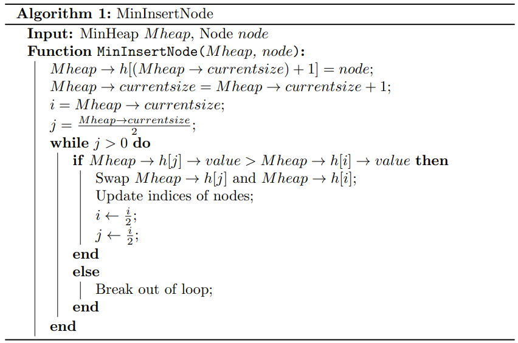</center>
<div STYLE="page-break-after: always;"></div>

**Algorithm Specification:**

**Input:**

`Mheap`: The Mheap that we insert a node to.

`node`: The node that we insert into the heap.

**Output:**

`void`

**Algorithm Steps:**

Add the `node` into the tail of array `Mheap->h`,and set the `node->index` to find it when we decrease key.

Percolate up to maintain the properties of minheap. Remember to update the index at the same time.

Increment currentsize. 


**Time Complexity**:

- The time complexity of the insert operation is  $O(logn)$,as we should traversal to the root in the worst case.

**Space Complexity:**

- The space that this algorithm need is a constant.
- Hence, the space complexity is $O(1)$.


#### minDeleteMin Algorithm


* Pseudocode

<center>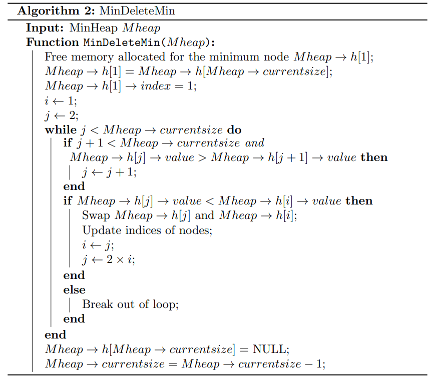</center>

<div STYLE="page-break-after: always;"></div>

**Algorithm Specification:**

**Input:**

`Mheap`: The minheap that we need to delete the min node from.


**Output:**

`void`

**Algorithm Steps:**

First,we move the end node to the first node.

Second,percolate down to maintain the properties of minheap. Remember to update the index at the same time.

Finally,decrement currentsize.

**Algorithm Analysis:**

**Time Complexity:**

- The time complexity of the deletemin operation is  $O(logn)$,as we should traversal to the final node in the worst case.

**Space Complexity:**

- The space that this algorithm need is a constant.
- Hence, the space complexity is $O(1)$.

#### minDecrease Algorithm


* Pseudocode

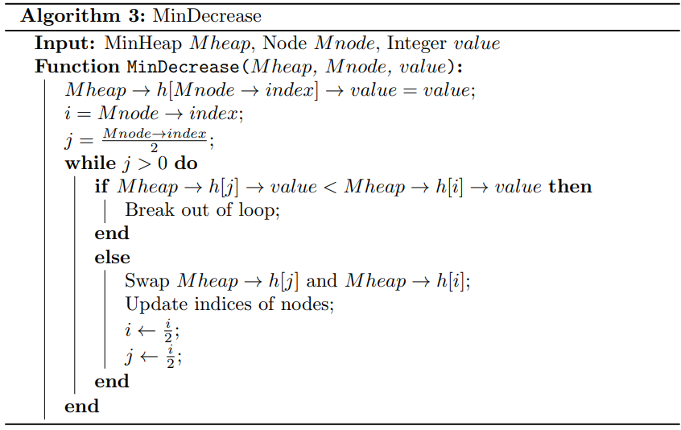


**Algorithm Specification:**

**Input:**

`Mheap`: The  minheap that we need to decrease node from.

`Mnode`: The node that should be decreased.

`value`: The new value.

**Output:**

`void`

**Algorithm Steps:**

First,change the value of the specified node.

Then,percolate up to maintain the properties of minheap. Remember to update the index at the same time.

**Algorithm Analysis:**

**Time Complexity:**

- The time complexity of the deletemin operation is  $O(logn)$,as we should traversal to the root in the worst case.

**Space Complexity:**

- The extra space we need is a constant. So the space complexity is $O(1)$.


#### Dijkstra with minheap
- Assuming that a connected graph has $V$ vertex and $E$ edges.
- we need $V$ insertions,which take $O(VlogV)$.
- we need $V$ findmin,which take $O(V)$.
- we need $V$ deletemin,which take $O(VlogV)$.
- we need $E$ decrease,which take $O(ElogV)$.
- In conclusion,the time complexity of Dijkstra with fibheap is $O((E+V)logV)$.
- In practical test,minheap performs well among four heap structures.This may due to the constant is smaller and the complexity of test case.Also,we add the index of the node in array to the node structure,which saves a lot of time since we don't need to traversal to find the node that we should decrease.

### Fibonacci Heap

#### Data Structure and Initialization:

**Data Structure:**

- **Fibonacci Heap**: The Fibonacci heap is composed of a collection of heap-ordered trees,just like binomial heap.However,the Fibonacci heap can be unconsolidated. It's unnecessary to do consolidation all the time for a Fibonacci heap,which is different from binomial heap.Roots of binomial tree in Fibonacci heap are connected into a circular doubly linked list.
- **Fibonacci Node Structure**: Each node in the Fibonacci Heap contains an integer value referring to the distance to destination,an integer vertex, pointers to left and right siblings,pointer to parent,the degree of the node, and a 1/0 marked for cut children.
```c
typedef struct FibonacciNode* FibNode;
struct FibonacciNode
{
    int vertex;
    int value;
    int degree;  
    struct FibonacciNode *left; 
    struct FibonacciNode *right; 
    struct FibonacciNode *child; 
    struct FibonacciNode *parent; 
    int marked;
};
```
- **Fibonacci Heap structure**: a Fibonacci heap contains a pointer to the min-node,an integer referring to the maximum of degree,an integer recording the number of nodes,and an additional colletion of roots that are useful only when we do consolidation.
```C
typedef struct FibonacciHeap *FibHeap;
struct FibonacciHeap{
    FibNode min;
    int maxDegree;
    int keyNum;
    FibNode *cons;
};
```

* Initialization

```C
FibHeap InitialHeap(void)
{
    FibHeap fibheap = (struct FibonacciHeap *)malloc(sizeof(struct FibonacciHeap));
    fibheap->min = NULL;
    fibheap->maxDegree = 0;
    fibheap->keyNum = 0;
    fibheap->cons = NULL;
    return fibheap;
}

FibNode InitialFibNode(int value, int vertex)
{
    FibNode newNode = (struct FibonacciNode *)malloc(sizeof(struct FibonacciNode));
    newNode->vertex = vertex;
    newNode->value = value;
    newNode->left = newNode;
    newNode->right = newNode;
    newNode->child = NULL;
    newNode->degree = 0;
    newNode->marked = 0;
    newNode->parent = NULL;
    return newNode;
}
```

#### FibInsert Algorithm

The `Insert` operation for Fibonacci heap is very easy.All we need to do is to add the new node to the circular doubly-linked list for roots.

* Pseudocode

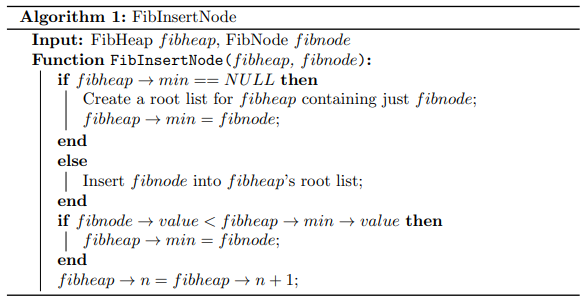

**Algorithm Specification:**


**Input:**

`fibheap`: The fibheap that we insert a node to.

`fibnode`: The node that we insert into the heap.

**Output:**

`void`

**Algorithm Steps:**

If there is no node in the root list of `fibheap`,create a root list for `fibheap` containing just `fibnode`.

If the root list is not NULL,add the `fibnode` into the root list.Then,increment the keynum of `fibheap` and update the min node if necessary.


**Time Complexity**:

- The time complexity of the insert operation is  $O(1)$,as we do nothing except adding a new node into the root list.

**Space Complexity:**

- The space that this algorithm need is a constant.
- Hence, the space complexity is $O(1)$.

#### FibMerge Algorithm

The `merge` operation for fibonacci heap is as easy as insert operation.We just need to combine the root lists of two fibheap and get the new keynum.

* Pseudocode

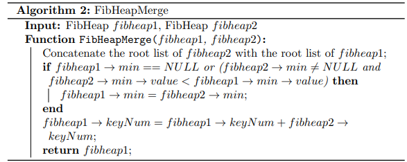


**Algorithm Specification:**

**Input:**

`fibheap1`: One of the fibheap to be merged

`fibheap2`: The other fibheap to be merged

**Output:**

Returns the fibheap that combines two fibheaps that we input.

**Algorithm Steps:**

If one of the input fibheaps has no root list,return the other fibheap.

If both have root list,concatenate the root list of `fibheap2` with the root list of `fibheap1`.Then update the keynum by the sum of them.Choose the smaller one to be the new min node.

**Time Complexity**:

- The time complexity of the merge operation is  $O(1)$,the same as insert operation. As we just combine two root lists together.

**Space Complexity:**
- The space that this algorithm need is a constant.
- Hence, the space complexity is $O(1)$.

#### FibConsolidate Algorithm
The `consolidate` operation is to combine the binomial trees which have the same degree. In fibonacci heap,we need to do consolidation only after we delete the min node. 

* Pseudocode
> Help algorithm
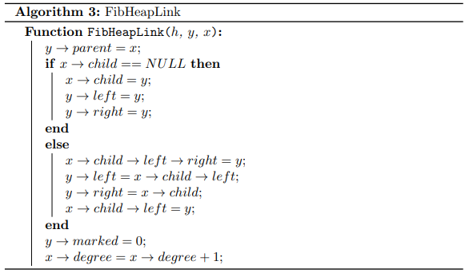

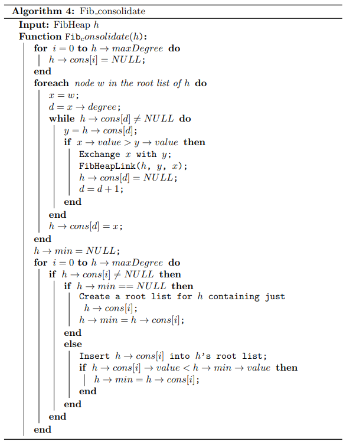

<div STYLE="page-break-after: always;"></div>

**Algorithm Specification:**

**Input:**

`fibheap`: The fibonacci heap that we need to do consolidation with.

**Output:**

`void`

**Algorithm Steps:**

If there is no node in root list,nothing happens.

If there are nodes in the root list:
- First,we calculate the maxdegree using keynum and malloc enough memory space for `fibheap->cons` to temporarily save the resulting root list.
- Secondly,delete all root in the root list.For each root in the root list,save it in `fibheap->cons[degree]`.If the place is not null,combine two binomial trees by adding the bigger root to the smaller root's child list and update degree and then save it into the proper place.After a success placement,move to the next root.
- Finally,add every root in `fibheap->cons` to the root list. At the same time,update the min node.Free `fibheap->cons` since it is useless for any other operation.

**Algorithm Analysis:**

**Time Complexity:**

- The number of nodes in the root list is $t(H)$.
- Every time we merge,the number of nodes will decrement. So the practical time complexity is $O(t(H))$

**Space Complexity:**

- The algorithm need to create a `fibheap->cons` containing nodes of different degree.The space needed is determined by the maxdegree of fibheap $D(n)$,which is $logn$.
- Hence, the space complexity is $O(D(n))$ or $O(log n)$.

#### FibDeleteMin Algorithm

The `DeleteMin` operation need us to delete the min node from the root list.

* Pseudocode

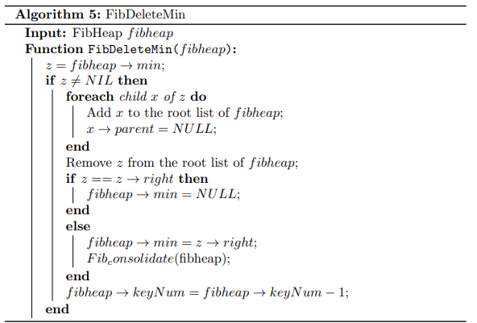


**Algorithm Specification:**

**Input:**

`fibheap`: The fibonacci heap that we need to delete the min node from.


**Output:**

`void`

**Algorithm Steps:**

First,we delete the min node from the root list and decrement the keynum.

Second,we add all child node of the previous min node into the root list of `fibheap`.

Finally,do consolidation,which has been introduced before.

**Algorithm Analysis:**

**Time Complexity:**

- The number of nodes in the original root list is $t(H)$.
- The maxdegree is $D(n)$.
- The cost for deleting the min node and adding its child list into root list is a constant.
- The cost for consolidation is determined by the number of nodes in root list as mentioned.However,the number of nodes is $D(n)+t(H)-1$ for the fibheap to be consolidated. So the cost is $O(D(n)+t(H))$ .
- In conclusion,the actual cost for `deletemin` operation is $O(D(n)+t(H))$.

**Space Complexity:**

- The extra space needed for this algorithm is the same as what `consolidate` needs. So the space complexity is also $O(D(n))$,which is $O(logn)$

#### FibDecrease Algorithm

The `Decrease` operation need us to decrease the value of one node. In Fibonacci heap,we need to cut the whole subtree off.

* Pseudocode

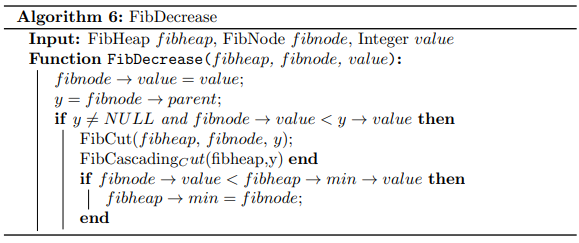

>Help algorithm
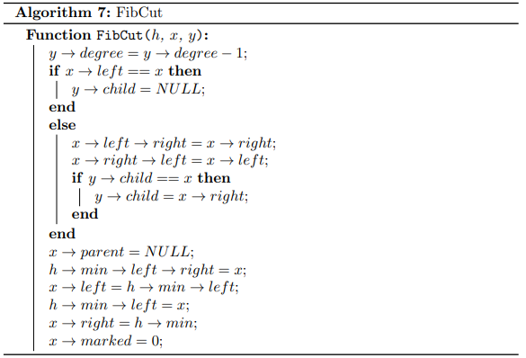
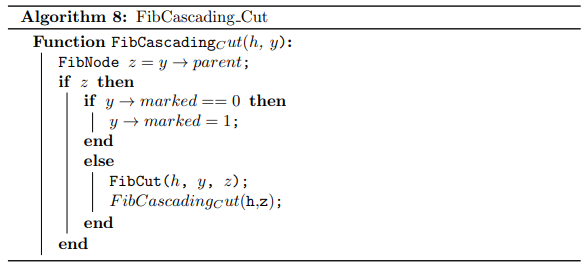


**Algorithm Specification:**

**Input:**

`fibheap`: The fibonacci heap that we need to decrease node from.

`fibnode`: The node that should be decreased.

`value`: The new value.

**Output:**

`void`

**Algorithm Steps:**

First,change the value of the specified node.

Then,judge whether the decrease value is less than its parent's value.
- If bigger,do nothing.
- If less,cut the subtree from its parent's child list and then add it to the root list and reset its marked.(`FibCut`)Then,check whether the marked of its parent is set 1.If 1,do cut and Cascading_Cut with its parent.(`FibCascading_Cut`).

Finally,compare the decreased value with the present min node.Choose the smaller one to be the min node.

**Algorithm Analysis:**

**Time Complexity:**

- Assuming that we call `FibCascading_Cut` c times.This is determined by the depth of a tree,which is implicit. So the actual cost is $O(c)$.

**Space Complexity:**

- The extra space we need is a constant. So the space complexity is $O(1)$.

#### Amortized Analysis For Fibonacci Heap
- The number of nodes in the root list is $t(H)$,the number of nodes marked is $m(H)$.The maxdegree of fibheap is $D(n)$,which is less than $O(log n)$
- The potential function for Fibonacci Heap is $$\Phi(H)=t(H)+2m(H)$$
- The actual cost for `insert` operation is $O(1)$,and the potential function increase by 1,since $t(H)$ increase by 1. So the amortized cost is $O(1)+1=O(1)$.
- The actual cost for `merge` operation is $O(1)$,and the potential function has no change. So the amortized cost is $O(1)$
- The actual cost and amortized cost for `findmin` are both $O(1)$,as we have a pointer to min node and potential function does no change.
- The actual cost for `Deletemin` operation is $O(D(n)+t(H))$.After the operation,the potential function's maximum is $D(n)+1+2m(H)$. So the amortized cost is $O(D(n))$.
- The actual cost for `Decrease` operation is $O(c)$.c is the time we do FibCut.There will be $m(H)-c+2$ marked nodes at most.And the number of nodes in the root list will be $t(H)+c$. So the potential function change by $4-c$. The amortized cost is $O(1)$.

#### Dijkstra with fibheap
- Assuming that a connected graph has $V$ vertex and $E$ edges.
- we need $V$ insertions,which take $O(V)$.
- we need $V$ findmin,which take $O(V)$.
- we need $V$ deletemin,which take $O(VlogV)$.
- we need $E$ decrease,which take $O(E)$.
- In conclusion,the time complexity of Dijkstra with fibheap is $O(E+VlogV)$.
- Theoretically，the performance of Fibonacci heap should be the best among four heap structures.However,in pactice,Fibonacii heap is the worst one due to large memory consumption per node and high constant factors on all operations.


## $Chapter 3:  Testing Results$

We use graph with vertex number from 1000 to 250000 to test executing time of dijkstra using different heap. The proportion of vertice and edges is 1:4. The final test time is the average of 100 calculation for different target vertex.

Datasets of US Road of NY, BAY and COL are also used. 

> These dataset are obtained in http://www.dis.uniroma1.it/challenge9/download.shtml
US-Road dataset are downloaded directly, others are generated by a random graph generator provided in the link.
Click **Download the Challenge 9 benchmarks -vs. 1.1 [ch9-1.1.tar.gz, 372 KB]** to download benchmarks.
The Path of generator is **ch9-1.1/gens/rand**
You can find our dataset in <a herf="https://pan.baidu.com/s/1SoFAfz8ryeHxcGMD2MIcvw?pwd=s00q">https://pan.baidu.com/s/1SoFAfz8ryeHxcGMD2MIcvw?pwd=s00q</a>


> Caveat: When reading graph from a file, the coding format should be **UTF-8** and **CRLF** should be used at the end of line.


Part of test program is shown for better understanding.

```c
void test(char* filename, int sample){          // sample stands for how many times each dijkstra will run
    Graph G = NULL;
    double time_pair = 0;
    double time_fib = 0;
    double time_bin = 0;
    double time_com = 0;
    double time_bf = 0;
    G = ReadGraph(filename);
    printf("test for graph with %d vertice, %d edges, %d samples: \n", G->nv, G->ne, sample);
    // PrintGraph(G);
    int n = 0;                           // n count how many times the program has ran
    int factor = G->nv / sample;
    for(n = 1; n*factor < G->nv; n++){
        time_pair += test_pair(G, n*factor, 0);     // test_ function will return running time it takes
        time_bin += test_bin(G, n*factor, 0);
        time_com += test_common(G, n*factor, 0);
        time_fib += test_fib(G, n*factor, 0);
        time_bf += test_bf(G, n*factor, 0);
    }
    n--;

    printf("average time: \n");
    printf("PairHeap: %f ms\n", time_pair/n);
    printf("BinHeap: %f ms\n", time_bin/n);
    printf("ComHeap: %f ms\n", time_com/n);
    printf("FibHeap: %f ms\n", time_fib/n);
    printf("BruteForce: %f ms\n", time_bf/n);
    CleanGraph(G);
    printf("\n");
}

double test_fib(Graph G, int target, int print){
    Table T;
    clock_t start, finish;
    double Tot_Time = 0;        
    InitialTable(G, T);
    start = clock();            // start 
    dijkstra_fib(T, target);
    finish = clock();           // finish
    Tot_Time = (double)(finish - start) / CLOCKS_PER_SEC * 1000;    // calculate total time
    if(print){
        printf("FibHeap: %d clock, %f ms\n", (finish - start), Tot_Time);
    }
    CleanTable(G, T);
    return Tot_Time;
}
```

The test table is shown below. Note that the units of time is milisecond.

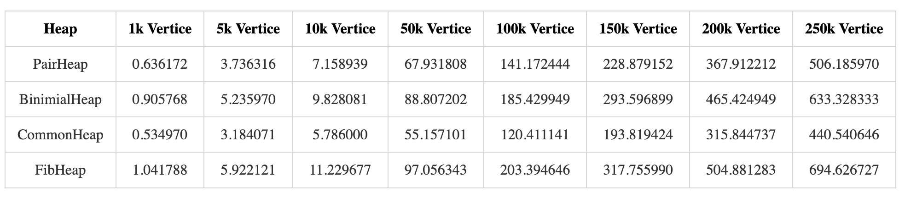

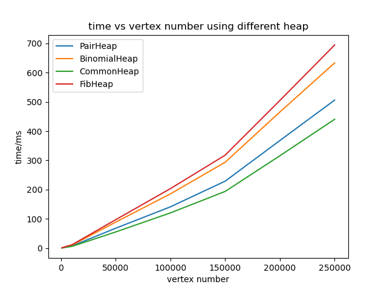

Here's result for US road. Note that US Road dataset and 1k to 250k dataset are running in different machine, so the time consuming may be not consistent. But they share the same trend.

Heap | NY | BAY | COL 
|:-------:|:-------:|:-------:|:-------:|
PairHeap | 95ms| 109ms| 158ms
BinimialHeap | 158ms| 173ms| 248ms
CommonHeap | 81ms| 92ms| 143ms
FibHeap | 172ms| 220ms| 275ms


From the plot and table we can notice the trend that Commom Heap faster than PairHeap faster than BinimialHeap faster than FibonacciHeap

**Analysis**

+ In practical test,minheap performs well among four heap structures.This may due to the constant is smaller and the complexity of test case.Also,we add the index of the node in array to the node structure,which saves a lot of time since we don't need to traversal to find the node that we should decrease.

+ the performance of pairing heap is worse than binary heap, because the binary heap use array to store the key and the pairing heap use linked list. 

+ In theory, the performance of Pairing heap is equal to Binomial heap .However, in practice, the implement of pairing are faster than binomial heap .That's because the implement of pairing heap is simpler than binomial heap.
+ From the definition, it's evident that, compared to other common heap structures, the pairing heap doesn't maintain any additional information like tree size, depth, rank, etc. (The binary heap also doesn't maintain extra information, but it guarantees the complexity of operations by maintaining a strictly complete binary tree structure.) Moreover, any tree that satisfies heap property is a valid pairing heap. This simple yet highly flexible data structure lays the foundation for the outstanding efficiency of the pairing heap in practice.
In contrast, the poor performance observed in Fibonacci heap can be attributed to the maintenance of a lot of additional information.


We also implement a brute force version of dijkstra and compare its time comsuming with heap implemented dijkstra. The graph is shown below.
<center>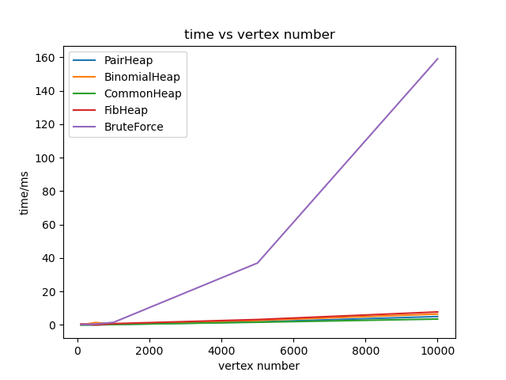</center>

Obviously, brute force version takes enormous amount of time while heap implemented dijkstra just need several millisecond so that they overlap in the bottom line.

### Conclusion & Analysis

#### Dijkstra with minheap
- Assuming that a connected graph has $V$ vertex and $E$ edges.
- we need $V$ insertions,which take $O(VlogV)$.
- we need $V$ findmin,which take $O(V)$.
- we need $V$ deletemin,which take $O(VlogV)$.
- we need $E$ decrease,which take $O(ElogV)$.
- In conclusion,the time complexity of Dijkstra with fibheap is $O((E+V)logV)$.


#### Dijkstra with Binomial Heap
+ Assuming that a connected graph has $V$ vertex and $E$ edges
+ we need *V* insertions, which takes $O(V)(amortized)$
  While worst case is $O(VlogV)$
+ we need *V* deletemin, which takes $O(VlogV)$
+ we need *E* decrease, which takes $O(ElogV)$
+ In conclusion,the time complexity of Dijkstra with Binomial Heap is $O((V+E)logV)$ 

#### Dijkstra with Pairing Heap
+ Assuming that a connected graph has $V$ vertex and $E$ edges
+ we need *V* insertions, which take $O(VlogV)$
+  we need *V* deletemin, which take $O(VlogV)$
+  we need *E* decrease, which take $O(ElogV)$
+  In conclusion,the time complexity of Dijkstra with Pairing Heap is $O((V+E)logV)$


#### Dijkstra with fibheap
- Assuming that a connected graph has $V$ vertex and $E$ edges.
- we need $V$ insertions,which take $O(V)$.
- we need $V$ findmin,which take $O(V)$.
- we need $V$ deletemin,which take $O(VlogV)$.
- we need $E$ decrease,which take $O(E)$.
- In conclusion,the time complexity of Dijkstra with fibheap is $O(E+VlogV)$.
- Theoretically，the performance of Fibonacci heap should be the best among four heap structures.However,in pactice,Fibonacii heap is the worst one due to large memory consumption per node and high constant factors on all operations.

#### Comparison
Commom Heap faster than PairHeap faster than BinimialHeap faster than FibonacciHeap in practical test.


## $Declaration$
*I hereby declare that all the work done in this project titled "Dijkstra Sequence" is of our independent effort.*

</font>
</font>