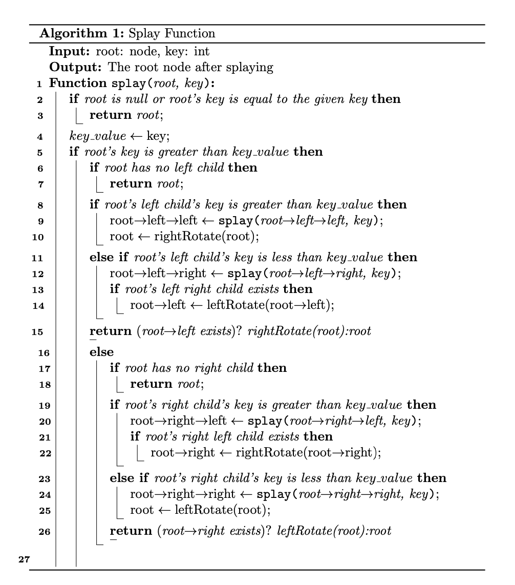
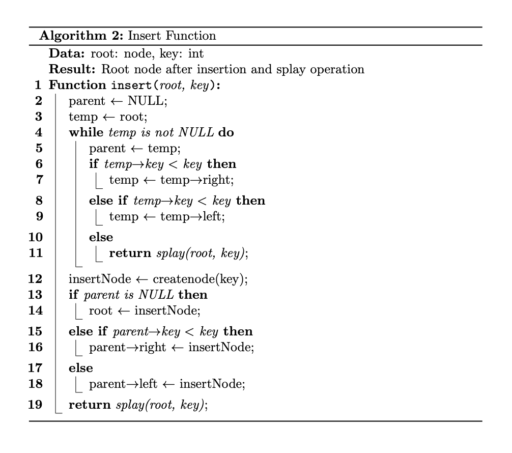
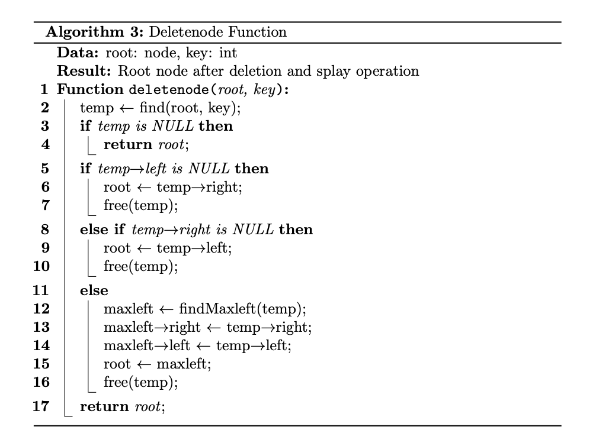
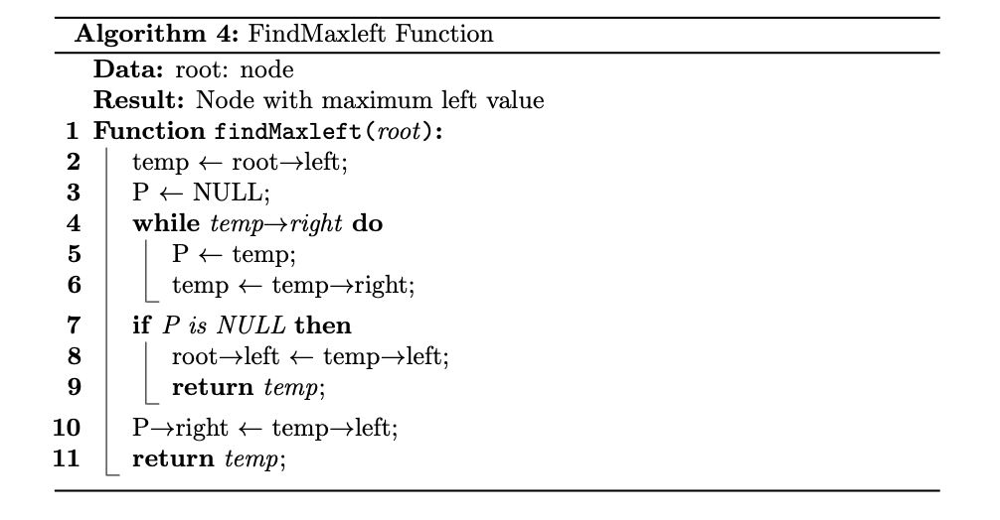
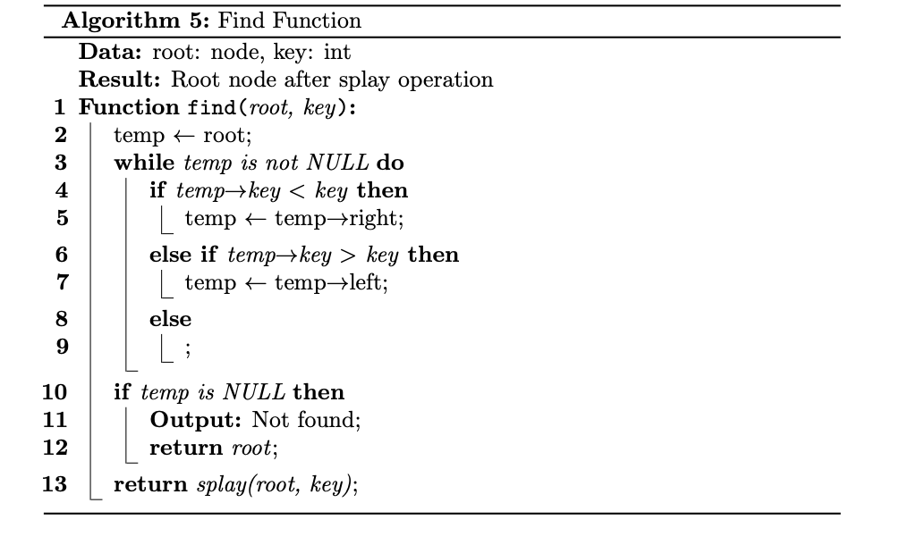

### Algorithm Analysis For Slay Tree

#### Data Structure and Initialization:

**Data Structure:**

- **Node Structure**: Each node in the splay tree contains an integer key, pointers to left and right children, and a height parameter to maintain balance.
- **Splay Tree**: The splay tree is a self-adjusting binary search tree where frequently accessed elements are moved closer to the root, improving access time.

> Note : Actually, we don't need to count 'height' for the splay tree,  this implementation is for **AVL tree**.

```C
typedef struct Treenode* node;
struct Treenode{
    int key;
    node left;
    node right;
    int height;
};
```

* Initialization

```C
node createnode(int value){
    node temp = (node)malloc(sizeof(struct Treenode));
    temp -> key = value;
    temp ->left = NULL;
    temp ->right = NULL;
    temp -> height = 0;
    return temp;
}
```

#### Splay Algorithm

The `splay` function performs a **top down splay operation** on the splay tree. It takes two parameters: the **root** of the tree and **key** to splay.

**Base Cases**:

If the root is `NULL` or matches the key node, return the root unchanged.

**Splaying Process**:

**If the key value is less than the root's key value:**

If the root has no left child, return the root as it cannot be splayed further.

If the key value is less than the key value of the left child:

- Recursively splay the left-left subtree.
- Perform a right rotation on the root.

Otherwise, if the key value is greater than the key value of the left child:

- Recursively splay the left-right subtree.
- If the left-right child exists, perform a left rotation on the root's left child.

Return the result of the right rotation if the left child exists; otherwise, return the root.

**If the key value is greater than the root's key value:**

If the root has no right child, return the root as it cannot be splayed further.

If the key value is greater than the key value of the right child:

- Recursively splay the right-left subtree.
- If the right-left child exists, perform a right rotation on the root's right child.

Otherwise, if the key value is less than the key value of the right child:

- Recursively splay the right-right subtree.
- Perform a left rotation on the root.

Return the result of the left rotation if the right child exists; otherwise, return the root.

**Return the root node of the BST after splaying.**

* Pseudocode




**Time Complexity**:

- The time complexity of the splay function is $T_{amortized} = O( log N )$. 
- However, in the worst case, where the tree becomes linear, the time complexity can degrade to $O(n)$.

**Space Complexity**:

- The space complexity of the `splay` function is $O(log\ n)$ by amortize analysis due to the recursive calls. Each recursive call consumes space on the call stack, and since the height of the tree is logarithmic, the space complexity is logarithmic.
- However, the worst-case space complexity can also be $O(n)$ in scenarios where the tree becomes linear.

#### Insertion Algorithm:

The insertion algorithm traverses the splay tree to find the appropriate position for the new node based on the key value.It maintains the balance of the tree by performing splay operations to **bring the inserted node to the root**.

* Pseudocode



**Algorithm Specification:**

**Input:**

`root`: Root node of the tree

`key`: Key value to be inserted

**Output:**

Returns the root node after inserting the new node, with a Splay operation performed.

**Algorithm Steps:**

Initialize the parent node `parent` as NULL and the temporary node `temp` as the root node `root`.

While the temporary node is not NULL, perform the following loop:

- If the key value of the current node is less than the key value to be inserted, move the temporary node to the right child.
- If the key value of the current node is greater than the key value to be inserted, move the temporary node to the left child.
- If the key value of the current node is equal to the key value to be inserted, return the root node after performing a Splay operation with the root node and the current node.

Create a new node `insertNode` and assign it the key value.

* If the parent node is NULL, set the root node to the new node.
* If the key value of the parent node is less than the key value to be inserted, set the new node as the right child of the parent node.
* If the key value of the parent node is greater than the key value to be inserted, set the new node as the left child of the parent node.

Return the root node after performing a Splay operation with the root node and the newly inserted node.

**Time Complexity**:

- The time complexity of the splay function is $T_{amortized} = O( log N )$. 
- However, in the worst case, where the tree becomes linear, the time complexity can degrade to $O(n)$.

**Space Complexity**:

- The space complexity of the `splay` function is $O(log\ n)$ by **amortize analysis** due to the recursive calls. Each recursive call consumes space on the call stack, and since the height of the tree is logarithmic, the space complexity is logarithmic.
- However, the worst-case space complexity can also be $O(n)$ in scenarios where the tree becomes linear.

#### Delete

* Pseudocode



> Helper Functions





### Algorithm Specification:

**Input:**

`root`: The root node of the tree.

`key`: The key value of the node to be deleted.

**Output:**

Returns the root node of the tree after deleting the node with the specified key.

**Algorithm Steps:**

Find the node with the specified key using the `find` function.

If the node is not found (`temp` is NULL), print "Not found" and return the original root node.

If the node has no left child:

- Update the root to the right child of the node.
- Free the memory allocated for the node.

If the node has no right child:

- Update the root to the left child of the node.
- Free the memory allocated for the node.

If the node has both left and right children:

- Find the maximum node in the left subtree using the `findMaxleft` function.
- Update the links to replace the deleted node with the maximum node in the left subtree.
- Free the memory allocated for the deleted node.

Return the updated root node.

**Helper Function Specifications**


### Algorithm Analysis:

**Time Complexity:**

- The time complexity of the `find` function is $O(h)$, where $h$ is the height of the tree.
- The time complexity of the `findMaxleft` function is also $O(h)$.
- Therefore, the overall time complexity of the `deletenode` function is $O(h)$​.
- From The Amortized Analysis with `function splay` We get the time complexity is $T_{amortized} = O( log N )$. 

**Space Complexity:**

- The space complexity of the `splay` function is $O(log\ n)$ by **amortize analysis** due to the recursive calls. Each recursive call consumes space on the call stack, and since the height of the tree is logarithmic, the space complexity is logarithmic.
- However, the worst-case space complexity can also be $O(n)$ in scenarios where the tree becomes linear.

By following this specification and analysis, the `deletenode` function efficiently deletes a node from the tree while maintaining its structural integrity, ensuring optimal performance in terms of time and space complexities.
