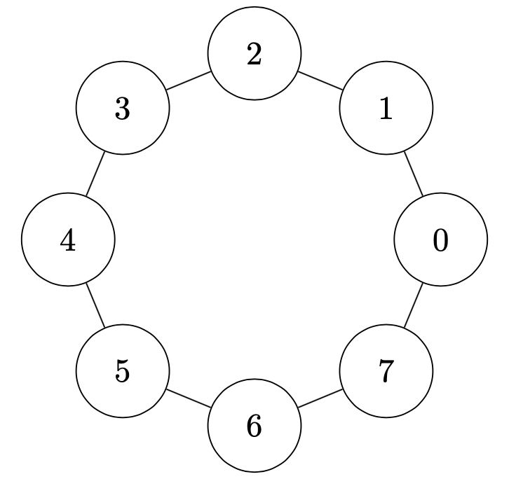
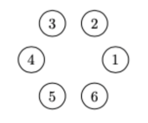
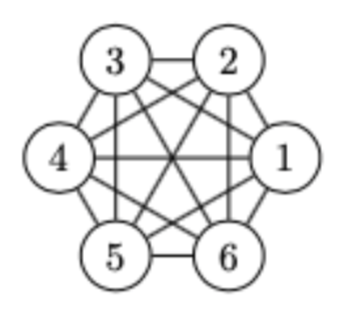
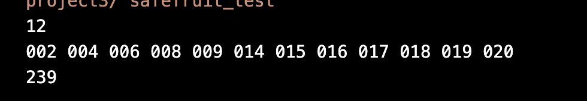
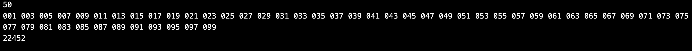
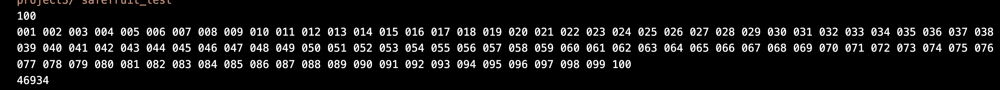
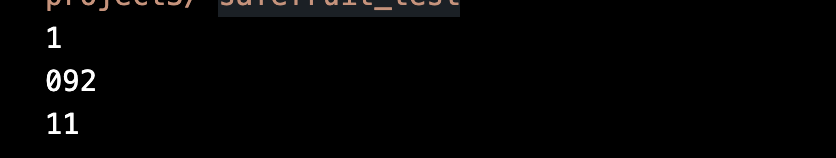
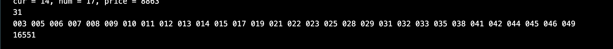
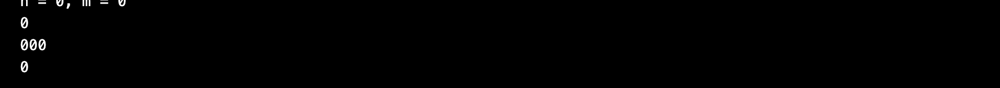

## $Chapter 3:  Testing Results$


>the `nodes` of the graph represent the fruits, and the `edges` represent the conflicts between the fruits.
The`price` of each node is a random integer between 0 and 999


|  |  |  |
| ------------------------------------- | ------------------------------------- | ------------------------------------- |
| input1 **(cyclic connected graph)**   | Input2 **(non-connected graph)**      | input3 **(non-connected graph)**      |


>our test cases include:

+ `input0.txt`: the sample input in the PTA problem description
+ `input1.txt`: a cyclic graph with 100 nodes (cyclic connected graph)
+ `input2.txt`: a graph with 100 nodes and no edges  (non-connected graph)
+ `input3.txt`: a graph with 100 nodes all nodes connected to each other (non-connected graph)
+ `input4.txt`: a random graph with 50 nodes and 50 edges (random graph)
+ `input5.txt`: a graph with 0 nodes and 0 edges (empty graph)

we use the following code to generate the test cases:
```c
#include<stdio.h>
#include<stdlib.h>
#include<time.h>
#include<string.h>

#define MAXN 100

int main(){
    int i, j, N, M;
    char input[30];
//  case 1: --------------------------------------------------
    sprintf(input, "input1.txt");
    FILE* data = fopen(input, "w");
    M = 100;    
    N = M;
    fprintf(data, "%d %d\n", N, M);

    for(i = 0; i < N - 1; i ++) {
        fprintf(data,"%.3d %.3d\n", i + 1, i + 2);
    }
    fprintf(data,"%.3d 001\n", N);

    // price
    srand((unsigned)time(NULL));
    for(i = 0; i < M; i ++) {
        int k=rand()%1000;
        fprintf(data,"%.3d %d\n", i + 1, k);
    }
    fclose(data);

 //case 2: --------------------------------------------------
    sprintf(input, "input2.txt");
    data = fopen(input, "w");
    M = 100;
    N = 0;
    fprintf(data, "%d %d\n", N, M);
    // price
    srand((unsigned)time(NULL));
    for(i = 0; i < M; i ++) {
        int k=rand()%1000;
        fprintf(data,"%.3d %d\n", i + 1, k);
    }
    fclose(data);


//case 3: --------------------------------------------------
    sprintf(input, "input3.txt");
    data = fopen(input, "w");
    M = 100;
    N = M*(M-1)/2;
    fprintf(data, "%d %d\n", N, M);
    // conflict
    for(i = 0; i < M; i ++) {
        for(j = i+1; j < M; j ++) {
            fprintf(data,"%.3d %.3d\n", i + 1, j + 1);
        }
    }
    // price
    srand((unsigned)time(NULL));
    for(i = 0; i < M; i ++) {
        int k=rand()%1000;
        fprintf(data,"%.3d %d\n", i + 1, k);
    }
    fclose(data);
 
 //case 4: --------------------------------------------------

    sprintf(input, "input4.txt");
    data = fopen(input, "w");
    M = 50;
    N = M ;
    fprintf(data, "%d %d\n", N, M);
    // conflict
    srand((unsigned)time(NULL));
    int n1[MAXN],n2[MAXN];
    for(i = 0; i < N; i ++) {
        int a = rand() % M + 1;
        int b = rand() % M + 1;
        if(a == b) continue;
        n1[i] = a;
        n2[i] = b;

        //garantee the connection is not duplicated
        for(j = 0;j < i;j ++)
            if(a == n1[j] && b == n2[j]) {
                i--;break;
            }
        fprintf(data,"%.3d %.3d\n", a, b);
    }
    // price
    srand((unsigned)time(NULL));
    for(i = 0; i < M; i ++) {
        int k=rand()%1000;
        fprintf(data,"%.3d %d\n", i + 1, k);
    }
    fclose(data);

//case 5: --------------------------------------------------
    sprintf(input, "input5.txt");
    data = fopen(input, "w");
    M = 0;
    N = 0;
    fprintf(data, "%d %d\n", N, M);
    fclose(data);
    return 0;
}

```

### Test Results
The test datas are in the `input_0.txt` …… in the `code` folder.
Here are the results of the test cases:

+ `input0.txt`: the sample input in the PTA problem description
  
  the result is same as the sample output

+ `input1.txt`: a cyclic graph with 100 nodes (cyclic connected graph)
  
  the result is correct

+ `input2.txt`: a graph with 100 nodes and no edges  (non-connected graph)
  
  the result is correct

+ `input3.txt`: a graph with 100 nodes all nodes connected to each other (complete graph)
  
  the result is correct

+ `input4.txt`: a random graph with 50 nodes and 50 edges (random graph)
  
  the result is correct

+ `input5.txt`: a graph with 0 nodes and 0 edges (empty graph)
  
  the result is correct


### Conclusion & Analysis


## $Declaration$
*We hereby declare that all the work done in this project titled "Dijkstra Sequence" is of our independent effort.*