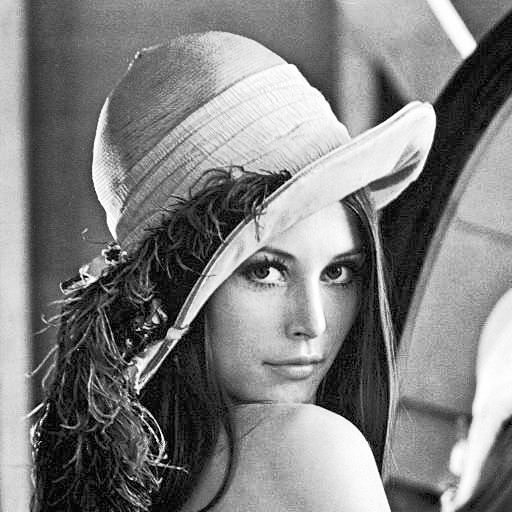

<font face="songti">

### 一、实验目的和要求

* 通过图像对数运算，探讨如何增强图像的可视性，特别是在低对比度或暗部细节不清晰的情况下。

* 通过直方图均衡化，研究如何改善图像的对比度和亮度分布，使图像更容易分辨和分析。

### 二、实验内容和原理

#### 1.增强图像的可视性

为了增强图像的可视信息，对图像中的像素进行基于对数的操作
$$
L_d =  \frac{log{({L_{w}+1})}}{log{({L_{max}+1})}}
$$
其中，$Ld $是显示亮度，$Lw $是真实世界亮度，$Lmax$是场景中的最亮值。

* 这个映射能够确保不管场景的动态范围是怎么样的，其最大值都能映射到 1(白)，其他的值能够比较平滑地变化。

#### 2.直方图均衡化

##### (1)直方图

###### a.灰度直方图

* 灰度直方图是一种统计图，它表示给定图像中不同灰度级的像素数占总像素数的比例。
* 计算公式如下：

$$
p(rk)=\frac{nk}{MN}\\
rk -- 像素的灰度级\\
nk -- 具有灰度rk的像素的个数\\
MN -- 图像中总的像素个数\\
\sum_{k=0}^{MN-1}P(rk)=1
$$

###### b.彩色直方图

* 彩色直方图表示给定图像中不同 R、G、B等级的像素数占总像素数的比例,计算方法与灰度直方图类似

  


##### （2）直方图均衡化

直方图均衡化（Histogram Equalization）是一种用于增强数字图像对比度的图像处理技术。它通过重新分布图像的像素值，使直方图变得更均匀，从而改善图像的视觉质量。直方图均衡化常被用于提高图像的可视性、分析性能和自动图像处理应用中。例如，过曝光图像的灰度级集中在高亮度范围内，而曝光不足将使图像灰度级集中在低亮度范围内。采用直方图均衡化，可以把原始图像的直方图变换为均匀分布(均衡)的形式，这样就增加了像素之间灰度值差别的动态范围，从而达到增强图像整体对比度的效果。

换言之，直方图均衡化的基本原理是:对在图像中像素个数多的灰度值(即对画面起主要作用的灰度值)进行展宽，而对像素个数少的灰度 值(即对画面不起主要作用的灰度值)进行归并，从而增大对比度，使图像清晰，达到增强的目的。

尽管直方图均衡化具有显著的优点，但它也有一些限制。它可能导致图像出现噪点或过度增强细节，特别是在噪音存在的情况下。此外，均衡化可能改变图像的整体亮度，这可能不适用于所有图像。


* 连续情况的转换$T$:

  

  <div STYLE="page-break-after: always;"></div>

  

  

  - 设 r 为转换前的灰度级， s 为变换前后的灰度级

  - $0 ≤ r,s ≤ 1$ [对应$(0,255)$]

  - P(r) 和 P(s) 是对应于 r 和 s 的概率。转换规则为:

    * T(r)是单调递增函数，$0≤r≤1$且$0≤T(r)≤1$

    * 逆变换 r = $T^{-1}(s)$也是一个单调递增函数 考虑到灰度变换不会改变位置和像素数，我们有
      $$
      \int_0^rP(r)dr = \int_0^sP(s)ds=\int_0^s 1*ds = s = T(r)\\
      Thus: T(r)=\int_0^rP(r)dr
      $$
      


* 离散情况的转换 $T$:

设一幅图像的像素总数为n，分L个灰度级，$n_k$为第k个灰度级出现的像素数，则第$k$个灰度级出现的概率为：
$$
P(r_k)= \frac{n_k}{n}(0≤n_k ≤1,k=0,1,2,...,MN−1)
$$

* 离散灰度直方图均衡化的转换公式为
  $$
  s_k = T(r_k)=\sum_{i=0}^kP(ri)=\frac{1}{n}\sum_{i=0}^{k}ni
  $$

<div STYLE="page-break-after: always;"></div>

###  三、实验步骤与分析

* 注明：本次使用了实验一的函数，在提交的DIP.h中可见。

#### 1.对数运算增强图像可视性

```C
void enhance(BMP bmp){
    // 创建一个新的BMP对象 enhanced，用于存储增强后的彩色图像
    BMP enhanced;
    // 复制输入BMP对象的内容到enhanced
    memcpy(&enhanced, &bmp, sizeof(enhanced));
    // 为enhanced分配内存以存储图像数据
    enhanced.bitmap = (byte *)calloc(enhanced.bmpih.imageSize , sizeof(byte));
    // 创建另一个BMP对象 enhanced_gray，用于处理灰度版本的图像
    BMP enhanced_gray;
    // 获取原始图像的高度和宽度
    int height = bmp.bmpih.height;
    int width = bmp.bmpih.width;
    // 计算原始图像每行的字节数和将宽度调整到4的倍数
    int old_byte = (3 * width + 3) / 4 * 4;
    int row = (width + 3) / 4 * 4;
    // 复制输入BMP对象的内容到enhanced_gray
    memcpy(&enhanced_gray, &bmp, sizeof(enhanced_gray));
    // 设置enhanced_gray的相关属性，将其转换为灰度图像
    enhanced_gray.bmph.bfOffset = 256 * 4 + HEADERSIZE;
    enhanced_gray.bmpih.bitCount = 8;
    enhanced_gray.bmpih.imageSize = height * row;
    enhanced_gray.bmph.bfSize = enhanced_gray.bmpih.imageSize + enhanced_gray.bmph.bfOffset;
    // 为enhanced_gray分配内存以存储图像数据
    enhanced_gray.bitmap = (byte*)calloc(enhanced_gray.bmpih.imageSize, sizeof(byte));
    // 初始化一个变量 max，用于存储亮度的最大值
    double max = 0.0;
    // 设置256级灰度颜色表
    for (int i = 0; i < 256; i++) {
        enhanced_gray.colours[i].blue = i;
        enhanced_gray.colours[i].green = i;
        enhanced_gray.colours[i].red = i;
    }
    // 计算原始图像中的最大亮度值
    for (int i = 0; i < height; i++) {
        for (int j = 0; j < width; j++) {
            int posi = i * old_byte + j * 3;
            double B = bmp.bitmap[posi];
            double G = bmp.bitmap[posi + 1];
            double R = bmp.bitmap[posi + 2];
            double Y, U, V;
            RGB_YUV(R, G, B, &Y, &U, &V);
            // 如果Y的值大于max，更新max
            if (Y > max) {
                max = Y;
            }
        }
    }
    // 遍历原始图像的每个像素，执行亮度增强
    for (int i = 0; i < height; i++) {
        for (int j = 0; j < width; j++) {
            int posi = i * old_byte + j * 3;
            int posi2 = i * row + j;
            double B = bmp.bitmap[posi];
            double G = bmp.bitmap[posi + 1];
            double R = bmp.bitmap[posi + 2];
            double Y, U, V;
            RGB_YUV(R, G, B, &Y, &U, &V);
            // 计算新的亮度值Y1，使用对数运算和调整函数
            double Y1 = log(Y + 1) / log(max + 1) * 255;
            Adjust(&Y1);
            // 将Y1作为灰度值存储到enhanced_gray图像中
            enhanced_gray.bitmap[posi2] = Y1;
            // 更新Y值并将YUV颜色转换回RGB颜色
            Y = Y1;
            YUV_RGB(Y, U, V, &R, &G, &B);
            Adjust(&R);
            Adjust(&G);
            Adjust(&B);
            // 存储调整后的RGB值到enhanced图像中
            enhanced.bitmap[posi] = B;
            enhanced.bitmap[posi + 1] = G;
            enhanced.bitmap[posi + 2] = R;
        }
    }
    // 将增强后的彩色图像和灰度图像分别保存为BMP文件
    FILE* fp = fopen("enhanced_color.bmp", "wb");
    OUTPUT(&enhanced, fp);
    fp = fopen("enhance_gray.bmp", "wb");
    OUTPUT(&enhanced_gray, fp);
    // 释放分配的内存
    free(enhanced.bitmap);
    free(enhanced_gray.bitmap);
}
```

* 首先将提取出读入 bmp 文件的 RGB 值，并转为 YUV 后找到最大的 Y,并利用公式进行增强。需要注意的是，不能先转为灰度图再寻找$Y_{max}$因为转为灰度图的过程涉及到对边界的检查，会导致最大值被强制调整到$255$，而这会影响之后的处理过程。

#### 2.直方图均衡

* 计算直方图

> Note:定义了以下全局变量
>
> ```C
> double RED[256]={0};
> double GREEN[256]={0};
> double BLUE[256]={0};
> double GRAY[256]={0};
> ```

```C
void histogram(BMP bmp) {
    // 获取原始图像的高度和宽度
    int height = bmp.bmpih.height;
    int width = bmp.bmpih.width;
    // 计算图像的总像素数量
    int size = height * width;
    // 计算每行的字节数，将宽度调整到4的倍数
    int row_byte = (width * 3 + 3) / 4 * 4;
    // 遍历原始图像的每个像素，以计算直方图
    for (int i = 0; i < height; i++) {
        for (int j = 0; j < width; j++) {
            // 计算当前像素在图像数据中的位置
            int posi = i * row_byte + j * 3;
            // 获取当前像素的RGB颜色分量
            double B = bmp.bitmap[posi];
            double G = bmp.bitmap[posi + 1];
            double R = bmp.bitmap[posi + 2];
            // 将RGB颜色转换为亮度YUV颜色空间
            double Y, U, V;
            RGB_YUV(R, G, B, &Y, &U, &V);
            // 调整亮度值Y
            Adjust(&Y);
            // 将像素的RGB分量值分别添加到相应的颜色通道的直方图中
            RED[(int)R] += 1.0;
            GREEN[(int)G] += 1.0;
            BLUE[(int)B] += 1.0;
            // 将像素的亮度值Y添加到灰度通道的直方图中
            GRAY[(int)Y] += 1.0;
        }
    }
}
```

* 直方图均衡化(3种方法)
  *  直接在 RGB 三个通道上均衡化
  *  将 RGB 转为 YUV 后在 Y 上均衡化，随后直接输出仅保留 Y 通道的灰度图 
  * 将 RGB 转为 YUV 后在 Y 上均衡化，随后将 YUV 转回 RGB 再输出彩色图

```C
void Equal(BMP bmp) {
    // 调用 histogram 函数计算原始图像的直方图
    histogram(bmp);
    // 创建数组 s、sR、sG 和 sB 以存储累积概率分布
    double s[256];
    double sR[256];
    double sG[256];
    double sB[256];
    // 获取原始图像的高度和宽度
    int height = bmp.bmpih.height;
    int width = bmp.bmpih.width;
    // 计算图像的总像素数量
    int size = height * width;
    // 计算每行的字节数
    int row_byte = (width * 3 + 3) / 4 * 4;
    int row = (width + 3) / 4 * 4;
    // 初始化累积概率分布数组的第一个元素
    s[0] = GRAY[0] / size;
    sR[0] = RED[0] / size;
    sG[0] = GREEN[0] / size;
    sB[0] = BLUE[0] / size;
    // 计算累积概率分布数组的其他元素
    for (int i = 1; i < 256; i++) {
        s[i] = s[i - 1] + GRAY[i] / size;
        sR[i] = sR[i - 1] + RED[i] / size;
        sG[i] = sG[i -1] + GREEN[i] / size;
        sB[i] = sB[i -1] + BLUE[i] / size;
    }
    // 创建一个新的BMP对象 direct，用于存储直方图均衡化后的彩色图像
    BMP direct;
    // 复制输入BMP对象的内容到direct
    memcpy(&direct, &bmp, sizeof(direct));
    // 为direct分配内存以存储图像数据
    direct.bitmap = (byte*)calloc(direct.bmpih.imageSize, sizeof(byte));
    // 创建灰度变换后的图像
    BMP gray = Gray_Transform(bmp, height, width);
    // 遍历原始图像的每个像素，进行直方图均衡化
    for (int i = 0; i < height; i++) {
        for (int j = 0; j < width; j++) {
            // 计算当前像素在图像数据中的位置
            int posi = row_byte * i + j * 3;
            // 获取当前像素的RGB颜色分量
            double B = bmp.bitmap[posi];
            double G = bmp.bitmap[posi + 1];
            double R = bmp.bitmap[posi + 2];
            double Y, U, V;
            RGB_YUV(R, G, B, &Y, &U, &V);
            // 调整亮度值Y
            Adjust(&Y);
            // 计算直方图均衡化后的像素值并存储到对应的图像中
            gray.bitmap[row * i + j] = s[(int)Y] * 255;
            direct.bitmap[posi] = sB[(int)B] * 255;
            direct.bitmap[posi + 1] = sG[(int)G] * 255;
            direct.bitmap[posi + 2] = sR[(int)R] * 255;
            // 调整RGB颜色并存储到原始图像中
            Y = s[(byte)Y] * 255;
            YUV_RGB(Y, U, V, &R, &G, &B);
            Adjust(&R);
            Adjust(&G);
            Adjust(&B);
            bmp.bitmap[posi] = B;
            bmp.bitmap[posi + 1] = G;
            bmp.bitmap[posi + 2] = R;
        }
    }
    // 将增强后的灰度图像保存为文件
    FILE* fp = fopen("gray_equal.bmp", "wb");
    OUTPUT(&gray, fp);
    // 将增强后的彩色图像保存为文件
    fp = fopen("direct_equal.bmp", "wb");
    OUTPUT(&direct, fp);
    // 将增强后的原始彩色图像保存为文件
    fp = fopen("indirect_equal.bmp", "wb");
    OUTPUT(&bmp, fp);
    // 释放分配的内存
    free(direct.bitmap);
    free(gray.bitmap);
}
```


### 四、实验环境及运行方法


#### 实验环境：

MacBook Air M2 Sonoma 14.0

Apple clang version 15.0.0(arm64-apple-darwin23.0.0)


#### 运行方法：

打开lab03 文件夹，用vscode打开其中的code文件夹，其中包含源文件`lab3.c`，头文件`DIP.h`，可执行文件`lab3mac,lab3.exe`和24位BMP图像`flower.bmp Lena.bmp Drawings.bmp `。

> （1）打开lab3.c,DIP.h,进入lab3.c，修改希望处理的图像名为`input.bmp`(如把Lena.bmp修改为input.bmp) , 点击Run Code可开始运行。输出"successfully loaded!"表示文件正常读入，「由于在DIP.h中改变了`#pragma pack alignment value`,会产生warning，但不影响程序运行」
>
> （2）程序会输出五张处理后的图片，分别为：
>
> * enhanced_color.bmp - 对数增强后的彩色图
> * enhance_gray.bmp - 对数增强后的灰度图
> * direct_equal.bmp - 直接对RGB进行直方图均衡
> * gray_equal.bmp - 直接对Y进行直方图均衡
> * indirect_equal.bmp - 直接对Y进行直方图均衡后转为RGB彩色图
>
> （3）如果是Mac用户 在终端中cd进入code目录 输入 chmod +x lab3mac 为其添加执行权限，接着输入 ./lab3mac 可得到如（2）中结果
>
> （4）如果是windows用户，可运行lab3.exe,输出效果与（2）相同


###  五、实验结果展示

<table>
  <tr>
    <td></td>
    <td></td>
    <td> </td>
  </tr>
   <tr>
    <td><center>INPUT </center></td>
    <td><center>对数增强后的<br>彩色图 </center></td>
    <td><center>对数增强后的<br>灰度图 </center></td>
  </tr>
    <tr>
    <td></td>
    <td></td>
    <td></td>
  </tr>
  <tr>
    <td><center>直接对RGB进行<br>直方图均衡 </center></td>
    <td><center>直接对Y进行<br>直方图均衡 </center></td>
    <td><center>直接对Y进行直方图均衡后<br>转为RGB彩色图</center></td>
  </tr>
</table>


<table>
  <tr>
    <td></td>
    <td></td>
    <td> </td>
  </tr>
   <tr>
    <td><center>INPUT </center></td>
    <td><center>对数增强后的<br>彩色图 </center></td>
    <td><center>对数增强后的<br>灰度图 </center></td>
  </tr>
  <tr>
    <td></td>
    <td></td>
    <td></td>
  </tr>
  <tr>
    <td><center>直接对RGB进行<br>直方图均衡 </center></td>
    <td><center>直接对Y进行<br>直方图均衡 </center></td>
    <td><center>直接对Y进行直方图均衡后<br>转为RGB彩色图</center></td>
  </tr>
</table>


<table>
<tr>
    <td></td>
    <td></td>
    <td></td>
    <td></td>
  </tr>
  <tr>
    <td><center>INPUT </center></td>
    <td><center>直接对RGB进行<br>直方图均衡 </center></td>
    <td><center>直接对Y进行<br>直方图均衡 </center></td>
    <td><center>直接对Y进行直方图均衡后<br>转为RGB彩色图</center></td>
  </tr>
</table>


### 六、心得体会

​	在本次实验中，我们学习了图像处理中的两个重要概念：灰度直方图和直方图均衡化。首先，我们进行了图像的灰度直方图分析，这有助于我们了解图像的亮度分布情况，进而为图像增强提供基础。接着，我们学习了直方图均衡化的原理和方法，它是一种用于增强图像对比度的技术。

​	在实验过程中，我们首先编写了代码来计算图像的灰度直方图，了解了不同灰度级别在图像中的分布情况。这为直方图均衡化提供了必要的信息，帮助我们确定如何调整图像的像素值以获得更好的可视效果。接着，我们实施了直方图均衡化，通过累积分布函数的计算和像素值的映射，将图像的亮度分布均匀化。这使得图像的对比度增加，细节更加清晰，从而提高了图像的可视性。

​	总的来说，本次实验使我们深入了解了图像处理中的一些关键概念和技术。通过实际编写和运行图像处理代码，我们不仅理论上理解了这些概念，还获得了实际操作的经验。这些技能对于处理和增强图像在许多领域，如计算机视觉、医学影像和数字媒体等方面都非常重要。通过这次实验，我更深刻地理解了图像处理的重要性和应用价值。

</font>
