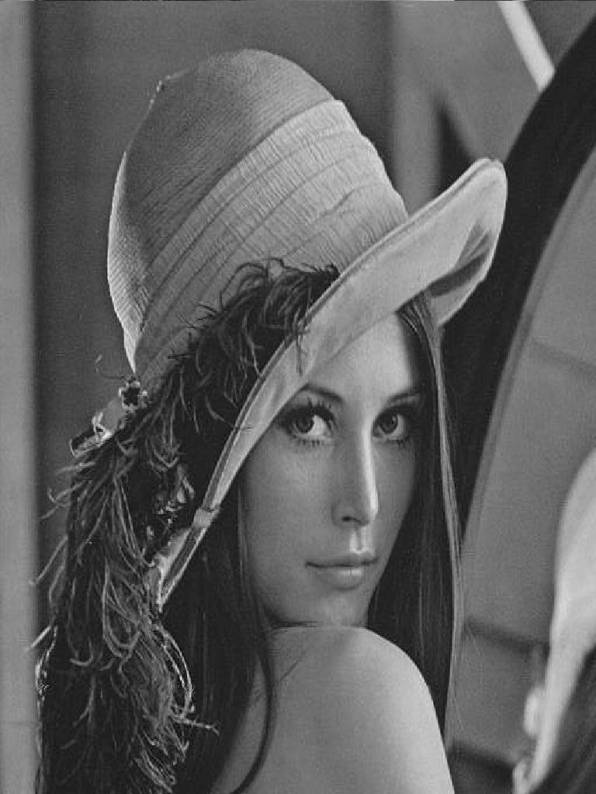
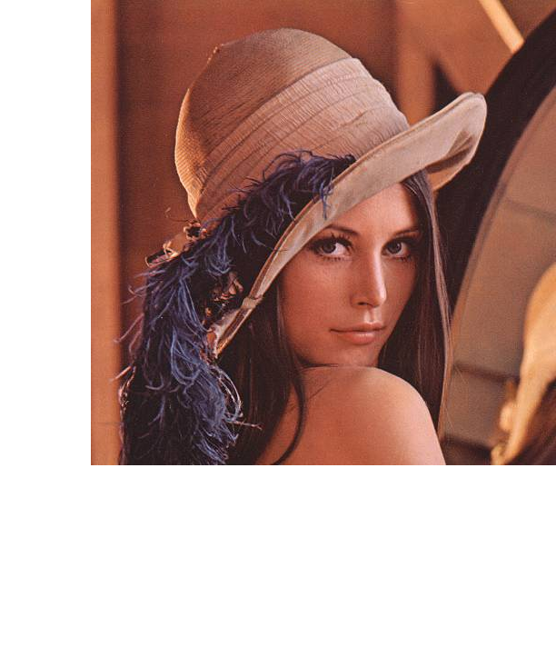
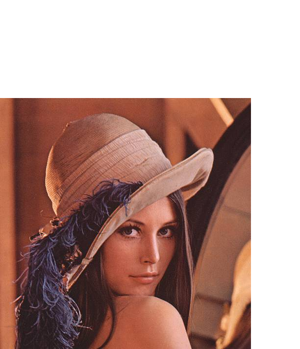
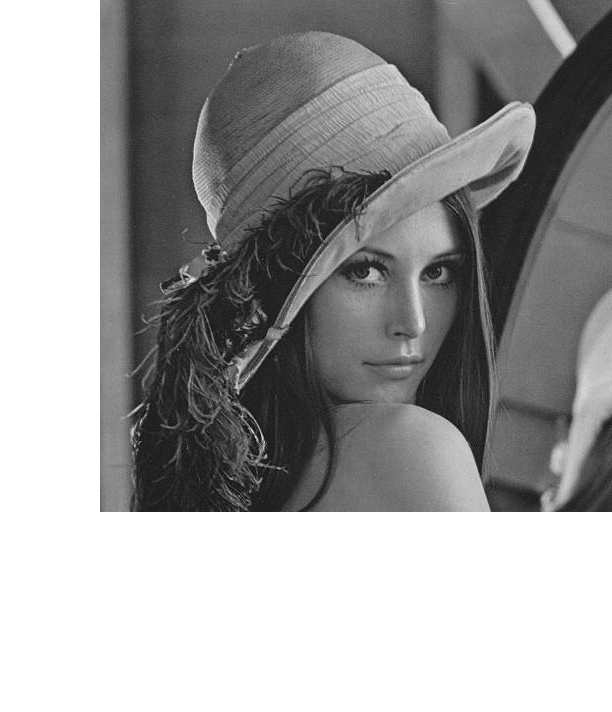
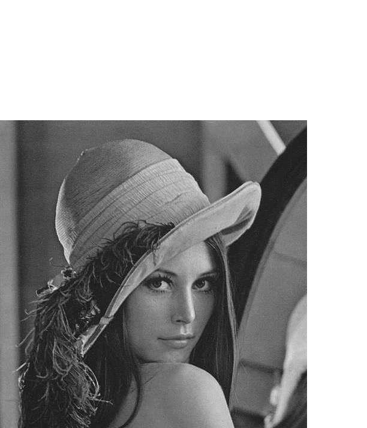
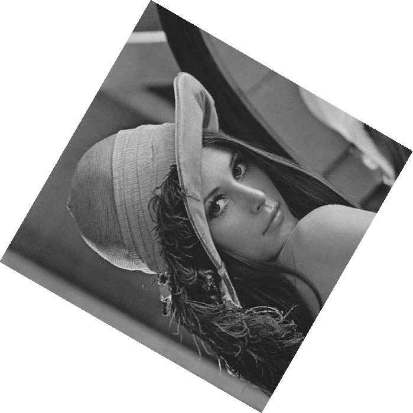
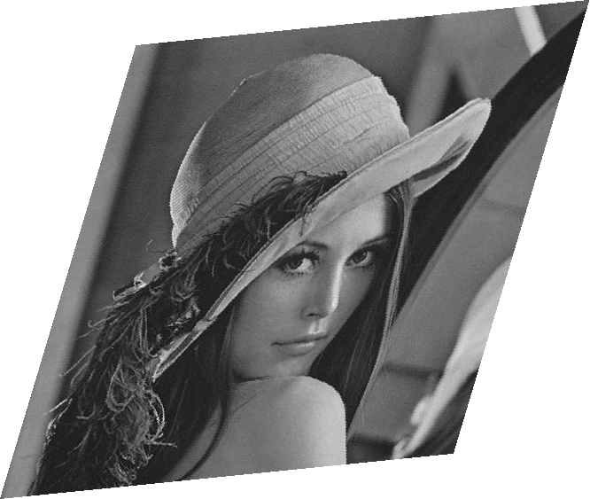
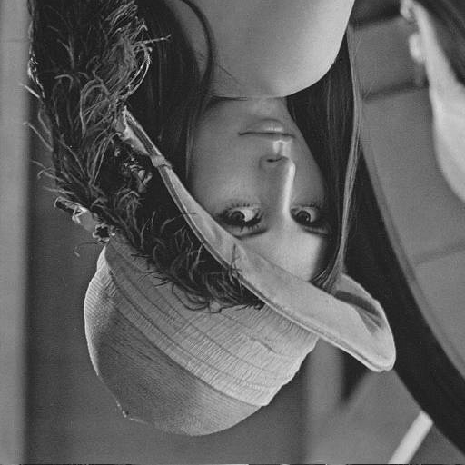

<font face="songti">

### 一、实验目的和要求

* 通过编写简单的几何变换程序，加深对几何变换原理的理解，掌握基本的图形学编程技能，以及通过实际操作掌握几何变换的应用。

* 实现平移、旋转、缩放、剪切、镜像等基本几何变换的图形学算法。


### 二、实验内容和原理

#### 1.基本几何变化

##### （1）平移（Translation）

> 将图像沿水平和竖直方向移动，从而产生新图像的过程。 

> 平移后的景物与原图像相同，但“画布”一定是扩大了，否则就会丢失信息。


* 矩阵表示

$$
\begin{bmatrix}x^{'}\\y^{'}\\1\end{bmatrix}=\begin{bmatrix}1&0&x_0\\0&1&y_0\\0&0&1\end{bmatrix}\begin{bmatrix}x\\y\\1\end{bmatrix}
$$


##### （2）旋转（Rotation）

* 绕原点旋转$\theta$角，得到新图像的过程

  

  * 注意：旋转变换的过程中，图像中会产生空洞，用插值法补全

* 矩阵表示
  $$
  \begin{bmatrix}x^{'}\\y^{'}\\1\end{bmatrix}=\begin{bmatrix}cos\theta&-sin\theta&0\\sin\theta&cos\theta&0\\0&0&1\end{bmatrix}\begin{bmatrix}x\\y\\1\end{bmatrix}
  $$
  

##### （3）缩放 (Scale)

将图像乘以一定系数，从而产生新图像的过程


* 沿x轴方向缩放c倍（c>1时为放大，0<c<1时为缩小）

  沿y轴方向缩放d倍（d>1时为放大，0<d<1时为缩小）

  *  当c=d时，图像等比缩放；否则为非等比缩放，导致图像变形。
  * 缩小 ：按一定间隔选取某些行和列的像素构成缩小后的新图像；
  * 放大  ：新图像出现空行和空列，可采用插值的方法加以填补，但存在“马赛克”现象。

* 矩阵表示
  $$
  \begin{bmatrix}x^{'}\\y^{'}\\1\end{bmatrix}=\begin{bmatrix}c&0&0\\0&d&0\\0&0&1\end{bmatrix}\begin{bmatrix}x\\y\\1\end{bmatrix}
  $$
  

##### （4）图像剪切 (Shear)

图像的错切变换实际上是景物在平面上的非垂直投影效果


$$
Shear\ on\ x-axis:
\left\{
  \begin{aligned}
    &a(x, y) = x + d_xy \\
    &b(x, y) = y
  \end{aligned}
  \right.
$$

$$
Shear\ on\ y-axis:
\left\{
  \begin{aligned}
    &a(x, y) = x  \\
    &b(x, y) = y+d_yx
  \end{aligned}
  \right.
$$

* 矩阵表示
  $$
  \begin{bmatrix}x^{'}\\y^{'}\\1\end{bmatrix}=\begin{bmatrix}1&d_x&0\\d_y&1&0\\0&0&1\end{bmatrix}\begin{bmatrix}x\\y\\1\end{bmatrix}
  $$

##### （5）镜像变换 (Mirror)

绕x轴或y轴翻转，从而产生与原图像对称的新图像的过程


* 矩阵表示

$$
\begin{bmatrix}x^{'}\\y^{'}\\1\end{bmatrix}=\begin{bmatrix}s_x&0&0\\0&s_y&0\\0&0&1\end{bmatrix}\begin{bmatrix}x\\y\\1\end{bmatrix}
$$

* 当Sx =$ 1$，且Sy =$ -1$时实现绕x轴的镜像变换
* 当Sx = $-1$，且Sy =$ 1$时实现绕y轴的镜像变换

##### （6）复合几何变换

$$
\begin{bmatrix}x^{'}\\y^{'}\\1\end{bmatrix}=\begin{bmatrix}a&b&c\\d&e&f\\g&h&1\end{bmatrix}\begin{bmatrix}x\\y\\1\end{bmatrix}
$$


#### 2.插值

##### （1）最邻近插值 (Nearest neighbor)

* 最邻近插值，即输出像素的灰度值等于离它所映射到的位置最近的输入像素的灰度值。

> 为了计算几何变换后新图像中某一点$ P’$处的像素值，可以首先计算该几何变换的逆变换，计算出 $P’$ 所对应的原图像中的位置 $P$
>
> 通常情况下，$P$ 的位置不可能正好处在原图像的某一个像素位置上(即 $P $点 的坐标通常都不会正好是整数)
>
> 寻找与 $P$ 点最接近的像素$Q$，把 $Q$ 点的像素值作为新图像中 $P’$点的 像素值。

* $Steps$
  $$
  (x^{'},y^{'})\xRightarrow{\text{Inverse Transtion}}(x,y)\\
  \ \ \ \ \ \ \ \ \ \ \ \ \ \ \ \ \ \ \ \ \ \xRightarrow{\text{rounding operation}}(x_{int},y_{int})\\
  \ \ \ \ \ \ \ \ \ \  \ \ \ \ \ \ \ \ \  \ \ \ \ \ \ \ \ \ \ \ \ \ \ \ \ \ \ \ \ \ \ \ \
  \xRightarrow{\text{assign value}}I_{new}(x^{'},y^{'})=I_{old}(x_{int},y_{int})\\
  $$
  
* 当图像中包含明显的几何结构时，结果将不太光滑连续，从而在图像中产生人为的痕迹

##### (2) 线性插值 (Linear interpolation)

* 在一维情况下，已知x1和x2处的灰度值分别为g1和g2，则x3处的灰度值g3为： 
  $$
  g_3 = \frac{g_2-g_1}{x_2-x_1}(x_3-x_1)+g1
  $$

* 在二维情况下，称为双线性插值

  * 注：可由一维的情况推导而来，得到双线性方程g(x,y)为
    $$
    g(x,y)=\frac{(y_1-y)(x_1-x)}{(y_1-y_0)(x_1-x_0)}g(0,0)+\frac{(y_1-y)(x-x_0)}{(y_1-y_0)(x_1-x_0)}g(1,0)+\frac{(y-y_0)(x_1-x)}{(y_1-y_0)(x_1-x_0)}g(0,1)+\frac{(y-y_0)(x-x_0)}{(y_1-y_0)(x_1-x_0)}g(1,1)
    $$
    即满足$g(x,y)=ax+by+cxy+d$的形式

  * 已知图像的正方形网格上四个点A、B、C、D的灰度，求P点的灰度:

    * 定义双线性方程$g(x,y)=ax+by+cxy+d $
    * 分别将$A\ B\ C\ D$四点的位置和灰度代入方程，得到方程组
    * 解方程组，解出$a\ b\ c\ d$四个系数
    * 将P点的位置代入方程，得到P点的灰度

##### (3)径向基函数插值[Radial Basis Function (RBF) based interpolation]

* 径向基函数$\phi(x)$

  * 最常见为高斯函数$φ(r)=e^{\frac{−r^2}{2σ^2}}$　

  * Multiquadrics:$\phi(r)=\sqrt{1+\frac{r^2}{\sigma^2}}$　

  * Linear: $\phi(r)=r$

  * Cubic:$\phi(r)=r^3$

    ……

* 插值函数

  $\hat{f}(x)=\sum_{i=1}^Nw_i\phi(||x-x_i||)$


###  三、实验步骤与分析

* 注明：本次使用了实验一的函数，在提交的DIP.h中可见。

#### 1.Translate

* 函数对输入的"bmp"进行平移：
  * 沿x轴向右（x<0 则向左）平移x个像素点距离
  * 沿y轴向上（y<0 则向下）平移y个像素点距离
* 几点注意：
  * 由于平移操作，需要对图片的尺寸进行处理：
    * 如果$x>0\ y>0$则新生成的图片左下角位置应为原图片平移前的位置.
    * 如果$x>0\ y<0$则新生成的图片左上角位置应为原图片平移前的位置.
    * 如果$x<0\ y>0$则新生成的图片右下角位置应为原图片平移前的位置.
    * 如果$x<0\ y<0$则新生成的图片右上角位置应为原图片平移前的位置.
  * 一定要注意，在对图像进行逐个像素遍历的时候，$i$对应行数，即对应$y$,$j$对应$x$.
  * **需要注意**，在y坐标上平移的时候，如果$y>0$即原图像向上平移，应做$i+y$操作，因为实际上bmp图像的存储是倒序的，即为第一个像素点其实是右下角的像素.

```C
void translate(BMP bmp, int x, int y) {
    // 创建一个新的BMP结构体用于存储平移后的图像
    BMP translate; 
    // 将传入的bmp图像的信息拷贝到新的结构体中
    memcpy(&translate, &bmp, sizeof(translate));
    // 获取原始图像的宽度和高度
    int width = translate.bmpih.width;
    int height = translate.bmpih.height;
    // 计算平移后的图像宽度和高度
    int width1 = width + abs(x);
    int height1 = height + abs(y);
    // 计算每行的字节数
    int row_byte1 = (translate.bmpih.bitCount / 8 * width1 + 3) / 4 * 4;
    int row_byte = (translate.bmpih.bitCount / 8 * width + 3) / 4 * 4;
    // 更新平移后图像的宽度、高度、图像大小等信息
    translate.bmpih.height = height1;
    translate.bmpih.width = width1;
    translate.bmpih.imageSize = height1 * row_byte1;
    translate.bmph.bfSize = translate.bmph.bfOffset + translate.bmpih.imageSize;
    // 分配内存用于存储平移后的图像数据，并将像素值初始化为255（白色）
    translate.bitmap = (byte *)calloc(translate.bmpih.imageSize, sizeof(byte));
    for (int i = 0; i < translate.bmpih.imageSize; i++) {
        translate.bitmap[i] = 255;
    }
    // 根据图像的位深度分情况处理像素值
    if (translate.bmpih.bitCount == 8) {
        for (int i = 0; i < height; i++) {
            for (int j = 0; j < width; j++) {
                int posi = i * row_byte + j;
                int i1, j1;
                if (y <= 0) {
                    i1 = i;
                } else {
                    i1 = i + y;
                }
                if (x >= 0) {
                    j1 = j + x;
                } else {
                    j1 = j;
                }
                int posi1 = i1 * row_byte1 + j1;
                translate.bitmap[posi1] = bmp.bitmap[posi];
            }
        }
    } else {
        for (int i = 0; i < height; i++) {
            for (int j = 0; j < width; j++) {
                int posi = i * row_byte + j * 3;
                int i1, j1;
                if (y <= 0) {
                    i1 = i;
                } else {
                    i1 = i + y;
                }
                if (x >= 0) {
                    j1 = j + x;
                } else {
                    j1 = j;
                }
                int posi1 = i1 * row_byte1 + j1 * 3;
                translate.bitmap[posi1] = bmp.bitmap[posi];
                translate.bitmap[posi1 + 1] = bmp.bitmap[posi + 1];
                translate.bitmap[posi1 + 2] = bmp.bitmap[posi + 2];
            }
        }
    }
    // 将平移后的图像保存为"translate.bmp"
    FILE *fp = fopen("translate.bmp", "wb");
    OUTPUT(&translate, fp);
    // 释放动态分配的内存
    free(translate.bitmap);
}
```

#### 2.Rotation

* 注意

  ```C
  // 在逆推原坐标点的过程中，需要考虑平移问题，因为变换了参考系
  double x = (double)(width1 / 2) - cx;
  double y = (double)(height1 / 2) - cy;
  ```

  这一步是非常必要的，一定要注意在旋转过程中也改变了图像的尺寸，也就是说做了坐标系的变换，在原图像中心点旋转后在原坐标系下位于$(c_x,c_y)$而在新图像位于新图像的正中央，即为$(width_1/2,height_1/2)$处

```C
void rotate(int *x, int *y, double cost, double sint) {
    // 保存原始坐标
    double tmp1 = *x;
    double tmp2 = *y;

    // 计算旋转后的新坐标
    *x = (tmp1 * cost) - (tmp2 * sint);
    *y = (tmp1 * sint) + (tmp2 * cost);
}
void rot(BMP bmp, double angle) {
    // 创建一个新的BMP结构体用于存储旋转后的图像
    BMP rot;
    // 将传入的bmp图像的信息拷贝到新的结构体中
    memcpy(&rot, &bmp, sizeof(rot));
    // 获取原始图像的宽度和高度
    int width = rot.bmpih.width;
    int height = rot.bmpih.height;
    // 将角度转换为弧度
    angle = angle * M_PI / 180.0;
    // 计算cos和sin值
    double cos_a = cos(angle);
    double sin_a = sin(angle);
    // 计算旋转后的图像宽度和高度
    int width1 = width * fabs(cos_a) + height * fabs(sin_a);
    int height1 = width * fabs(sin_a) + width * fabs(cos_a);
    // 计算旋转中心点的坐标
    int cx = width / 2;
    int cy = height / 2;
    // 对旋转中心点进行坐标变换
    rotate(&cx, &cy, cos_a, sin_a);
    // 计算每行的字节数
    int row_byte1 = (rot.bmpih.bitCount / 8 * width1 + 3) / 4 * 4;
    int row_byte = (rot.bmpih.bitCount / 8 * width + 3) / 4 * 4;
    // 更新旋转后图像的宽度、高度、图像大小等信息
    rot.bmpih.height = height1;
    rot.bmpih.width = width1;
    rot.bmpih.imageSize = height1 * row_byte1;
    rot.bmph.bfSize = rot.bmph.bfOffset + rot.bmpih.imageSize;
    // 分配内存用于存储旋转后的图像数据
    rot.bitmap = (byte *)calloc(rot.bmpih.imageSize, sizeof(byte));
    // 在逆推原坐标点的过程中，需要考虑平移问题，因为变换了参考系
    double x = (double)(width1 / 2) - cx;
    double y = (double)(height1 / 2) - cy;
    // 根据图像的位深度分情况处理像素值
    if (rot.bmpih.bitCount == 8) {
        for (int i = 0; i < height1; i++) {
            for (int j = 0; j < width1; j++) {
                int posi1 = i * row_byte1 + j;
                double x1 = j - x;
                double y1 = i - y;
                int x2 = round((x1 * cos_a) + (y1 * sin_a));
                int y2 = round(-(x1 * sin_a) + (y1 * cos_a));
                int posi = y2 * row_byte + x2;
                if (x2 < 0 || y2 < 0 || x2 >= width || y2 >= height) {
                    rot.bitmap[posi1] = 255;
                    continue;
                }
                rot.bitmap[posi1] = bmp.bitmap[posi];
            }
        }
    } else {
        for (int i = 0; i < height1; i++) {
            for (int j = 0; j < width1; j++) {
                int posi1 = i * row_byte1 + j * 3;
                double x1 = j - x;
                double y1 = i - y;
                int x2 = round((x1 * cos_a) + (y1 * sin_a));
                int y2 = round(-(x1 * sin_a) + (y1 * cos_a));
                int posi = y2 * row_byte + x2 * 3;
                if (x2 < 0 || y2 < 0 || x2 >= width || y2 >= height) {
                    rot.bitmap[posi1] = 255;
                    rot.bitmap[posi1 + 1] = 255;
                    rot.bitmap[posi1 + 2] = 255;
                    continue;
                }
                rot.bitmap[posi1] = bmp.bitmap[posi];
                rot.bitmap[posi1 + 1] = bmp.bitmap[posi + 1];
                rot.bitmap[posi1 + 2] = bmp.bitmap[posi + 2];
            }
        }
    }
    // 将旋转后的图像保存为"rotate.bmp"
    FILE *fp = fopen("rotate.bmp", "wb");
    OUTPUT(&rot, fp);
    // 释放动态分配的内存
    free(rot.bitmap);
}
```

#### 3.Scale

* 一定要注意，在对图像进行逐个像素遍历的时候，$i$对应行数，即对应$y$,$j$对应$x$.

```C
void scale(double x, double y, BMP bmp) {
    // 创建一个新的BMP结构体用于存储缩放后的图像
    BMP scale;
    // 复制原始图像信息到新的结构体
    memcpy(&scale, &bmp, sizeof(scale));
    // 获取原始图像的宽度和高度
    int width = scale.bmpih.width;
    int height = scale.bmpih.height;
    // 计算缩放后的宽度和高度
    int width1 = round(width * x);
    int height1 = round(height * y);
    // 计算每行的字节数（包含补齐的字节）
    int row_byte = (bmp.bmpih.bitCount / 8 * width + 3) / 4 * 4;
    int row_byte1 = (bmp.bmpih.bitCount / 8 * width1 + 3) / 4 * 4;
    // 更新新BMP结构体的宽度和高度信息
    scale.bmpih.width = width1;
    scale.bmpih.height = height1;
    // 分配内存以存储缩放后的图像数据
    scale.bitmap = (byte*)malloc(row_byte1 * height1 * sizeof(byte));
    // 更新新BMP结构体的图像大小信息
    scale.bmpih.imageSize = height1 * row_byte1;
    scale.bmph.bfSize = scale.bmph.bfOffset + scale.bmpih.imageSize;
    // 根据图像的位深度进行缩放操作
    if (scale.bmpih.bitCount == 24) {
        // 24位深度的图像
        for (int i = 0; i < height1; i++) {
            for (int j = 0; j < width1; j++) {
                // 计算缩放后的位置
                int posi = i * row_byte1 + j * 3;
                int posi1 = round(i / y) * row_byte + round(j / x) * 3;
                // 复制像素值到新的位置
                scale.bitmap[posi] = bmp.bitmap[posi1];
                scale.bitmap[posi + 1] = bmp.bitmap[posi1 + 1];
                scale.bitmap[posi + 2] = bmp.bitmap[posi1 + 2];
            }
        }
    } else {
        // 其他位深度的图像
        for (int i = 0; i < height1; i++) {
            for (int j = 0; j < width1; j++) {
                // 计算缩放后的位置
                int posi = i * row_byte1 + j;
                int posi1 = round(i / y) * row_byte + round(j / x);
                // 复制像素值到新的位置
                scale.bitmap[posi] = bmp.bitmap[posi1];
            }
        }
    }
    // 打开一个文件用于写入缩放后的图像数据
    FILE* fp = fopen("scale.bmp", "wb");
    // 输出新的BMP结构体到文件
    OUTPUT(&scale, fp);
    // 释放分配的内存
    free(scale.bitmap);
}
```

#### 4.Rear

* 不涉及$height1-i$，由于原图像新图像素均为倒序储存「即为第一个点在图像左下角」

* 根据公式计算得到逆过程
  $$
  \left\{
    \begin{aligned}
      &x = \frac{x^{'} -d_x*y^{'}}{1- d_x*d_y} \\
      &y = \frac{y^{'} -d_y*x^{'}}{1- d_x*d_y}
    \end{aligned}
    \right.
  $$

```C
void affine(double dx, double dy, BMP bmp) {
    // 创建一个新的BMP结构体用于存储仿射变换后的图像
    BMP affine;
    // 复制原始图像信息到新的结构体
    memcpy(&affine, &bmp, sizeof(affine));
    // 获取原始图像的宽度和高度
    int width = affine.bmpih.width;
    int height = affine.bmpih.height;
    // 计算仿射变换后的宽度和高度
    int width1 = round(width + dx * height);
    int height1 = round(height + dy * width);
    // 计算每行的字节数（包含补齐的字节）
    int row_byte = (bmp.bmpih.bitCount / 8 * width + 3) / 4 * 4;
    int row_byte1 = (bmp.bmpih.bitCount / 8 * width1 + 3) / 4 * 4;
    // 更新新BMP结构体的宽度和高度信息
    affine.bmpih.width = width1;
    affine.bmpih.height = height1;
    // 分配内存以存储仿射变换后的图像数据
    affine.bitmap = (byte*)malloc(row_byte1 * height1 * sizeof(byte));
    // 更新新BMP结构体的图像大小信息
    affine.bmpih.imageSize = height1 * row_byte1;
    affine.bmph.bfSize = affine.bmph.bfOffset + affine.bmpih.imageSize;
    // 根据图像的位深度进行仿射变换操作
    if (affine.bmpih.bitCount == 24) {
        // 24位深度的图像
        for (int i = 0; i < height1; i++) {
            for (int j = 0; j < width1; j++) {
                // 计算仿射变换后的位置
                int posi = i * row_byte1 + j * 3;
                int x1 = round((j - dx * (i)) / (1 - dx * dy));
                int y1 = round((i - dy * j) / (1 - dx * dy));
                // 检查新位置是否在原始图像范围内，如果不在则填充白色
                if (x1 < 0 || y1 < 0 || x1 >= width || y1 >= height){
                    affine.bitmap[posi] = 255;
                    affine.bitmap[posi + 1] = 255;
                    affine.bitmap[posi + 2] = 255;
                    continue;
                }
                // 复制像素值到新的位置
                int posi1 = y1 * row_byte + x1 * 3;
                affine.bitmap[posi] = bmp.bitmap[posi1];
                affine.bitmap[posi + 1] = bmp.bitmap[posi1 + 1];
                affine.bitmap[posi + 2] = bmp.bitmap[posi1 + 2];
            }
        }
    } else {
        // 其他位深度的图像
        for (int i = 0; i < height1; i++) {
            for (int j = 0; j < width1; j++) {
                // 计算仿射变换后的位置
                int posi = i * row_byte1 + j;
                int x1 = round((j - dx * (i)) / (1 - dx * dy));
                int y1 = round((i - dy * j) / (1 - dx * dy));
                // 检查新位置是否在原始图像范围内，如果不在则填充白色
                if (x1 < 0 || y1 < 0 || x1 >= width || y1 >= height){
                    affine.bitmap[posi] = 255;
                    continue;
                }
                // 复制像素值到新的位置
                int posi1 = y1 * row_byte + x1;
                affine.bitmap[posi] = bmp.bitmap[posi1];
            }
        }     
    }
    // 打开一个文件用于写入仿射变换后的图像数据
    FILE* fp = fopen("affine.bmp", "wb");
    // 输出新的BMP结构体到文件
    OUTPUT(&affine, fp);
    // 释放分配的内存
    free(affine.bitmap);
}
```

#### 5.Mirror

```C
void mirror(int axis, BMP bmp) {
    // 创建一个新的BMP结构体用于存储镜像操作后的图像
    BMP mirror;
    // 复制原始图像信息到新的结构体
    memcpy(&mirror, &bmp, sizeof(mirror));
    // 获取原始图像的宽度和高度
    int height = bmp.bmpih.height;
    int width = bmp.bmpih.width;
    // 计算每行的字节数（包含补齐的字节）
    int row_byte = (bmp.bmpih.bitCount / 8 * width + 3) / 4 * 4;
    // 分配内存以存储镜像操作后的图像数据
    mirror.bitmap = (byte*)calloc(mirror.bmpih.imageSize, sizeof(byte));
    // 根据图像的位深度进行镜像操作
    if (mirror.bmpih.bitCount == 24) {
        // 24位深度的图像
        for (int i = 0; i < height; i++) {
            for (int j = 0; j < width; j++) {
                // 计算当前位置的索引
                int posi = i * row_byte + j * 3;
                int posi1;
                // 根据镜像轴选择镜像位置
                if (axis) {
                    posi1 = i * row_byte + (width - j) * 3;
                } else {
                    posi1 = (height - i) * row_byte + j * 3;
                }
                // 复制像素值到新的位置
                mirror.bitmap[posi] = bmp.bitmap[posi1];
                mirror.bitmap[posi + 1] = bmp.bitmap[posi1 + 1];
                mirror.bitmap[posi + 2] = bmp.bitmap[posi1 + 2];
            }
        }
    } else {
        // 其他位深度的图像
        for (int i = 0; i < height; i++) {
            for (int j = 0; j < width; j++) {
                // 计算当前位置的索引
                int posi = i * row_byte + j;
                int posi1;
                // 根据镜像轴选择镜像位置
                if (axis) {
                    posi1 = i * row_byte + (width - j);
                } else {
                    posi1 = (height - i) * row_byte + j;
                }
                // 复制像素值到新的位置
                mirror.bitmap[posi] = bmp.bitmap[posi1];
            }
        }
    }
    // 打开一个文件用于写入镜像操作后的图像数据
    FILE* fp = fopen("mirror.bmp", "wb");
    // 输出新的BMP结构体到文件
    OUTPUT(&mirror, fp);
    // 释放分配的内存
    free(mirror.bitmap);
}
```

### 四、实验环境及运行方法

#### 实验环境：

MacBook Air M2 Sonoma 14.0

Apple clang version 15.0.0(arm64-apple-darwin23.0.0)

#### 运行方法：

打开lab04 文件夹，用vscode打开其中的code文件夹，其中包含源文件`lab4.c`，头文件`DIP.h`，可执行文件`lab4mac,lab4.exe`和24位BMP图像` Lena.bmp `。

> （1）打开lab4.c,DIP.h,进入lab4.c，修改希望处理的图像名为`input.bmp`(如把Lena.bmp修改为input.bmp) , 点击Run Code可开始运行。输出"successfully loaded!"表示文件正常读入，「由于在DIP.h中改变了`#pragma pack alignment value`,会产生warning，但不影响程序运行」
>
> * 代码中注释掉了对灰度图进行几何变化的代码，如果想观察效果可以uncomment后运行
> * 在 What's the translation on the x axis? 后输入在x轴的平移量；在 What's the translation on the y axis? 后输入在y轴的平移量
> * 在 What's the rotation angle?后输入旋转的角度（正值为逆时针）
> * 在 What's the scale on the x axis? What's the scale on the y axis? 后分别输入x轴 y轴上的缩放比例（1为大小不变）
> * 在 What's affine dx on the x axis? What's the affine dy on the y axis?后分别输入x轴，y轴上由于剪切变换的单位平移量（在0.1-0.3附近生成图像好观察）
> * 在 What's the mirrow axis?(1 for x and 0 for y) 后输入对称轴（1为x轴 0为y轴）
>
> (2) 如果是Mac用户 在终端中cd进入code目录 输入 chmod +x lab4mac 为其添加执行权限，接着输入 ./lab4mac 可得到如（2）中结果
>
> (3）如果是windows用户，可运行lab4.exe,输出效果与（2）相同

（实验结果展示见下一页）

<div STYLE="page-break-after: always;"></div>

###  五、实验结果展示

> 注明 对于灰度图来说，input也使用了彩色图，是使用了函数将其直接转换为灰度图处理。

* Scale

<table>
  <tr>
    <td></td>
    <td></td>
    <td></td>
  </tr>
    <tr>
    <td></td>
    <td></td>
    <td></td>
  </tr>
  <tr>
   <td><center> Input </center></td>
   <td><center> x scale=1.5<br>y scale=2 </center></td>
   <td><center> x scale=0.7<br>y scale = 0.6</center></td>
  </tr>
</table>

<div STYLE="page-break-after: always;"></div>

* Translate 

<table>
  <tr>
    <td></td>
    <td></td>
    <td></td>
  </tr>
  <tr>
    <td></td>
    <td></td>
    <td></td>
  </tr>
  <tr>
   <td><center> Input </center></td>
   <td><center> dx=100 dy=200 </center></td>
   <td><center> dx=-100 dy=-200 </center></td>
  </tr>
</table>

<div STYLE="page-break-after: always;"></div>

* Rotate

<table>
  <tr>
    <td></td>
    <td></td>
    <td></td>
  </tr>
   <tr>
    <td></td>
    <td></td>
    <td></td>
  </tr>
  <tr>
   <td><center> Input </center></td>
   <td><center> 逆时针60度 </center></td>
   <td><center> 逆时针90度</center></td>
  </tr>
</table>

<div STYLE="page-break-after: always;"></div>


* Rear

<table>
  <tr>
    <td></td>
    <td></td>
    <td></td>
  </tr>
    <tr>
    <td></td>
    <td></td>
    <td></td>
  </tr>
  <tr>
   <td><center> Input </center></td>
   <td><center> dx=0.1<br>dy=0.2 </center></td>
   <td><center>dx=0.3<br>dy=0.1 </center></td>
  </tr>
</table>

<div STYLE="page-break-after: always;"></div>


* Mirrow

<table>
  <tr>
    <td></td>
    <td></td>
    <td></td>
  </tr>
    <tr>
    <td></td>
    <td></td>
    <td></td>
  </tr>
  <tr>
   <td><center> Input </center></td>
   <td><center> 沿x轴</center></td>
   <td><center> 沿y轴</center></td>
  </tr>
</table>


### 六、心得体会

​	本次实验比较简单，只不过在考虑像素点坐标的时候需要比较注意谨慎，不然很可能在几何变换的过程中出现错误，其中尤其要注意不同参考系之间的变换以及像素点在bmp图中的储存方式。总体来说，本次实验还是比较轻松的，同时也有很多收获，通过这次实验，我掌握了基本的几何变换操作，非常有成就感。

</font>