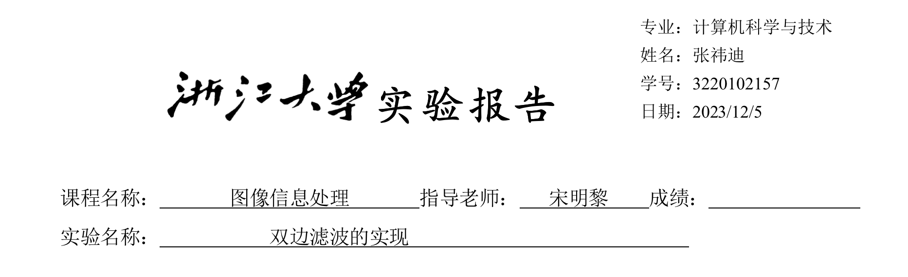
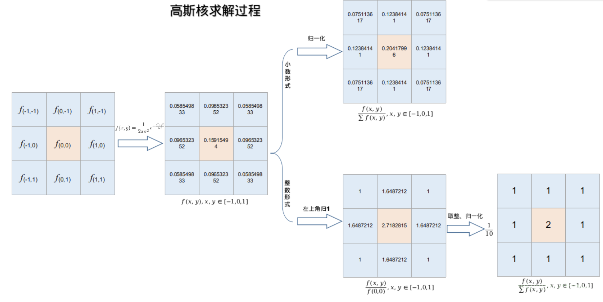
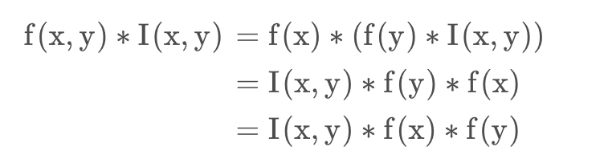
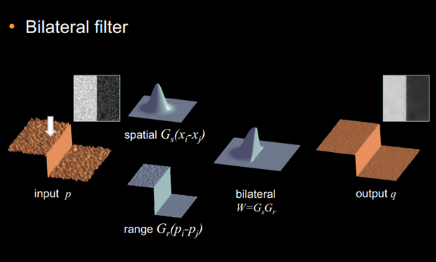
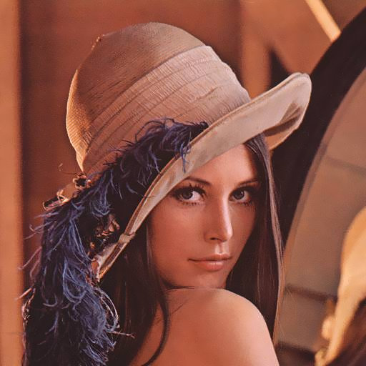
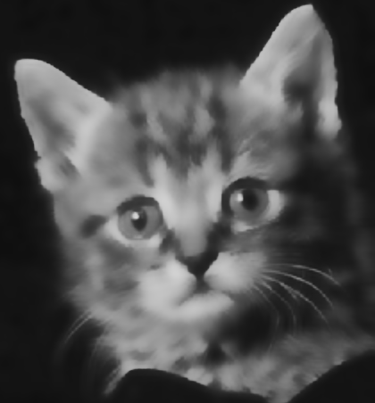

<font face="songti">

### 一、实验目的和要求

​	通过实现双边滤波算法，深入理解图像处理领域中的滤波技术。双边滤波是一种能够同时考虑空域和灰度值信息的滤波方法，可用于图像去噪、边缘保留等应用。

​	通过手动编写双边滤波算法，加深对图像处理理论和算法的理解，并培养编程实现图像处理算法的能力。


### 二、实验内容和原理

#### 1.高斯滤波

​	高斯滤波是一种常用的图像处理滤波器，其主要目的是对图像进行平滑处理。它的名称来源于所使用的滤波核（卷积核）是一个二维高斯函数。高斯滤波在去除图像中的噪声、模糊处理、边缘检测等方面有着广泛的应用。

​	高斯滤波的核心思想是对图像中的每个像素点进行加权平均，其中权值是由二维高斯函数确定的。这意味着离中心像素越远的像素对中心像素的影响越小，这种权值的分布符合高斯分布。通过调整高斯函数的标准差$σ$，可以控制权值的分布范围，从而调整滤波效果。

##### （1）数学表达

一般情况下，二维高斯函数表示为$f(x,y)=\frac{1}{\sqrt{2\pi}\sigma_x}e^{-\frac{(x-\mu_x)^2}{2\sigma_x^2}}\cdot \frac{1}{\sqrt{2\pi}\sigma_y}e^{-\frac{(y-\mu_y)^2}{2\sigma_y^2}}$

在图像滤波中,一般情况下$μ_x = μ_y = 0$因此二维高斯函数可表示为$f(x,y)=\frac{1}{2\pi\sigma^2}e^{-\frac{x^2+y^2}{2\sigma^2}}$


##### （2）滤波过程

* 高斯核的求解：

  将各个位置的坐标代入到高斯函数中,得到的值就是初步的高斯核

* 归一化：



##### (3) 分离实现高斯滤波

利用高斯函数进行卷积(高斯滤波)的过程具有可分离性。



#### 2.双边滤波

​	双边滤波（Bilateral filter）是一种非线性的滤波方法，是结合图像的空间邻近度和像素值相似度的一种折衷处理，同时考虑空域信息和灰度相似性，达到保边去噪的目的。具有简单、非迭代、局部的特点。

​	双边滤波器的好处是可以做边缘保存（edge preserving），一般用高斯滤波去降噪，会较明显地模糊边缘，对于高频细节的保护效果并不明显。双边滤波器顾名思义比高斯滤波多了一个高斯方差sigma－d，它是基于空间分布的高斯滤波函数，所以在边缘附近，离的较远的像素不会太多影响到边缘上的像素值，这样就保证了边缘附近像素值的保存。但是由于保存了过多的高频信息，对于彩色图像里的高频噪声，双边滤波器不能够干净的滤掉，只能够对于低频信息进行较好的滤波。

##### （1）数学推导



$h(x)=k_r^{−1}(x)∫^{+∞}_{−∞}∫^{+∞}_{−∞}f(ξ)c(ξ,x)s(f(ξ),f(x))dξ$

$c(ξ,x)=\frac{1}{2\pi\sigma_s^2}e^{-\frac{||ξ-x||^2}{2\sigma_s^2}}$

$c(ξ,x)=\frac{1}{2\pi\sigma_r^2}e^{-\frac{||f(ξ)-f(x)||^2}{2\sigma_r^2}}$

Which is $BF[I]p=\frac{1}{W_p}\sum_{q\in S}G_{\sigma_s}(||p-q||)G_{\sigma_r}(|O_p-I_q|)I_q$

* $\frac{1}{W_p}$为归一化因子

##### （2）参数设置

* $σ_s$ 越大，图像越平滑，趋于无穷大时，每个权重都一样，类似均值滤波.

  $σ_s$ 越小，中心点权重越大，周围点权重越小，对图像的滤波作用越小，趋于零时，输出等同于原图.

* $σ_r$ 越大，边缘越模糊，极限情况为$σ_r$ 无穷大，值域系数近似相等(忽略常数时，将近为 $e_0 = 1$)，与高斯模板(空间域模板)相乘后可认为等效于高斯滤波.

  $σ_r$ 越小，边缘越清晰，极限情况为 $σ_r$ 无限接近 0，值域系数除了中心位置，其他近似为 0(接近 $e_∞ = 0$)，与高斯模板(空间域模板)相乘进行滤波的结果等效于原图像.

### 三、实验步骤与分析

* 注明：本次使用了实验一的函数，在提交的$DIP.h$中可见。

#### 双边滤波

* Gauss函数计算$e^{-\frac{delta}{2*sigma^2}}$

```C
double Gauss(double delta,double sigma){
    double result = exp(-delta/(2*sigma*sigma));
    return result;
}
```

* 双边滤波的实现函数

```C
void bilateral(BMP bmp, int scale, double r) {
    // 创建一个新的BMP结构体，用于存储双边滤波后的结果
    BMP bilateral;
    memcpy(&bilateral, &bmp, sizeof(bilateral));
    // 计算窗口大小的一半和高斯标准差
    int window = scale / 2;
    double sx = 0.25 * ((bilateral.bmpih.height - 1) * 0.5 - 1) + 0.8;
    double sy = 0.25 * ((bilateral.bmpih.width - 1) * 0.5 - 1) + 0.8;
    double s = (sx + sy) / 2;
    // 获取位图的宽度、高度和每行字节数
    int width = bilateral.bmpih.width;
    int height = bilateral.bmpih.height;
    int row = (bilateral.bmpih.bitCount / 8 * width + 3) / 4 * 4;
    // 分配内存用于存储双边滤波后的位图数据
    bilateral.bitmap = (byte*)malloc(height * row * sizeof(byte));
    // 循环遍历图像的每个像素
    for (int i = 0; i < height; i++) {
        for (int j = 0; j < width; j++) {
            if (bilateral.bmpih.bitCount == 24) {
                // 对于24位图像，分别处理每个通道的双边滤波
                double Bsum = 0;
                double Gsum = 0;
                double Rsum = 0;
                int posi = i * row + j * 3;
                // 获取当前像素的B、G、R值
                double B = bmp.bitmap[posi];
                double G = bmp.bitmap[posi + 1];
                double R = bmp.bitmap[posi + 2];
                double WB = 0;
                double WG = 0;
                double WR = 0;
                // 遍历窗口内的像素
                for (int p = i - window; p <= i + window; p++) {
                    for (int q = j - window; q <= j + window; q++) {
                        int x, y;
                        x = p * row;
                        y = q * 3;
                        // 处理边界情况，确保索引不越界
                        if (p < 0) { x = 0; }
                        if (q < 0) { y = 0; }
                        if (p >= height) { x = (height - 1) * row; }
                        if (q >= width) { y = (width - 1) * 3; }
                        // 计算相邻像素的索引
                        int posi1 = x + y;
                        // 获取相邻像素的B、G、R值
                        double B1 = bmp.bitmap[posi1];
                        double G1 = bmp.bitmap[posi1 + 1];
                        double R1 = bmp.bitmap[posi1 + 2];
                        // 计算高斯权重
                        double Gauss_Dist = Gauss((p - i) * (p - i) + (q - j) * (q - j), s);
                        double Gauss_BiB = Gauss((B1 - B) * (B1 - B), r);
                        double Gauss_BiG = Gauss((G1 - G) * (G1 - G), r);
                        double Gauss_BiR = Gauss((R1 - R) * (R1 - R), r);
                        // 累加权重和
                        WB += Gauss_Dist * Gauss_BiB;
                        WG += Gauss_Dist * Gauss_BiG;
                        WR += Gauss_Dist * Gauss_BiR;
                        // 累加加权后的像素值
                        Bsum += Gauss_Dist * Gauss_BiB * B1;
                        Gsum += Gauss_Dist * Gauss_BiG * G1;
                        Rsum += Gauss_Dist * Gauss_BiR * R1;
                    }
                }
                // 更新双边滤波后的像素值
                bilateral.bitmap[posi] = Bsum / WB;
                bilateral.bitmap[posi + 1] = Gsum / WG;
                bilateral.bitmap[posi + 2] = Rsum / WR;
            } else {
                // 处理其他位深度的图像（暂未实现）
                // 初始化变量用于存储像素值和权重
                double sum = 0;
                int posi = i * row + j * 3;
                double Pix = bmp.bitmap[posi];
                double W = 0;
                // 遍历窗口内的像素
                for (int p = i - window; p <= i + window; p++) {
                    for (int q = j - window; q <= j + window; q++) {
                        int x, y;
                        x = p * row;
                        y = q * 3;
                        // 处理边界情况，确保索引不越界
                        if (p < 0) { x = 0; }
                        if (q < 0) { y = 0; }
                        if (p >= height) { x = (height - 1) * row; }
                        if (q >= width) { y = (width - 1) * 3; }
                        // 计算相邻像素的索引
                        int posi1 = x + y;
                        // 获取相邻像素的值
                        double Pix1 = bmp.bitmap[posi1];
                        // 计算高斯权重
                        double Gauss_Dist = Gauss((p - i) * (p - i) + (q - j) * (q - j), s);
                        double Gauss_Pix = Gauss((Pix1 - Pix) * (Pix1 - Pix), r);
                        // 累加权重和
                        W += Gauss_Dist * Gauss_Pix;
                        sum += Gauss_Dist * Gauss_Pix * Pix1;
                    }
                }
              
                // 更新双边滤波后的像素值
                bilateral.bitmap[posi] = sum / W;
            }
        }
    }
  
    // 将双边滤波后的结果写入文件
    FILE* fp = fopen("bilateral.bmp", "wb");
    OUTPUT(&bilateral, fp);
    // 释放内存
    free(bilateral.bitmap);
}
```

### 四、实验环境及运行方法

#### 实验环境：

MacBook Air M2 Sonoma 14.0

Apple clang version 15.0.0(arm64-apple-darwin23.0.0)

#### 运行方法：

打开lab06 文件夹，用vscode打开其中的code文件夹，其中包含源文件`lab6.c`，头文件`DIP.h`，可执行文件`lab6mac,lab6.exe`和24位BMP图像` Lena.bmp , cat.bmp`。

> （1）打开lab6.c,DIP.h,进入lab6.c，修改希望处理的图像名为`input.bmp`(如把Lena.bmp修改为input.bmp) , 点击Run Code可开始运行。输出"successfully loaded!"表示文件正常读入，「由于在DIP.h中改变了`#pragma pack alignment value`,会产生warning，但不影响程序运行」
>
> * 在 What's the value of sigma r?  后输入双边滤波的参数$\sigma_r$
> * 在 What's the size of the window? 后输入滤波窗口的边长
>
> （2）程序会输出双边滤波处理后的图片 
>
> （3）如果是Mac用户，在终端中cd进入code目录，输入 `chmod +x lab6mac`  为其添加执行权限，接着输入 `./lab6mac` 可得到如(2)中结果 
>
> （4）如果是windows用户，可运行lab6.exe,输出效果与(2)相同

###  五、实验结果展示

* 第一组测试：仍然使用Lena图 窗口边长为9

  <table>
      <tr>
        <td></td>
        <td></td>
        <td> </td>
      </tr>
       <tr>
        <td><center>INPUT </center></td>
        <td><center>sigma r = 0.5</center></td>
         <td><center>sigma r = 5</center></td>
      </tr>
    <tr>
        <td> </td>
        <td> </td>
        <td> </td>
    </tr>
    <tr>
        <td><center>sigma r = 10</center></td>
        <td><center>sigma r =20 </center></td>
         <td><center>sigma r = 40</center></td>
      </tr>
    </table>

  <div style="page-break-before: always;">

* 第二组测试，窗口边长 15

    <table>
      <tr>
        <td></td>
        <td></td>
        <td> </td>
      </tr>
       <tr>
        <td><center>INPUT </center></td>
        <td><center>sigma r = 8 </center></td>
        <td><center>sigma r = 20</center></td>
      </tr>
      <tr>
        <td></td>
        <td></td>
        <td> </td>
      </tr>
      <tr>
        <td><center>sigma r = 30 </center></td>
        <td><center>sigma r = 50 </center></td>
        <td><center>sigma r = 100</center></td>
      </tr>
    </table>

### 六、心得体会

​	通过本次实验，我深入学习了双边滤波算法，一种同时考虑空域和灰度信息的图像处理技术。在实现中，我掌握了高斯滤波的原理和分离实现方法，并深刻理解了双边滤波对图像去噪和边缘保留的效果。调整算法中的参数，如空域和灰度标准差，我能够直观地感受到对滤波结果的影响。实验结果表明，适当调整参数能够平衡图像的平滑度和边缘清晰度。通过多次调试，我提高了对图像处理理论和算法实现的认知，同时在编写和调试代码方面也获得了实际经验。这次实验培养了我对图像处理领域的兴趣，并为将来更深入的学习和应用打下了基础。

</font>