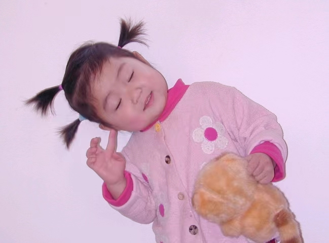

<font face="songti">

### 一、实验目的和要求

#### 1.图像二值化

- 使用适当的阈值技术（大津算法）将一张灰度图像转换为二值图像。
- 记录并分析选择的阈值方法对二值化结果的影响。

#### 2.二值图像腐蚀

- 对二值图像应用腐蚀操作

#### 3.二值图像膨胀

- 对二值图像应用膨胀操作

#### 4.二值图像开运算

- 实现二值图像的开运算，即腐蚀后膨胀。
- 观察开运算对去除小噪声和分离物体的效果。

#### 5.二值图像闭运算

- 实现二值图像的闭运算，即膨胀后腐蚀。
- 观察闭运算对填充空洞和连接物体的效果。

### 二、**实验内容和原理**

#### 1.图像二值化：

##### （1）二值图像

二值图像（Binary Image）中，像素值限定为 $0$ 或 $1$（编程中一般用 $0$ 和$255$ 来构造二值图像)。

* 优点：占用更少内存、更高效，有时可应用于灰度图像，同时更加便宜。
* 缺点：应用领域有限，不能用于三维数据，表达能力较弱，难以传达视觉细节，也不能控制对比度。

##### （2）大津算法（Otsu's algorithm）

​	在把灰度图转换为二值图像的时候，一个基本的想法是找到一个合适的阈值（Threshold），像素点值比阈值大的设为$255$，比阈值小的设为$0$。即为如下：
$$
\left\{  
             \begin{array}{**lr**}     
             I(x,y) = 0\ if\ I(x,y)\leq Threshold  \\
             I(x,y) = 255\ if\ I(x,y)\geq Threshold \\   
             \end{array}  
\right.  
$$
​	而大津算法就是一种自动确定该合适阈值的方法，旨在找到一个阈值，将图像分成两个类别（前景和背景），以使两个类别内的方差最小，同时两个类别之间的方差最大，步骤如下。

> a.统计像素点的最大值和最小值
>
> b.对于每个可能的阈值，计算分成两个类别后的背景和前景的内部协方差和外部协方差。
>
> c.选择最大外部和最小内部协方差对应的 threshold作为二值化阈值。
>
> d.应用选择的阈值将图像分割成前景和背景。

​	其中，最大外部方差和最小内部方差是等价的，我们选择找到最大外部方差，推导过程如下：

​	设图像尺寸为$M\ *\ N$，其二值化的最佳阈值为$T$，该阈值将图像分为背景和目标两个类别。其中属于背景的像素点数量为$N0$,属于目标的像素点数量为$N1$,背景像素点数占整幅图像的比例$\omega0$,其灰度均值$μ0$,目标像素点数占整幅图像的比例为$ω1$,其灰度均值为$μ1$ ，整幅图像的灰度均值为$\mu$。
$$
\omega_0=\frac{N0}{M*N}\\
\omega_1=\frac{N1}{M*N}\\
N0+N1=M*N\\
\omega0\ + \omega1\ = 1\\
\mu = \frac{\mu0*N0+\mu1*N1}{M*N}=\mu0\omega0\ + \mu1\omega1\\
类内方差(Within-class\ variance)公式:
\sigma_{Withen}^{2}=\omega_{0} \sigma_{0}^{2}+\omega_{1} \sigma_{1}^{2} \\
类间方差(Between-class\ variance)的公式:\sigma_{Between}^{2}=\sigma^{2}-\sigma_{Within}^{2}\\
$$

$$
\begin{align*}\label{2} 

& 有此可推导得到：\\

& \sigma_{Between}^{2}=\omega_{0}(\mu_{0}-\mu)^{2}+\omega_{1}(\mu_{1}-\mu)^{2}\\
& \ \ \ \ \ \ \ \ \ \ \ \ \ \ =\omega0(\mu0-\omega0\mu0-\omega1\mu1)^{2}+\omega1(\mu1-\omega0\mu0-\omega1\mu1)^{2}\\
& \ \ \ \ \ \ \ \ \ \ \ \ \ \ =\omega0(\omega1\mu0-\omega1\mu1)^{2}+\omega1(\omega0\mu1-\omega0\mu0)^{2}\\
& \ \ \ \ \ \ \ \ \ \ \ \ \ \ =(\omega0\omega1^{2}+\omega1\omega0^{2})(\mu1-\mu0)^{2}\\
& \ \ \ \ \ \ \ \ \ \ \ \ \ \ =\omega0\omega1(\mu0-\mu1)^{2}\\

\end{align*}
$$

* 即在计算最大外部和最小内部方差时，只需判断$\omega0\omega1(\mu0-\mu1)^{2}$取得最大值即可

  

#### 1.形态学操作：

​	数学形态学（也称图像代数）是一种用于分析图像形态和结构的工具。其基本思想是通过利用结构元素来度量和提取形状，从而实现对图像的分析和识别。图像形态学操作基于集合论，可以简化图像，去除不需要的结构，同时保留主要的形状特征。在这里有四种形态学操作符：膨胀、腐蚀、开运算和闭运算。

​	在下面的介绍中，我们的 A 指二值图像; B 指二值模板，称为结构元(structure element)。

##### （1）膨胀

​	形态学的膨胀操作是图像处理中的一种基本操作，通常用于增强图像中的特定目标或结构，使其更加显著和容易检测。膨胀操作的主要思想是利用一个称为结构元素的小窗口或模板，沿着图像的各个方向扫描，并根据结构元素与图像的重叠程度来改变图像的像素值。

​	膨胀操作的结果通常是增强了原始图像中的目标或特定结构。这是因为它可以将目标区域扩展，填充空洞，使边缘更加清晰。因此，膨胀操作可用于改善图像中的特定特征，使它们更容易检测和分析。
$$
A⊕B=\{ z|(B)z ∩A̸=∅ \}
$$

##### （2）腐蚀

​	形态学的腐蚀操作是图像处理中的一种基本操作，通常用于减小图像中的特定目标或结构，从而弱化或消除一些特征。腐蚀操作的主要思想是利用一个称为结构元素的小窗口或模板，沿着图像的各个方向扫描，并根据结构元素与图像的重叠程度来改变图像的像素值。

​	腐蚀操作的结果通常是减小了原始图像中的目标或特定结构。这是因为它可以去除小的特征、缩小目标区域或消除噪声。腐蚀操作可用于弱化图像中的特定特征，使其更容易检测和分析。
$$
A⊖B=\{(x,y)|(B)xy ⊆A\}
$$

##### （3）开操作

​	形态学的开操作是一种常见的图像处理操作，它结合了腐蚀（erosion）和膨胀（dilation）操作，通常用于去噪和分割图像中的目标。开操作的主要思想是首先对图像执行腐蚀操作，然后再对其执行膨胀操作，这个过程通常使用一个特定的结构元素进行。

​	开操作在图像处理中常用于去除噪声、分割目标、减小目标区域的不规则性以及减小目标之间的干扰。它也有助于改善二值化图像的质量，以便后续的分析和特征提取。
$$
A ◦ B = (A ⊖ B) ⊕ B
$$


##### （4）闭操作

​	形态学的开操作是一种常见的图像处理操作，它结合了腐蚀（erosion）和膨胀（dilation）操作，通常用于去噪和分割图像中的目标。开操作的主要思想是首先对图像执行腐蚀操作，然后再对其执行膨胀操作，这个过程通常使用一个特定的结构元素进行。

​	闭操作在图像处理中常用于去除小孔、连接断开的线条、填充不规则目标的内部空洞、增强图像中的连通区域。它也有助于改善二值化图像的质量，以便后续的分析和特征提取。
$$
A • B = (A ⊕ B) ⊖ B
$$

<div STYLE="page-break-after: always;"></div>

###  三、实验步骤与分析

#### 1.图像二值化

##### （1）首先使用lab1的方法读如一张彩色bmp图片，将其转为灰度图（直接使用了lab1中的函数作为库函数）

```C
#include<stdio.h>
#include"DIP.h" //使用lab1的函数
#include<stdlib.h>
// 使用#pragma pack(1)指令设置结构体的字节对齐方式为1字节
#pragma pack(1)
void OTSU(BMP* bmp,int row1,int col1,int row2,int col2);
void OTSU_improve(BMP* bmp,BMP* improve,int row1,int col1,int row2,int col2,int x,int y);
void Solve(BMP bmp);
void Solve_imporve(BMP bmp);
void dilation(BMP bmp,BMP* dila);
void erosion(BMP bmp,BMP* ero);
void open(BMP bmp,BMP *ero);
void close(BMP bmp,BMP *dila);
int main(){
    BMP bmp = ReadBMP();
    int width = bmp.bmpih.width; // 获取图像的宽度
    int height = bmp.bmpih.height; // 获取图像的高度  
    // 转换图像为灰度图像
    BMP gray = Gray_Transform(bmp, height, width);
    Solve(gray);//全局大津法    
    //腐蚀 & 开操作
    BMP ero;
    memcpy(&ero,&gray,sizeof(ero));
    open(gray,&ero);
    //膨胀 & 闭操作
    BMP dila;
    memcpy(&dila,&gray,sizeof(dila));
    close(gray,&dila);
    free(gray.bitmap);
    // 转换图像为灰度图像
    gray = Gray_Transform(bmp, height, width);
    Solve_imporve(gray);//滑动窗口大津法
    free(gray.bitmap);
    free(bmp.bitmap);
    return 0;
}
```

<div STYLE="page-break-after: always;"></div>

##### （2）使用大津算法确定阈值并做二值化处理

a.遍历每个像素点，寻找到最大和最小像素值。

 b.从Min(pixel)+1开始，依次计算相应阈值对应的外部方差，确定使得外部方差最大的阈值。

c.对指定区域以得到的阈值进行二值化操作。

```C
//函数执行otsu二值化算法，将图像在指定区域进行二值化处理。
void OTSU(BMP* bmp, int row1, int col1, int row2, int col2) {
    int width = bmp->bmpih.width;
    int height = bmp->bmpih.height;
    int MAX = 0, MIN = 255;
    // 计算每行（带填充）中的字节数。
    int row_byte = (width + 3) / 4 * 4;
    // 寻找指定区域内的最大和最小像素值。
    for (int i = row1; i < height && i < row2; i++) {
        for (int j = col1; j < width && j < col2; j++) {
            int k = row_byte * i + j;
            byte temp = bmp->bitmap[k];
            if (temp > MAX) {
                MAX = temp;
            }
            if (temp < MIN) {
                MIN = temp;
            }
        }
    }
    // 利用Otsu方法进行二值化。
    double n, nfront, nback, front, back;
    int Threshold;
    double variance = 0.0;
    for (int k = MIN + 1; k <= MAX; k++) {
        n = 0.0;
        nback = 0.0;
        nfront = 0.0;
        back=0.0;
        front=0.0;
        for (int i = row1; i < height && i < row2; i++) {
            for (int j = col1; j < width && j < col2; j++) {
                int q = row_byte * i + j;
                n += 1.0;
                byte temp = bmp->bitmap[q];
                if (temp >= k) {
                    nfront += 1.0;
                    front += temp;
                } else {
                    nback += 1.0;
                    back += temp;}
            }
        }
        front /= nfront;
        back /= nback;
        double w = (nfront * nback / n / n )* (back - front) * (back - front);
        if (w > variance) {
            variance = w;
            Threshold = k;
        }
    }
    // 应用计算的阈值对指定区域内的图像进行二值化。
    for (int i = row1; i < height && i < row2; i++) {
        for (int j = col1; j < width && j < col2; j++) {
            int k = i * row_byte + j;
            byte temp = bmp->bitmap[k];
            if (temp > Threshold) {
                bmp->bitmap[k] = 255;
            } else {
                bmp->bitmap[k] = 0;}
        }
    }
}
```

##### （3）分块处理

* 注明，OUTPUT函数包含在"DIP.h"中。

a.用户输入每行/列的分块，即输入整数q，图像将被分为$q^{2}$块儿利用大津算法进行二值化处理

b.在“实验结果展示”中，可以看到，适当的分块可以使得图片处理结果更好，尤其是对某些与其他区域明显像素值不同的地方，但是单纯的分块操作会使得处理得到的二值图片有很明显的分块感和割裂感。

```C
// Solve函数将输入的BMP图像划分为较小的块，对每个块应用OTSU_1函数，然后将处理后的图像保存到文件。
void Solve(BMP bmp) {
    int q;
    printf("How many divisions you'd like?\n");
    scanf("%d",&q);
    int block_size_h = bmp.bmpih.height / q;
    int block_size_w = bmp.bmpih.width / q;
    for (int i = 0; i < bmp.bmpih.height; i += block_size_h) {
        for (int j = 0; j < bmp.bmpih.width; j += block_size_w) {
            // 对图像中的每个块应用OTSU函数。
            OTSU(&bmp, i, j, i + block_size_h, j + block_size_w);
        }
    }
    // 将处理后的图像保存到名为 "OSTU.bmp" 的文件中。
    FILE* fp = fopen("OSTU.bmp", "wb");
    OUTPUT(&bmp,fp);}
```

##### （4）局部大津法

​	相比全局大津法，我们依次枚举灰度图中的每个像素$（i,j)$，以用户输入一个整数为边长，在$(i - length / 2, j - length / 2, i + length / 2, j + length / 2, i, j)$这个正方形中进行大津法，得到阈值后仅对$(i,j)$点进行二值化处理。

* 注意局部大津法需要新建立一个BMP结构保存修改后的像素值，否则如果将每一个修改的像素值保留在原结构体的bitmap中，将会影响后续像素点的二值化过程。
* 相比全局大津法，局部大津法耗时显著增加。

```C
// 函数用于通过改进的OTSU方法对图像进行二值化处理
void OTSU_improve(BMP* bmp, BMP* improve, int row1, int col1, int row2, int col2, int x, int y) {
    if (row1 < 0) { row1 = 0; } // 如果行索引小于0，则将其设置为0，确保不越界
    if (row2 < 0) { row2 = 0; } // 如果行索引小于0，则将其设置为0，确保不越界
    int width = bmp->bmpih.width; // 获取图像的宽度
    int height = bmp->bmpih.height; // 获取图像的高度
    int MAX = 0, MIN = 255; // 初始化最大和最小像素值
    // 计算每行（带填充）中的字节数。
    int row_byte = (width + 3) / 4 * 4;
    // 寻找指定区域内的最大和最小像素值。
    for (int i = row1; i < height && i < row2; i++) {
        for (int j = col1; j < width && j < col2; j++) {
            int k = row_byte * i + j;
            byte temp = bmp->bitmap[k];
            if (temp > MAX) {
                MAX = temp;
            }
            if (temp < MIN) {
                MIN = temp;
            }
        }
    }
    // 利用OTSU方法进行二值化。
    double n, nfront, nback, front, back;
    int Threshold;
    double variance = 0.0;
    for (int k = MIN + 1; k <= MAX; k++) {
        n = 0.0;
        nback = 0.0;
        nfront = 0.0;
        back = 0.0;
        front = 0.0;
        for (int i = row1; i < height && i < row2; i++) {
            for (int j = col1; j < width && j < col2; j++) {
                int q = row_byte * i + j;
                n += 1.0;
                byte temp = bmp->bitmap[q];
                if (temp >= k) {
                    nfront += 1.0;
                    front += temp;
                } else {
                    nback += 1.0;
                    back += temp;
                }
            }
        }
        front /= nfront;
        back /= nback;
        // 计算类间方差，并选取最大方差对应的阈值
        double w = (nfront * nback / n / n) * (back - front) * (back - front);
        if (w > variance) {
            variance = w;
            Threshold = k;
        }
    }
    int k = row_byte * x + y;
    byte temp = bmp->bitmap[k];
    // 根据计算得到的阈值将像素设为白色（255）或黑色（0）
    if (temp >= Threshold) {
        improve->bitmap[k] = 255; // 将像素值设置为白色
    } else {
        improve->bitmap[k] = 0; // 将像素值设置为黑色
    }
}
// 处理图像并应用OTSU改进
void Solve_imporve(BMP bmp) {
    int length;
    printf("What's the window length?\n");
    scanf("%d", &length); // 获取窗口大小
    BMP improve;
    memcpy(&improve, &bmp, sizeof(improve));
    improve.bitmap = (byte *)calloc(improve.bmpih.imageSize, sizeof(byte)); // 为改进后的图像分配内存
    int height = bmp.bmpih.height;
    int width = bmp.bmpih.width;
    for (int i = 0; i < height; i++) {
        for (int j = 0; j < width; j++) {
            OTSU_improve(&bmp, &improve, i - length / 2, j - length / 2, i + length / 2, j + length / 2, i, j);
            printf("%d %d\n", i, j); // 打印处理进度
        }
    }
    FILE* fp = fopen("OSTU_IMPROVE.bmp", "wb");
    OUTPUT(&improve, fp); // 将改进后的图像保存为文件
    free(improve.bitmap); // 释放内存
}
```

#### 2.形态学操作

##### （1）腐蚀

* 注：在腐蚀（和膨胀）操作中，均选用了$3*3$的结构元，并且建立新的结构体保存结果，需要注意对新建结构体处理满足条件需要被腐蚀（膨胀）的点外，也需要为其他色素点赋值。

```C
// 函数用于执行形态学腐蚀操作
void erosion(BMP bmp, BMP* ero) {
    ero->bitmap = (byte *)calloc(ero->bmpih.imageSize, sizeof(byte)); // 为腐蚀后的图像分配内存
    int width = bmp.bmpih.width; // 原始图像的宽度
    int height = bmp.bmpih.height; // 原始图像的高度
    // 计算每行（带填充）中的字节数。
    int row_byte = (width + 3) / 4 * 4;
    // 定义3x3的结构元素的位置偏移数组，用于表示腐蚀操作的区域
    int xaxis[9] = {-1, 0, 1, -1, 0, 1, -1, 0, 1};
    int yaxis[9] = {-1, -1, -1, 0, 0, 0, 1, 1, 1};
    for (int i = 0; i < height; i++) {
        for (int j = 0; j < width; j++) {
            int flag = 1;
            // 遍历3x3的结构元素区域
            for (int p = 0; p < 9; p++) {
                int x = i + xaxis[p];
                int y = j + yaxis[p];
                // 检查结构元素区域内的像素是否满足条件
                if (x >= 0 && y >= 0 && x < height && y < width && bmp.bitmap[x * row_byte + y] == 0) {
                    ero->bitmap[row_byte * i + j] = 0; // 如果不满足条件，将输出图像对应位置的像素值设为0
                    flag = 0;
                    break;
                }
            }
            if (flag) {
                ero->bitmap[row_byte * i + j] = 255; // 如果满足条件，将输出图像对应位置的像素值设为255
            }
        }
    }
}
```

##### （2）膨胀

```C
// 函数用于执行形态学膨胀操作
void dilation(BMP bmp, BMP* dila) {
    dila->bitmap = (byte *)calloc(dila->bmpih.imageSize, sizeof(byte)); // 为膨胀后的图像分配内存
    int width = bmp.bmpih.width; // 原始图像的宽度
    int height = bmp.bmpih.height; // 原始图像的高度
    // 计算每行（带填充）中的字节数。
    int row_byte = (width + 3) / 4 * 4;
    // 定义3x3的结构元素的位置偏移数组，用于表示膨胀操作的区域
    int xaxis[9] = {-1, 0, 1, -1, 0, 1, -1, 0, 1};
    int yaxis[9] = {-1, -1, -1, 0, 0, 0, 1, 1, 1};
    for (int i = 0; i < height; i++) {
        for (int j = 0; j < width; j++) {
            int flag = 0;
            // 遍历3x3的结构元素区域
            for (int p = 0; p < 9; p++) {
                int x = i + xaxis[p];
                int y = j + yaxis[p];
                // 检查结构元素区域内的像素是否满足条件
                if (x >= 0 && y >= 0 && x < height && y < width && bmp.bitmap[x * row_byte + y] == 255) {
                    dila->bitmap[row_byte * i + j] = 255; // 如果满足条件，将输出图像对应位置的像素值设为255
                    flag = 1;
                    break;
                }
            }
            if (!flag) {
                dila->bitmap[row_byte * i + j] = 0; // 如果不满足条件，将输出图像对应位置的像素值设为0
            }
        }
    }
}
```

##### （3）开操作

```C
void open(BMP bmp,BMP * ero)
{
    erosion(bmp, ero);
    FILE *fp = fopen("erosion.bmp","wb");
    OUTPUT(ero,fp);
    BMP open;
    memcpy(&open,ero,sizeof(open));
    dilation(*ero, &open);
    fp = fopen("open.bmp","wb");
    OUTPUT(&open,fp);
    free(ero->bitmap);
    free(open.bitmap);
}
```

<div STYLE="page-break-after: always;"></div>

##### （4）闭操作

```C
void close(BMP bmp,BMP *dila){
    dilation(bmp, dila);
    FILE *fp = fopen("dilation.bmp","wb");
    OUTPUT(dila,fp);
    BMP close;
    memcpy(&close,dila,sizeof(close));
    erosion(*dila, &close);
    fp = fopen("close.bmp","wb");
    OUTPUT(&close,fp);
    free(close.bitmap);
    free(dila->bitmap);
}
```

### 四、实验环境及运行方法

#### 实验环境：

MacBook Air M2 Sonoma 14.0

Apple clang version 15.0.0(arm64-apple-darwin23.0.0)

#### 运行方法：

打开lab02 文件夹，用vscode打开其中的code文件夹，其中包含源文件`lab2.c`，头文件`DIP.h`，可执行文件`lab2mac,lab2.exe`和24位BMP图像`doudou.bmp Lena.bmp Lion.bmp`。

> （1）打开lab2.c,DIP.h,进入lab2.c，修改希望处理的图像名为`input.bmp`(如把Lena.bmp修改为input.bmp),点击Run Code可开始运行。输出"successfully loaded!"表示文件正常读入，「由于在DIP.h中改变了`#pragma pack alignment value`,会产生warning，但不影响程序运行」
>
> （2）在问题$How\ many\ divisions\ you'd\ like?$后输入全局大津算法希望得到的$n*n$分块（即输入n的值），在问题$What's\ the\ window\ length?$后输入滑动窗口大津算法的窗口边长。程序会输出全局大津算法、滑动窗口大津算法得到的灰度图像，也会输出形态学操作后得到的图像。「注明：在进行滑动窗口大津算法操作的过程中，由于运行时间较长，增加输出显示目前正在处理的像素点坐标，以更好地标记处理进度。」
>
> （3）如果是Mac用户 在终端中cd进入code目录 输入 chmod +x lab2mac 为其添加执行权限，接着输入 ./lab2mac 可得到如（2）中结果
>
> （4）如果是windows用户，可运行lab2.exe,输出效果与（2）相同

<div STYLE="page-break-after: always;"></div>

### 五、实验结果展示

#### 1.图像二值化

##### (1）全局大津法

<table>
  <tr>
    <td></td>
    <td></td>
    <td></td>
  </tr>
   <tr>
    <td><center>INPUT </center></td>
    <td><center>OSTU分块1块 </center></td>
    <td><center>OSTU分块4块 </center></td>
  </tr>
  <tr>
    <td></td>
    <td></td>
    <td></td>
  </tr>
  <tr>
    <td><center>OSTU分块16块 </center></td>
    <td><center>OSTU分块64块 </center></td>
    <td><center>OSTU分块256块 </center></td>
  </tr>
</table>

​	如图，可明显看出随着分块的增加，二值化对局部的处理变好，但是整体的割裂感增强，能看出明显的分块痕迹。

##### (2）局部大津法

<table>
  <tr>
    <td></td>
    <td></td>
    <td></td>
    <td></td>
  </tr>
   <tr>
    <td><center>INPUT </center></td>
    <td><center>OSTU分块4块 </center></td>
    <td><center>OSTU局部长度40 </center></td>
    <td><center>OSTU局部长度60 </center></td>
  </tr>
  <tr>
    <td></td>
    <td></td>
    <td></td>
    <td></td>
  </tr>
  <tr>
    <td><center>INPUT </center></td>
    <td><center>OSTU分块4块 </center></td>
    <td><center>OSTU局部长度50 </center></td>
    <td><center>OSTU局部长度70 </center></td>
  </tr>
</table>

​	如图，可明显看出随着滑动窗口变大，二值化对高频部分的处理越来越好，但是对低频部分处理效果较差，同时，局部大津算法带来的时间成本也是不可忽略的。

#### 2.形态学操作

<table>
  <tr>
    <td></td>
    <td></td>
    <td></td>
  </tr>
   <tr>
    <td><center>INPUT </center></td>
    <td><center>OSTU </center></td>
    <td><center>EROSION </center></td>
  </tr>
  <tr>
    <td></td>
    <td></td>
    <td></td>
  </tr>
  <tr>
    <td><center>DILATION </center></td>
    <td><center>OPEN </center></td>
    <td><center>CLOSE </center></td>
  </tr>
</table>

### 六、心得体会

​	在本次实验中，我学习并掌握了图像二值化和形态学的基本操作。在过程中遇到了几个问题：一个是在做形态学操作和改进全局大津算法的时候，最开始我忘记建立新的结构体来保存原先的bmp图像，而是直接在原bmp图像上进行修改和保存，导致图像处理出错，发现问题后改正得以正常进行。第二是在进行形态学操作的过程中，最开始忘记对边界点讨论，同时在将处理好的图像存储到新的结构体的时候忘记对“没有进行形态学操作的像素点”做原来的赋值导致处理图像出错，经改正后能够正常完成对图像的处理。

​	在处理图像和改进的过程中，我感到非常有成就感，尤其是在成功用滑动窗口的大津算法处理得到比较好看的图片的时候，感到非常开心且学有所得，期待之后的作业内容。

##### </font>