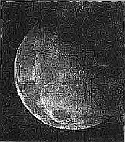

<font face="songti">

### 一、实验目的和要求

**1.均值滤波实现：**

编写程序，实现图像的均值滤波算法。

可自定义滤波器的大小，理解滤波器大小对平滑效果的影响。

**2.拉普拉斯变换实现：**

学习拉普拉斯算子的定义和离散形式。

编写程序，实现图像的拉普拉斯变换，即锐化处理。


### 二、实验内容和原理

#### 1.滤波

##### （1）卷积

$L(x,y,σ)=G(x,y,σ)∗I(x,y)$

连续形式：$(f∗g)(n)=\int_{-\infty }^{\infty}f(\tau )g(n-\tau)d\tau$

离散形式：$(f∗g)(n)=\frac{1}{M}\sum_{\tau=0 }^{M-1}f(\tau)g(n-\tau)$

##### (2)基本概念

​	滤波器是一个大小为 M×N 的窗口，其中窗口中的元素对应于原始图像中的相应像素进行操作，结果保存为新图像中的像素。滤波也被称作:遮罩 (mask)、内核 (kernel)、模板 (template) 等。滤波器中的元素是系数而不是像素值，它们表示应用于原始图像中像素的权重。在待处理图像中逐点移动掩模，在每一点(x,y)处，滤波器在该点的响应通过实现定义的关系来计算。对于线性空间滤波，其响应由滤波器系数与滤波掩模扫过区域的对应像素值的乘积之和给出。 

​	通常，掩模的长宽都为奇数。假设分别为$2a+1$和$2b+1$。当窗口中心处于像素$(x,y)$处时，新的像素值为：$g(x,y)=\sum_{s=-a}^a\sum_{t=-b}^b w(s,t)f(x+s,y+t)$.对图像f中所有像素都与掩模进行运算之后，最终产生一幅新图像g。(这实际上是一种卷积操作)

​	图像在传输过程中，由于传输信道、采样系统质量较差，或受各种干扰的影响，而造成图像毛糙，此时，就需对图像进行平滑处理。平滑可以抑制高频成分，但也使图像变得模糊。  平滑空间滤波器用于模糊处理和减少噪声。模糊处理经常用于预处理，例如，在提取大的目标之前去除图像中一些琐碎的细节，桥接直线或曲线的缝隙。

##### (3) 平滑线性空间滤波器

​	平滑线性空间滤波器的输出是包含在滤波掩模邻域内像素的简单平均值。因此，这些滤波器也称为均值滤波器。

* 简单平均，表示窗口中每一个像素对响应的贡献是一样的, 滤波窗口：$\frac{1}{9} \times \begin{bmatrix}1&1&1 \\ 1&1&1\\ 1&1&1\end{bmatrix}$

* 加权平均，表示窗口中的像素对相应的贡献有大小之分，滤波窗口：$\frac{1}{16} \times \begin{bmatrix}1&2&1 \\ 2&4&2\\ 1&2&1\end{bmatrix}$

* General Equation

<center></center>

其中，滤波器大小为$(2a+1) ×(2b+1)$，$w$为滤波器，$f$为输入图像，$g$为输出图像。

​	滤波掩模的大小与图像的平滑效果有直接的关系。当掩模比较小时，可以观察到在整幅图像中有轻微的模糊，当掩模大小增加，模糊程度也随之增加。

##### （4）统计滤波器

​	用像素邻域内灰度的中值代替该像素的值。提供了优秀的去噪能力，比小尺寸的线性平滑滤波器的模糊程度明显要低。对处理脉冲噪声（也称为椒盐噪声）非常有效，因为这种噪声是以黑白点叠加在图像上的。 

​	为了对一幅图像上的某个点作中值滤波处理。必须先将掩模内欲求的像素及其邻域的像素值排序，确定出中值，并将中值赋予该像素点。

#### 2.拉普拉斯变换图像增强

​	拉普拉斯锐化是一种图像处理技术，旨在突出图像中的边缘和细节，使图像看起来更加锐利。这种技术使用拉普拉斯算子（Laplacian operator）或拉普拉斯滤波器对图像进行卷积操作，以增强图像中的高频信息。

##### （1）拉普拉斯算子 

一阶微分算子:$\frac{\partial{f}}{\partial{x}}$$= f(x + 1) − f(x) $

二阶微分算子:$\frac{\partial^2{f}}{\partial{x}^2}$$= f(x + 1) +f(x-1)− 2f(x) $

* 对于函数f(x,y)，首先定义一个二维列向量：

<center></center>

<div STYLE="page-break-after: always;"></div>

* 对整幅图像计算梯度时，运算量会很大，因此，在实际操作中，常用绝对值代替平方与平方根运算近似求梯度的模值

<center>
  
</center>

<center><center>

* 离散形式

$\ \ \ \ \ \ \ \triangledown^2f=f(x+1,y)+f(x-1,y)+f(x,y+1),F(x,y-1)-4f(x,y)$

##### (2)拉普拉斯变换图像锐化

* 掩模

<center></center>

> 如果考虑对角线元素

<center></center>

<center></center>

​	由于拉普拉斯算子是一种导数算子，它的使用会突出显示图像中的强度不连续性，而不强调具有缓慢 变化的强度级别的区域。这将倾向于生成具有灰色边缘线和其他不连续性的图像，所有这些图像都叠加在黑暗、无特征的背景上。只需将拉普拉斯图像添加到原始图像中，即可“恢复”背景特征，同时仍保持拉 普拉斯图像的锐化效果。也就是说，如果使用的定义具有负中心系数，则我们减去而不是添加拉普拉斯图像以获得锐化结果。 因此，我们使用拉普拉斯函数进行图像锐化的基本方法是:

$g(x,y)=\left\{\begin{array}{ll}f(x,y)-\triangledown^2f(x,y)& if\ the\ center\ of\ the\ mask\ is\ negative \\ f(x,y)+\triangledown^2f(x,y)& if\ the\ center\ of\ the\ mask\ is\ positive  \end{array} \right.$

<div STYLE="page-break-after: always;"></div>

###  三、实验步骤与分析

* 注明：本次使用了实验一的函数，在提交的DIP.h中可见。

#### 1.均值滤波

* 由于需要对边界上的点进行处理（由于边界上的点无法构成完整的九宫格）: 以该点周围所有存在的属于以该点为中心的九宫格的点计算，cnt为所有存在点的个数
  * eg.像素点[0,0]:$mean = \frac{image[0,0]+image[0,1]+image[1,0]+image[1,1]}{4}$

```C
// 均值滤波函数
void filtermean(BMP bmp, int size) {
    BMP mean;
    // 复制 bmp 到 mean
    memcpy(&mean, &bmp, sizeof(mean));
    int width = mean.bmpih.width;
    int height = mean.bmpih.height;
    int rowbyte = (mean.bmpih.bitCount / 8 * width + 3) / 4 * 4;
    mean.bitmap = (byte *)calloc(mean.bmpih.imageSize, sizeof(byte));
    int s = size / 2;
    if (mean.bmpih.bitCount == 24) {
        // 如果每像素位数为24（真彩色图像）
        for (int i = 0; i < height; i++) {
            for (int j = 0; j < width; j++) {
                double R = 0;
                double G = 0;
                double B = 0;
                int cnt = 0;
                for (int q = i - s; q <= i + s; q++) {
                    for (int p = j - s; p <= j + s; p++) {
                        if (q >= 0 && p >= 0 && q < height && p < width) {
                            int posi1 = q * rowbyte + p * 3;
                            B += bmp.bitmap[posi1];
                            G += bmp.bitmap[posi1 + 1];
                            R += bmp.bitmap[posi1 + 2];
                            cnt++;
                        }
                    }
                }
                B /= cnt;
                G /= cnt;
                R /= cnt;
                int posi = i * rowbyte + j * 3;
                mean.bitmap[posi] = B;
                mean.bitmap[posi + 1] = G;
                mean.bitmap[posi + 2] = R;
            }
        }
    } else {
        // 如果每像素位数为8
        for (int i = 0; i < height; i++) {
            for (int j = 0; j < width; j++) {
                double P = 0;
                int cnt = 0;
                for (int q = i - s; q <= i + s; q++) {
                    for (int p = j - s; p <= j + s; p++) {
                        if (q >= 0 && p >= 0 && q < height && p < width) {
                            int posi1 = q * rowbyte + p;
                            P += bmp.bitmap[posi1];
                            cnt++;
                        }
                    }
                }
                P /= cnt;
                int posi = i * rowbyte + j;
                mean.bitmap[posi] = P;
            }
        }
    }
    // 保存均值滤波后的图像
    FILE *fp = fopen("mean.bmp", "wb");
    OUTPUT(&mean, fp);
    free(mean.bitmap);
}
```

#### 2.拉普拉斯变换图像增强

(1)遮蔽窗口为$\begin{bmatrix}1&1&1\\1&-8&1\\1&1&1\end{bmatrix}$

```C
// Laplacian 锐化函数1
void Lap1(BMP bmp) {
    BMP lap1;
    BMP g;
    // 复制 bmp 到 lap1 和 g
    memcpy(&g, &bmp, sizeof(lap1));
    memcpy(&lap1, &bmp, sizeof(lap1));
    int width = lap1.bmpih.width;
    int height = lap1.bmpih.height;
    int rowbyte = (lap1.bmpih.bitCount / 8 * width + 3) / 4 * 4;
    lap1.bitmap = (byte *)calloc(lap1.bmpih.imageSize, sizeof(byte));
    g.bitmap = (byte *)calloc(g.bmpih.imageSize, sizeof(byte));
    if (lap1.bmpih.bitCount == 24) {
        // 如果每像素位数为24（真彩色图像）
        for (int i = 0; i < height; i++) {
            for (int j = 0; j < width; j++) {
                double R = 0;
                double G = 0;
                double B = 0;
                int cnt = 0;
                for (int q = i - 1; q <= i + 1; q++) {
                    for (int p = j - 1; p <= j + 1; p++) {
                        if (q >= 0 && p >= 0 && q < height && p < width) {
                            int posi1 = q * rowbyte + p * 3;
                            B += bmp.bitmap[posi1];
                            G += bmp.bitmap[posi1 + 1];
                            R += bmp.bitmap[posi1 + 2];
                            cnt++;
                        }
                    }
                }
                int posi = i * rowbyte + j * 3;
                double B1 = bmp.bitmap[posi];
                double G1 = bmp.bitmap[posi + 1];
                double R1 = bmp.bitmap[posi + 2];
                B -= B1 * cnt;
                G -= G1 * cnt;
                R -= R1 * cnt;
                lap1.bitmap[posi] = B;
                lap1.bitmap[posi + 1] = G;
                lap1.bitmap[posi + 2] = R;
                g.bitmap[posi] = Adjust2(B1 - B);
                g.bitmap[posi + 1] = Adjust2(G1 - G);
                g.bitmap[posi + 2] = Adjust2(R1 - R);
            }
        }
    } else {
        // 如果每像素位数为8
        for (int i = 0; i < height; i++) {
            for (int j = 0; j < width; j++) {
                double P = 0;
                int cnt = 0;
                for (int q = i - 1; q <= i + 1; q++) {
                    for (int p = j - 1; q <= j + 1; p++) {
                        if (q >= 0 && p >= 0 && q < height && p < width) {
                            int posi1 = q * rowbyte + p;
                            P += bmp.bitmap[posi1];
                            cnt++;
                        }
                    }
                }
                int posi = i * rowbyte + j;
                double P1 = bmp.bitmap[posi];
                P -= P1 * cnt;
                lap1.bitmap[posi] = P;
                g.bitmap[posi] = Adjust2(P1 - P);
            }
        }
    }
    // 保存 Laplacian 锐化后的图像
    FILE *fp = fopen("lap1.bmp", "wb");
    OUTPUT(&lap1, fp);
    free(lap1.bitmap);
    // 保存 Sharpened 后的图像
    fp = fopen("sharpen1.bmp", "wb");
    OUTPUT(&g, fp);
    free(g.bitmap);
}
```

(2)遮蔽窗口为$\begin{bmatrix}0&1&0\\1&-4&1\\0&1&0\end{bmatrix}$

```C
// Laplacian 锐化函数2
void Lap2(BMP bmp) {
    BMP lap2;
    BMP g;
    // 复制 bmp 到 lap2 和 g
    memcpy(&g, &bmp, sizeof(lap2));
    memcpy(&lap2, &bmp, sizeof(lap2));
    int width = lap2.bmpih.width;
    int height = lap2.bmpih.height;
    int rowbyte = (lap2.bmpih.bitCount / 8 * width + 3) / 4 * 4;
    lap2.bitmap = (byte *)calloc(lap2.bmpih.imageSize, sizeof(byte));
    g.bitmap = (byte *)calloc(g.bmpih.imageSize, sizeof(byte));
    int dx[5] = {-1, 0, 0, 0, 1};
    int dy[5] = {0, 1, 0, 1, 0};
    if (lap2.bmpih.bitCount == 24) {
        // 如果每像素位数为24（真彩色图像）
        for (int i = 0; i < height; i++) {
            for (int j = 0; j < width; j++) {
                double R = 0;
                double G = 0;
                double B = 0;
                int cnt = 0;
                for (int q = 0; q < 4; q++) {
                    if (i + dx[q] >= 0 && j + dy[q] >= 0 && i + dx[q] < height && j + dy[q] < width) {
                        int posi1 = (i + dx[q]) * rowbyte + (j + dy[q]) * 3;
                        B += bmp.bitmap[posi1];
                        G += bmp.bitmap[posi1 + 1];
                        R += bmp.bitmap[posi1 + 2];
                        cnt++;
                    }
                }
                int posi = i * rowbyte + j * 3;
                double B1 = bmp.bitmap[posi];
                double G1 = bmp.bitmap[posi + 1];
                double R1 = bmp.bitmap[posi + 2];
                B = B1 * (cnt)-B;
                G = G1 * cnt - G;
                R = R1 * cnt - R;
                lap2.bitmap[posi] = B;
                lap2.bitmap[posi + 1] = G;
                lap2.bitmap[posi + 2] = R;
                g.bitmap[posi] = Adjust2(B1 + B);
                g.bitmap[posi + 1] = Adjust2(G1 + G);
                g.bitmap[posi + 2] = Adjust2(R1 + R);
            }
        }
    } else {
        // 如果每像素位数为8
        for (int i = 0; i < height; i++) {
            for (int j = 0; j < width; j++) {
                double P = 0;
                int cnt = 0;
                for (int q = 0; q < 4; q++) {
                    if (i + dx[q] >= 0 && j + dy[q] >= 0 && i + dx[q] < height && j + dy[q] < width) {
                        int posi1 = (i + dx[q]) * rowbyte + (j + dy[q]);
                        P += bmp.bitmap[posi1];
                        cnt++;
                    }
                }
                int posi = i * rowbyte + j;
                double P1 = bmp.bitmap[posi];
                P = P1 * cnt - P;
                lap2.bitmap[posi] = P;
                g.bitmap[posi] = Adjust2(P1 + P);
            }
        }
    }
    // 保存 Laplacian 锐化后的图像
    FILE *fp = fopen("lap2.bmp", "wb");
    OUTPUT(&lap2, fp);
    free(lap2.bitmap);
    // 保存 Sharpened 后的图像
    fp = fopen("sharpen2.bmp", "wb");
    OUTPUT(&g, fp);
    free(g.bitmap);
}
```

<div STYLE="page-break-after: always;"></div>

### 四、实验环境及运行方法

#### 实验环境：

MacBook Air M2 Sonoma 14.0

Apple clang version 15.0.0(arm64-apple-darwin23.0.0)

#### 运行方法：

打开lab05 文件夹，用vscode打开其中的code文件夹，其中包含源文件`lab5.c`，头文件`DIP.h`，可执行文件`lab5mac,lab5.exe`和24位BMP图像` Lena.bmp moon1.bmp moon2.bmp	 `。

> (1）打开lab5.c,DIP.h,进入lab5.c，修改希望处理的图像名为`input.bmp`(如把Lena.bmp修改为input.bmp) , 点击Run Code可开始运行。输出"successfully loaded!"表示文件正常读入，「由于在DIP.h中改变了`#pragma pack alignment value`,会产生warning，但不影响程序运行」
>
> * 在源码中，注释掉了转为灰度图后处理的情况，如果要观察结果，可uncomment后运行即可。
>
> * 在“请输入滤波窗口的大小:” 后输入滤波窗口的边长
>
> * 程序会输出五张处理后的图片，分别为：
>
>   * mean.bmp : 对图像进行均值滤波产生的图像
>
>   * lap1.bmp ：以第一种滤波窗口（见上）对图像进行滤波得到的图像
>
>   * sharpen1.bmp ：以第一种滤波窗口（见上）对图像进行拉普拉斯锐化得到的图像
>
>   * lap2.bmp ： 以第二种滤波窗口（见上）对图像进行滤波得到的图像
>
>   * sharpen2.bmp ： 以第二种滤波窗口（见上）对图像进行拉普拉斯锐化得到的图像
>
> (2）如果是Mac用户 在终端中cd进入code目录 输入 chmod +x lab5mac 为其添加执行权限，接着输入 ./lab5mac 可得到如（1）中结果
>
> (3)如果是windows用户，可运行lab5.exe,输出效果与（2）相同

实验结果与展示见下一页

<div STYLE="page-break-after: always;"></div>

###  五、实验结果展示

#### (1)均值滤波

<table>
  <tr>
    <td></td>
    <td></td>
    <td> </td>
  </tr>
   <tr>
    <td><center>INPUT </center></td>
    <td><center>滤波窗口边长：5 </center></td>
    <td><center>滤波窗口边长：7 </center></td>
  </tr>
  <tr>
    <td> </td>
    <td> </td>
    <td> </td>
  </tr>
  <tr>
    <td><center>滤波窗口边长：9 </center></td>
    <td><center>滤波窗口边长：11 </center></td>
    <td><center>转为灰度图<br>滤波窗口边长：15 </center></td>
  </tr>
</table>

#### (2)拉普拉斯变换图像增强

* 第一组：Lena.bmp

<table>
  <tr>
    <td></td>
    <td></td>
    <td> </td>
  </tr>
   <tr>
    <td><center>INPUT </center></td>
    <td><center>第一种滤波窗口滤波后图像 </center></td>
    <td><center>利用第一种滤波窗口锐化得到图像</center></td>
  </tr>
</table>


<table>
   <tr>
    <td> </td>
    <td> </td>
  </tr>
  <tr>
    <td><center>第二种滤波窗口滤波后图像 </center></td>
    <td><center>利用第二种滤波窗口锐化得到图像</center></td>
  </tr>
</table>

* 第二组：moon.bmp

  <table>
    <tr>
      <td></td>
      <td></td>
      <td> </td>
    </tr>
     <tr>
      <td><center>INPUT </center></td>
      <td><center>第一种滤波窗口滤波后图像 </center></td>
      <td><center>利用第一种滤波窗口锐化得到图像</center></td>
    </tr>
  </table>

  <table>
     <tr>
      <td> </td>
      <td> </td>
    </tr>
    <tr>
      <td><center>第二种滤波窗口滤波后图像 </center></td>
      <td><center>利用第二种滤波窗口锐化得到图像</center></td>
    </tr>
  </table>

* 第三组：moon2.bmp

<table>
  <tr>
    <td></td>
    <td></td>
    <td> </td>
  </tr>
   <tr>
    <td><center>INPUT </center></td>
    <td><center>第一种滤波窗口滤波后图像 </center></td>
    <td><center>利用第一种滤波窗口锐化得到图像</center></td>
  </tr>
</table>

<table>
   <tr>
    <td> </td>
    <td> </td>
  </tr>
  <tr>
    <td><center>第二种滤波窗口滤波后图像 </center></td>
    <td><center>利用第二种滤波窗口锐化得到图像</center></td>
  </tr>
</table>
### 六、心得体会

​	本次实验更深入了解了滤波的过程，并动手实现了均值滤波和拉普拉斯图像增强，成功完成并看到效果的过程还是非常有趣的；同时，这次作业内容进行得比较顺利，基本上没有出现太多的偏差和错误，期待下一次实验。


</font>