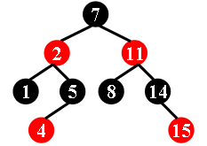
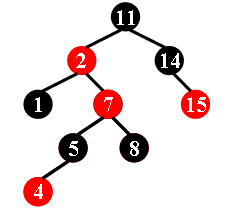
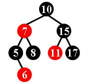
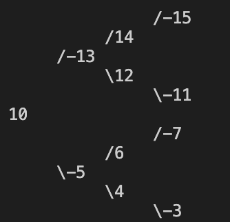
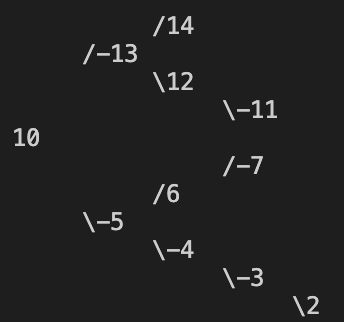
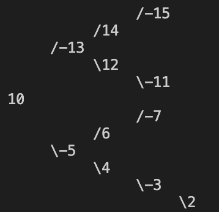
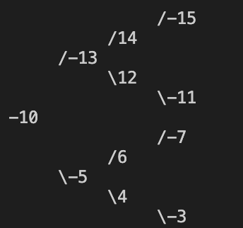
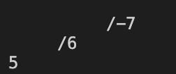

<br><br><br><br><br><br><br><br><br><br><br><br><br><br><br><br><br><br><br><center><font size = 7>Project 2: Is It A Red-Black Tree</font></center>


<br>

<center><font size = 6>Author : 张祎迪</center></font>

<center><font size = 4.5>Date:2023-10-24</center></font>

<div STYLE="page-break-after: always;"></div>


## $Chapter 1: Introduction$

<font face=Times New Roman>

Designed to automate the verification of red-black tree properties，this project provides an efficient tool for assessing the structural integrity of red-black tree and ensuring its suitability for specific applications.

#### 1.Why red-black trees?

When it comes to searching and sorting data, one of the most fundamental data structures is the binary search tree. However, the performance of such tree is highly dependent on its shape, and in the worst case, it can degenerate into a linear structure with a time complexity of O(n). 

This is where Red Black Trees come in, they are a type of balanced binary search tree that use a specific set of rules to ensure that the tree is always balanced. This balance guarantees that the time complexity for operations such as insertion, deletion, and searching is always O(log n), regardless of the initial shape of the tree.It uses a simple but powerful mechanism to maintain balance, by coloring each node in the tree either red or black. 

#### 2.Basic properties

###### (1) Root property:The root is black.

###### (2) If a node is red, then both its children are black. Hence possible parent of red node is a black node.

###### (3)Every leaf (NULL) is black.

###### (4)Every node is either red or black.

###### (5)Every path from a node (including root) to any of its descendants NULL nodes has the same number of black nodes.

**The following will provide specific code for assessing red-black trees and a comprehensive analysis.**

## $Chapter 2:  Algorithm Specification$

* Full code is presented at the end of this PDF document and also submitted in the code directory.

we will first construct a binary search tree using the input data , then assess whether the constructed tree is a red-black tree.

The "main function" is as follows,which can give a brief glimpse of the algorithm.

* The "main function" (code in C) :

  ```C
  struct node{
      int data;
      TreeNode left ;
      TreeNode right;
  };
  int main() {
      int n;
      scanf("%d", &n);
      while (n--) {
          int cnt;
          scanf("%d", &cnt);
          TreeNode root = NULL;
          // Create the binary tree with 'cnt' nodes
          while (cnt--) {
              int num;
              scanf("%d", &num);
              // Construct the binary tree using 'construct' function
              root = construct(root, num);
          }
          // Check if the binary tree is a valid red-black tree
          if (root->data < 0) {
              // If the root data is negative, it's not a valid red-black tree
              printf("No\n");} 
        	else {
              int flag = 1;
              // Call 'paths' function to check properties of red-black tree
              paths(root, &flag);
              if (rednode(root) == 0) {
                  // If there's a red-red violation, it's not a valid red-black tree
                  printf("No\n");} 
              else if (!(flag)) {
      // If not all paths have the same number of black nodes, it's not a valid red-black tree
                  printf("No\n");}
              else {
                  // If all checks pass, it's a valid red-black tree
                  printf("Yes\n");
              }
          }
      }
      return 0;
  }
  ```

The main function serves as the  entry point of the program, responsible for handling multiple test cases.

> * *Struct*:
>  - `struct node` with fields for left child, right child, and data.
>   - Represents an individual node within the binary tree. Each node contains data, as well as left and right pointers to its children.
> * *Variables*:
>   - `n`: An integer representing the number of test cases.
>   - `cnt`: An integer representing the number of nodes in the binary tree for each test case.
>   - `root`: A pointer to a `TreeNode` representing the root of the constructed binary tree.
> 

<div STYLE="page-break-after: always;"></div>

The main function calls "construct" function to construct a binary search tree of the given data, assesses whether the root of the tree is black, calls "paths"function to see  whether every path from a node (including root) to any of its descendants NULL nodes has the same number of black nodes,then calls "rednode"function to judge whether every red node's  children are black. 

Thus all the properties are judged, and the main function OUPTUTS "Yes" or "No" to give its judgement whether the input binary search tree is a red-black one.


### 1.Contruct a binary search tree

#### （1）Input from the "main function"

The following codes  from the "main function"(as can be seen above) read the user's input and call the function"construct" to fully construct a binary search tree.

* code in C :

```C
while (cnt--) {
  					int num;
            scanf("%d", &num);
            // Construct the binary tree using 'construct' function
            root = construct(root, num);}
```

#### (2) Insert every node

* pseudo-code

```pseudocode
// This function constructs a binary tree node and inserts a new node with the given data.
// It returns the modified binary tree's root.
Function construct(root, num):
    //If the root is NULL, create a new node and assign it the given data
    if root is NULL:
        Create a new node as root
        Set root's data to num
        Set root's left child to NULL
        Set root's right child to NULL
    else:
				// If the root is not NULL, compare the absolute value of 'num' with the absolute
        // value of the data in the current root node to determine the insertion location.
        if Absolute Value of num < Absolute Value of root's data:
            //If 'num' is smaller, recursively insert it into the left subtree
            Set root's left child to the result of Construct(root's left child, num)
        else:
            //If 'num' is larger or equal, recursively insert it into the right subtree
            Set root's right child to the result of Construct(root's right child, num)
         end if
     end if
    //Return the modified binary tree's root
    Return root 
```

* code in C

```C
// This function constructs a binary tree node and inserts a new node with the given data.
// It returns the modified binary tree's root.
TreeNode construct(TreeNode root, int num) {
    // If the root is NULL, create a new node and assign it the given data.
    if (!root) {
        root = (TreeNode)malloc(sizeof(struct node));
        root->data = num;
        root->left = NULL;
        root->right = NULL;
}
    else {
        // If the root is not NULL, compare the absolute value of 'num' with the absolute
        // value of the data in the current root node to determine the insertion location.
        if (abs(num) < abs(root->data)) {
            // If 'num' is smaller, recursively insert it into the left subtree.
            root->left = construct(root->left, num);}
        else {
            // If 'num' is larger or equal, recursively insert it into the right subtree.
            root->right = construct(root->right, num);}
    }
    // Return the modified binary tree's root.
    return root;
}
```

This function constructs a binary tree and inserts nodes based on the given data.

> - *Parameters*:
>   - `root`: A pointer to the root of the current binary tree.
>   - `num`: An integer representing the data for the new node to be inserted.
> - *Logic*:
>   - If the `root` is `NULL`, the function creates a new node and assigns it the given data. This new node becomes the root of the binary tree.
>   - If the `root` is not `NULL`, the function compares the absolute value of `num` with the absolute value of the data in the current root node to determine the insertion location.
>   - If the absolute value of `num` is less than the absolute value of the data in the current root node, the function recursively inserts the new node into the left subtree.
>   - If the absolute value of `num` is greater than or equal to the absolute value of the data in the current root node, the function recursively inserts the new node into the right subtree.
>   - The function returns the modified binary tree's root after inserting the new node.
>

<div STYLE="page-break-after: always;"></div>

> * *Main Data Structures*:
>     * The main data structure used in this code is a binary tree. The binary tree consists of individual nodes, where each node is an instance of the `TreeNode` structure. The binary tree is constructed and modified by calling the `construct` function, which inserts nodes based on the data value.
>   
>     * *Binary Search Tree* is a node-based binary tree data structure which has the following properties:
>   * The left subtree of a node contains only nodes with keys lesser than the node’s key.
>       
>   * The right subtree of a node contains only nodes with keys greater than the node’s key.
>       
>   * The left and right subtree each must also be a binary search tree.


### 2.Assess the properties of red-black trees

#### (1) Judge whether the root is black

As in the "main function" above, the following code judges whether the root is black.If it is not black,then the input tree is not red-black,thus the main function OUPUTS "No" and returns.

```C
if (root->data < 0) {
    // If the root data is negative, it's not a valid red-black tree
    printf("No\n");} 
```

#### (2) Judge whether every path from a node (including root) to any of its descendants NULL nodes has the same number of black nodes

* pseudo-code

  ```pseudocode
  Function paths(root, flag):
      //Base case: If the current node is NULL (a leaf), return 1 (black node count).
      If root is NULL:
          Return 1
      end if
      // Recursively calculate the count of black nodes in the left subtree.
      left = Paths(root.left, flag)
      //Recursively calculate the count of black nodes in the right subtree.
      right = Paths(root.right, flag)
      // Compare the black node counts in the left and right subtrees.
      // If they are not equal, update the flag to 0, indicating an inconsistency.
      If left ≠ right:
          Set flag to 0
      end if
      // Determine the total count of black nodes in the current subtree.
      // Increment by 1 if the current node is a black node (data > 0).
      // If the current node is a red node (data < 0), the count is not incremented.
      if root.data > 0:
          Return left + 1
      else:
          Return left
      end if
  ```

* code in C

  ```C
  // This function checks if all paths from the root to leaves in a binary tree
  // have the same number of black nodes, updating a flag to indicate the result.
  int paths(TreeNode root, int* flag) {
      // Base case: If the current node is NULL (a leaf), return 1 (black node count).
      if (root == NULL) return 1;
      // Recursively calculate the count of black nodes in the left subtree.
      int left = paths(root->left, flag);
      // Recursively calculate the count of black nodes in the right subtree.
      int right = paths(root->right, flag);
      // Compare the black node counts in the left and right subtrees.
      // If they are not equal, update the flag to 0, indicating an inconsistency.
      if (left != right) {
          *flag = 0;
      }
      // Determine the total count of black nodes in the current subtree.
      // Increment by 1 if the current node is a black node (data > 0).
      // If the current node is a red node (data < 0), the count is not incremented.
      return (root->data > 0) ? left + 1 : left;
  }
  ```

The provided code defines a function for checking if all paths from the root to leaves in a binary tree have the same number of black nodes, updating a flag to indicate the result. Let's analyze the data structure used in this code:

> * *Function `paths(TreeNode root, int * flag)`*:
>   * Role: The function traverses the binary tree and checks if all paths from the root to the leaves contain the same number of black nodes, while updating a `flag` to indicate the result.
>   * Parameters:
>     * `root`: A pointer to the root node of the binary tree.
>     * `flag`: A pointer to an integer flag that is used to track the validity of the binary tree paths.[Originally set to $ONE$ in the main function ]
>
> * *Logic*:
>
>    - The function follows a recursive depth-first traversal of the binary tree.
>
>
>    - It starts with a base case: If the current node (`root`) is `NULL`, it means a leaf node has been reached, and the function returns 1 to indicate the presence of one black node (since all leaves in a red-black tree are black).
>
>
>    - The function then recursively calculates the count of black nodes in the left subtree by calling itself with the left child (`root->left`).
>
>
>    - It similarly calculates the count of black nodes in the right subtree by calling itself with the right child (`root->right`).
>
>
>    - The code compares the black node counts in the left and right subtrees. If they are not equal, it updates the `flag` to 0, indicating an inconsistency in the number of black nodes on the current path.
>
>
>    - The total count of black nodes in the current subtree is determined. If the current node's data (`root->data`) is greater than 0 (indicating a black node), the count is incremented by 1. If the data is negative (indicating a red node), the count is not incremented.
>
> * *Result* :
>   * If the input tree doesn't satisfy that every path from a node (including root) to any of its descendants NULL nodes has the same number of black nodes,the value of the int "flag" in the "main function"  [Originally set to ONE]will be changed to ZERO.


#### (3) Judge whether every red node's  children are black. 

* pseudo-code

  ```pseudocode
  Function rednode(root):
      //Base case: If the current node is NULL, there are no violations.
      if root is NULL:
          return 1
      end if
      //Check if the data of the current node is negative (indicating a red node).
      if root.data < 0:
          //Check if the child is also a red node, indicating a red-red violation.
          if root.left is not NULL and root.left.data < 0 or root.right is not NULL and root.right.data < 0:
              Return 0
          end if
      end if
      //Recursively check for red-red violations in the left and right subtrees.
      return Rednode(root.left) and Rednode(root.right)
  ```


* code in C

  ```C
  int rednode(TreeNode root) {
      // Base case: If the current node is NULL, there are no violations.
      if (!root) {
          return 1;
      }
      // Check if the data of the current node is negative (indicating a red node).
      if (root->data < 0) {
          // Check if the child is also a red node, indicating a red-red violation.
          if ((root->left && root->left->data < 0)||(root->right && root->right->data < 0)) {
              return 0;
          }
      }
      // Recursively check for red violations in the left and right subtrees.
      return rednode(root->left) && rednode(root->right);
  }
  ```


> * *Function `rednode(TreeNode root)`*:
>  - Role: This function recursively checks for red-red violations within the binary tree, returning 1 if no violations are found and 0 if any red-red violations are detected.
>   
>  - Parameters:
>     - `root`: A pointer to the root node of the binary tree.
>   
>* *Logic*:
>   - The function operates recursively, starting with the root node of the binary tree and traversing its subtrees.
>  
>   - In the base case, if the current node is `NULL`, the function returns 1, indicating no violations.
>  
>   - The function checks whether the data of the current node is negative (indicating a red node). If it is, further checks are performed.
>  
>   - It checks if the left child exists (`root->left`) and if its data is also negative. If both conditions are met, it returns 0, indicating a red-red violation.
>  
>   - Similarly, it checks if the right child exists (`root->right`) and if its data is also negative. If both conditions are met, it returns 0, indicating a red-red violation.
>  
>   - The function then recursively calls itself for the left and right subtrees and returns the logical AND of the results. This ensures that any violation detected in the subtrees is propagated up.
>  
> * *Result*:
>   * The function returns 1 if every red node's  children are black,else it returns 0.

<div STYLE="page-break-after: always;"></div>

## $Chapter 3:  Testing Results$

* Basic tests given in the $question$

<table>
  <tr>
    <td>Graph</td>
    <td>Input</td>
    <td>Judgement</td>
    <td>Reason</td>
  </tr>
  <tr>
    <td></td>
    <td>7 -2 1 5 -4 -11 8 14 -15</td>
    <td>Yes</td>
    <td>  / </td>
  </tr>
   <tr>
    <td></td>
    <td>11 -2 1 -7 5 -4 8 14 -15</td>
    <td>No</td>
    <td>A red node has a red child. </td>
  </tr>
    <tr>
    <td></td>
    <td>10 -7 5 -6 8 15 -11 17</td>
    <td>No</td>
    <td>Not every path from a node to all its<br> descendants NULL nodes has the <br>same number of black nodes.</td>
  </tr>
</table>


* Other Test Cases

> Note:For easier illustration,I've implemented a function called"printTree"to visually present the input binary search tree，which is commented in the souce code.Feel free to uncomment it if you want to see the tree more vividly when testing the result.

> printTree function

```pseudocode
void printTree(TreeNode n, int type, int level) {
    if (!n) {
        return; // If the node is empty, no operation is performed, just return
    }
    printTree(n->right, 2, level + 1); // Recursively traverse the right subtree, set type to 2, indicating the right subtree
    
    if (type != 0) {
        for (int i = 0; i < level; i++) {
            printf("     "); // Print a certain number of spaces to create a hierarchical structure
        }
    }
    if (type == 1) {
        printf("\\%d\n", n->data); // Print the node value with a backslash, indicating the right subtree
    } else if (type == 2) {
        printf("/%d\n", n->data); // Print the node value with a forward slash, indicating the left subtree
    } else {
        printf("%d\n", n->data); // By default, only print the node value
    }
    printTree(n->left, 1, level + 1);  // Recursively traverse the left subtree, set type to 1, indicating the left subtree
}
```

<table>
  <tr>
    <td>Graph</td>
    <td>Input</td>
    <td>Judgement</td>
    <td>Reason</td>
  </tr>
  <tr>
    <td></td>
    <td>10 -5 4 -3 6 -7 -13 12 -11 14 -15</td>
    <td>Yes</td>
    <td> / </td>
  </tr>
   <tr>
    <td></td>
    <td>10 -5 -4 -3 6 -7 -13 12 -11 14 -15</td>
    <td>No</td>
    <td>A red node has a red child. </td>
  </tr>
    <tr>
    <td></td>
    <td>10 -5 4 -3 2  6 -7 -13 12 -11 14 -15</td>
    <td>No</td>
    <td>Not every path from a node to all its<br> descendants NULL nodes has the <br>same number of black nodes.</td>
  </tr>
   <tr>
    <td></td>
    <td> -10 -5 4 -3 6 -7 -13 12 -11 14 -15</td>
    <td>No</td>
    <td>The root node is red. </td>
  </tr>
    <td></td>
    <td>5 6 -7</td>
    <td>No</td>
    <td>Not every path from a node to all its<br> descendants NULL nodes has the <br>same number of black nodes.<br>(This case is to justify that null leaf is black!)</td>
</table>


*The Program has past all the above test cases,indicating that it is to a degree complete and efficient to judge a red-black tree .*

<div STYLE="page-break-after: always;"></div>


## $Chapter 4:  Analysis$ $and$ $Comments$


### 1.Construct a binary search tree

#### $Time\ complexcity$

*  The "construct" function constructs a binary search tree by inserting every input node.

* In every insertion(OR consider only the "construct"function),suppose we have already construted a tree with N nodes using the prior input nodes,the inserted node has to go through at most  h（the height of the tree） times comparisons .

  * If the given tree is balanced, then $h =O(log_2N)= O(logN)$.
  * If the given tree is not balanced,then $h = O(N)$.

* Consider the whole process:

  * If the count of the input data is n,then,we have to call the"construct" function n times.

  * If the given tree is balanced:The overall time complexity is $O(nlogn)$  for the reason:
    $$
    log(𝑥−1)≤log⌊𝑥⌋≤log𝑥\\
    ∫_0^{n}log𝑥𝑑𝑥<∑_{k=1}^{n}log𝑘<∫_{1}^{n+1}log𝑥𝑑𝑥.\\
    
    O(log1 +log2+log3+……+logn)=O((𝑛+1)log(𝑛+1)−𝑛)=O(nlogn)\\
    $$

  * If the given tree is not balanced : The overall time complexity is $O(n^2)$  for the reason:[Worst case]
    $$
    O(1+2+3+……+n)=O(n^{2})
    $$

* Conclusion : Generally speaking , the time complexity can be $O(nlogn)$ considering that the given tree is balanced.However,if the input is a skewed tree,worst case time complexity can be $O(n^{2})$

#### $Space\ complexity$

* *Memory for Call Stack*:

  - Each recursive call to the `construct` function adds a new stack frame to the call stack. The space required for each stack frame includes function parameters, local variables, and the return address. In this case, the primary local variables are `root`, `num`, and `abs(num)`.

  - The maximum depth of the call stack (i.e., the maximum recursion depth) is equal to the height （h）of the binary tree. 
    - If the given tree is balanced, then $h =O(log_2N)= O(logN)$.
    - If the given tree is not balanced,then $h = O(N)$.
    - note : explantion provided above
  - Thus,like the time complexity analyzed above:
    - If the given tree is balanced:The overall space complexity for stack is $O(nlogn)$  for the reason:
    - If the given tree is not balanced : The overall space complexity for stack is $O(n^2)$  [Worst case]

* *Memory for Tree Nodes*:

  - For each call to `construct`, a new binary tree node is allocated using `malloc`. The memory for each node includes the data value, pointers to the left and right children, and any additional fields such as color information. This memory usage is constant per node and does not depend on the tree's height or size.

  - The space complexity for these tree nodes is O(N), where N is the number of nodes created during the execution of the `construct` function.

* *Total Space Complexity*:
  - If the given tree is balanced:The overall space complexity is $O(nlogn)+O(n)=O(nlogn)$ .
  - If the given tree is not balanced : The overall space complexity  is $O(n^2)+O(n)=O(n^2)$  [Worst case].


###  2.The "paths" Function

#### $time\ complexity$

- The function recursively calculates the count of black nodes in the left subtree and the right subtree by making two recursive calls.

- In the worst case, the function will visit every node in the tree exactly once. Therefore, the time complexity for the recursive calls is O(n), where n is the number of nodes in the binary tree.

#### $space\ complexity$

*  *Memory for Call Stack*:

  - Each function call to `paths` adds a new stack frame to the call stack, and the stack frame includes function parameters, local variables, and the return address.

  - In the worst case, the function will visit every node in the tree exactly once.,resulting in calling "paths" $O(n)$ times. Therefore, the space complexity for the call stack is O(n)) in the worst case.
* *Overall Space Complexity*:

  - Other than the call stack, the `paths` function uses a constant amount of memory for variables such as `left`, `right`, and `root`. This memory usage is not dependent on the size of the tree.
- Therefore, the overall space complexity of the `paths` function is O(n) due to the call stack and the recursion depth.


### 3.The "rednode"Function

#### $time\ complexity$

* *Data Comparison*:

  - The function checks the color of the current node (red or black) by inspecting the `data` field of the node (positive or negative).

  - Checking the color of the node is a constant-time operation and does not depend on the size of the tree. It is O(1).

* *Recursive Calls*:

  - The function makes recursive calls to `rednode` for the left and right child nodes.

  - In the worst case, the function will visit every node in the tree exactly once. Therefore, the time complexity for the recursive calls is O(n), where n is the number of nodes in the binary tree.

Overall, the time complexity of the `rednode` function is dominated by the recursive calls and is O(n), where n is the number of nodes in the binary tree.

#### $Space\ Complexity$:

- Each function call to `rednode` adds a new stack frame to the call stack, and the stack frame includes function parameters, local variables, and the return address.
- In the worst case, the function will visit every node in the tree exactly once.,resulting in calling "paths" $O(n)$ times. Therefore, the space complexity for the call stack is $O(n)$ in the worst case.


### Total

> Suppose input m sets of test cases,and the maximum size of the test case is n

#### $time\ complexity$

* If all the input test cases are balanced trees,from all the analysis above,we can easily get the overall time complexity of the program is $O(m*nlogn)$
* If all the input test cases are not balanced, from all the analysis above,we can easily get the overall time complexity of the program is $O(m*n^{2})$

Thus the time complexity of the program is between $O(m*nlog)$ and $O(m*n^{2})(worst\ case)$

#### $space\ complexity$

* If all the input test cases are balanced trees,from all the analysis above,we can easily get the overall space complexity of the program is $O(m*nlogn)$
* If all the input test cases are not balanced, from all the analysis above,we can easily get the overall space complexity of the program is $O(m*n^{2})$

Thus the space complexity of the program is between $O(m*nlog)$ and $O(m*n^{2})(worst\ case)$


## $Appendix:$  $Source$ $Code$ 

```C
#include<stdio.h>
#include<stdlib.h>
#include<math.h>
typedef struct node *TreeNode;

// Use "struct" to represent a tree node
struct node{
    int data;
    TreeNode left ;
    TreeNode right;
};

// This function constructs a binary tree node and inserts a new node with the given data.
// It returns the modified binary tree's root.
TreeNode construct(TreeNode root, int num) {
    // If the root is NULL, create a new node and assign it the given data.
    if (!root) {
        root = (TreeNode)malloc(sizeof(struct node));
        root->data = num;
        root->left = NULL;
        root->right = NULL;
    }
    else {
        // If the root is not NULL, compare the absolute value of 'num' with the absolute
        // value of the data in the current root node to determine the insertion location.
        if (abs(num) < abs(root->data)) {
            // If 'num' is smaller, recursively insert it into the left subtree.
            root->left = construct(root->left, num);
        }
        else {
            // If 'num' is larger or equal, recursively insert it into the right subtree.
            root->right = construct(root->right, num);
        }
    }
    // Return the modified binary tree's root.
    return root;
}

// This function checks for red-red violations within a binary tree.
// It returns 1 if there are no violations and 0 if any red-red violations are found.
int rednode(TreeNode root) {
    // Base case: If the current node is NULL, there are no violations.
    if (!root) {
        return 1;
    }
    // Check if the data of the current node is negative (indicating a red node).
    if (root->data < 0) {
        // Check if the child is also a red node, indicating a red-red violation.
        if ((root->left && root->left->data < 0)||(root->right && root->right->data < 0)) {
            return 0;
        }
    }
    // Recursively check for red violations in the left and right subtrees.
    return rednode(root->left) && rednode(root->right);
}


// This function checks if all paths from the root to leaves in a binary tree
// have the same number of black nodes, updating a flag to indicate the result.
int paths(TreeNode root, int* flag) {
    // Base case: If the current node is NULL (a leaf), return 1 (black node count).
    if (root == NULL) return 1;
    // Recursively calculate the count of black nodes in the left subtree.
    int left = paths(root->left, flag);
    // Recursively calculate the count of black nodes in the right subtree.
    int right = paths(root->right, flag);
    // Compare the black node counts in the left and right subtrees.
    // If they are not equal, update the flag to 0, indicating an inconsistency.
    if (left != right) {
        *flag = 0;
    }
    // Determine the total count of black nodes in the current subtree.
    // Increment by 1 if the current node is a black node (data > 0).
    // If the current node is a red node (data < 0), the count is not incremented.
    return (root->data > 0) ? left + 1 : left;
}
//This is a function to "print" to binary search tree.
void printTree(TreeNode n, int type, int level) {
    if (!n) {
        return; // If the node is empty, no operation is performed, just return
    }
    printTree(n->right, 2, level + 1); // Recursively traverse the right subtree, set type to 2, indicating the right subtree
    
    if (type != 0) {
        for (int i = 0; i < level; i++) {
            printf("     "); // Print a certain number of spaces to create a hierarchical structure
        }
    }
    if (type == 1) {
        printf("\\%d\n", n->data); // Print the node value with a backslash, indicating the right subtree
    } else if (type == 2) {
        printf("/%d\n", n->data); // Print the node value with a forward slash, indicating the left subtree
    } else {
        printf("%d\n", n->data); // By default, only print the node value
    }
    printTree(n->left, 1, level + 1);  // Recursively traverse the left subtree, set type to 1, indicating the left subtree
}
int main() {
    int n;
    scanf("%d", &n);

    // Process 'n' test cases
    while (n--) {
        int cnt;
        scanf("%d", &cnt);
        TreeNode root = NULL;

        // Create the binary tree with 'cnt' nodes
        while (cnt--) {
            int num;
            scanf("%d", &num);

            // Construct the binary tree using 'construct' function
            root = construct(root, num);
        }
      //Uncomment it if you want to see to printed tree.
      /*
        printf("\n");
        printTree(root, 0,  0);	
      */
        // Check if the binary tree is a valid red-black tree
        if (root->data < 0) {
            // If the root data is negative, it's not a valid red-black tree
            printf("No\n");
        } else {
            int flag = 1;
            // Call 'paths' function to check properties of red-black tree
            paths(root, &flag);

            if (rednode(root) == 0) {
                // If there's a red-red violation, it's not a valid red-black tree
                printf("No\n");
            } else if (!(flag)) {
                // If not all paths have the same number of black nodes, it's not a valid red-black tree
                printf("No\n");
            } else {
                // If all checks pass, it's a valid red-black tree
                printf("Yes\n");
            }
        }
    }
    return 0;
}
```


## $Declaration$

*I hereby declare that all the work done in this project titled "Is It A Red-Black Tree" is of my independent effort.*

</font>