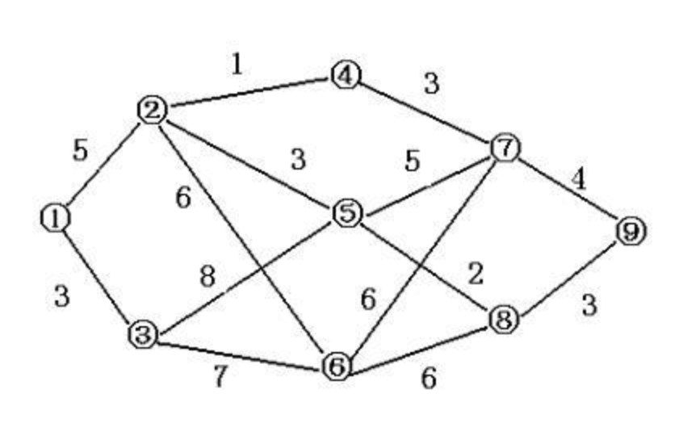

<br><br><br><br><br><br><br><br><br><br><br><br><br><br><br><br><br><br><br><center><font size = 7>Project 3:  Dijkstra Sequence</font></center>

<center><font size = 4>Author:张祎迪</font></center>

<br>

<center><font size = 4.5>Date:2023-12-8</center></font>

<div STYLE="page-break-after: always;"></div>

## $Chapter 1: Introduction$

<font face=Times New Roman>

$Dijkstra's$  $algorithm$, a renowned greedy algorithm devised by computer scientist $Edsger$ $W. Dijkstra$，stands as a pivotal solution for the single-source shortest path problem. It efficiently computes the shortest paths from a designated source vertex to all other vertices within a given graph. The algorithm maintains a set of vertices included in the shortest path tree, systematically adding vertices at each step based on their minimum distance from the source. This sequential addition produces what we term a "$Dijkstra$ $sequence$."

However, a critical aspect arises when considering that a given graph might have more than one valid Dijkstra sequence. This project tackles the challenge of determining whether a provided sequence qualifies as a Dijkstra sequence for a given connected graph.

**This project  will provide specific code for checking whether a given sequence is Dijkstra sequence or not and also a comprehensive analysis for the algorithm.**

## $Chapter 2:  Algorithm Specification$

* Full code is presented at the end of this PDF document and also submitted in the code directory.

we will first construct a **weighted undirected graph** using the input data(**NOTE** ：We can get from the project requirements that the given graph is undirected) , then assess whether the given sequence is a $Dijkstra \ sequence$.

#### Basic Data Structure : Weighted Undirected Graph

In the project , i use the following implementation to represent the given graph

Define "struct nei" to represent the neighbours of a specified node in the graph.

* the variable **distance** with type **int** represents the distance between this neighbouring vertex and the specified vertex

* the variable **index** with type**int** represents the index of this neighbouring vertex

```C
// Struct definition: Adjacent node
struct nei {
    int distance;  // Weight of the edge
    int index;      // Index of the target vertex
};
```

Define "struct ver" to represent  a vertex in the graph.

* the variable **distance** with type **int** represents the shortest distance updated form the source vertex to this specified vertex.
* the variable **list** with type **struct nei** points to an array with type  **struct nei** ,containing all the neighbouring vertices of this specified vertex.
* the variable **neinum** with type **int** represents the number of vertices adjacent to this specified vertex.
* the variable **known** with type **int** represents whether this vertex has been processed **(Which is a key step of the Dijkstra's algorithm)**

```C
struct ver {
    int distance;     // Shortest path length from the source to this node
    struct nei *list;  // Adjacency list, storing information about adjacent vertices
    int neinum;        // Number of vertices adjacent to this node
    int known;         // Whether this node has been processed};
```

Use an array with type "struct ver" to represent the Graph ,each element in the array represents a vertex in the graph.

```C
int vertice, edge;
scanf("%d %d", &vertice, &edge);
struct ver Graph[vertice];
```

#### Initialization of the Graph

* The first loop initializes each vertex, allocating memory for an empty array **Graph[i].list** (whose type is **struct nei**) for every vertice in the given Graph with size :  `vertices*sizeof(struct nei)`.

* Through the second loop reading edge information, the code updates the adjacency lists for each vertex based on the edges. 

  As it is an undirected graph, each edge updates the adjacency lists of two vertices.


#### Sketch of the whole program

* In the main function,we first read in  "cnt",which is the number of the test cases.

* Then,for each test case,we read in a sequence , initialize the Graph by setting the distance of each edge to the source edge to  $-1$  (which represents infinity),and each vertex to be"unknown" at the very beginning.
* After that,we call the  function $Dijkstra$ to check whether the input sequence is a dijsktra sequence.
* Also,we have to free the memory we malloced previously.


#### The Checking algorithm $Dijsktra$

#### (1)The 'FindShortest' Function

First implement a function to find the minimum distance among unknown vertices(from the specified source vertex)

The project requirements specified that "the positive integer weight (≤100) ", the number of vertices $Nv (≤10^3)$  and the number of edges $Ne(≤10^5)$ .

* Thus,  the use of **INT_MAX** for initialization ensures that any valid distance in the graph will be smaller during the first iteration.

**Note** : In the function Dijsktra(to be analysed below), the `distance` of the source vertex is already set to be zero,so there is no need to worry that we cannot get a real **min** distance (say,all the vertices' distance is -1)

<div STYLE="page-break-after: always;"></div>

The function checks all the vertices of the given Graph , and returns the minimum distance between the source vertex and the unknown vertices.

* Initialize `min` to the maximum possible integer value (`INT_MAX`).

* For each vertex, check if it's unprocessed (`!Graph[i].known`) and if its distance is smaller than the current minimum (`Graph[i].distance <= min`). If true, update `min` with the vertex's distance.

* After the loop, `min` will contain the minimum distance among unprocessed nodes.

* Return the minimum distance


#### (2) The 'Dijsktra' function

* **Initialization:**
  - The function starts by initializing the distance of the source node (given by `a[0]`) to itself as 0.

* **Node Traversal:**

  - The function iterates over all vertices in the graph using a loop.

  - For each loop, it finds the minimum distance among unprocessed nodes by calling the `findshortest` function.

* **Validity Check:**

  - It checks whether the distance of the current node is invalid (if the distance is less than zero,it means this vertex is not reachable at the current state ) or greater than the minimum distance found in the previous step. 

  - If so, it prints "No" and returns, indicating that the given sequence is not a valid Dijsktra sequence.

* **Processing Mark:**
  - It marks the current node as processed by setting `Graph[vertex].known` to 1.

<div STYLE="page-break-after: always;"></div>

* **Update Neighbor Distances:**

  - For each neighbor of the current node, it checks if the distance from the source node to the neighbor through the current node is smaller than the known distance to the neighbor. 

  - If true, it updates the distance.

* **Result Output:**
  - After processing all nodes without any violations, it prints "Yes," indicating that the shortest paths have been successfully computed.


<div STYLE="page-break-after: always;"></div>

## $Chapter 3:  Testing Results$

* Basic tests given in the $question$

**Sample  Input**

```
5 7
1 2 2
1 5 1
2 3 1
2 4 1
2 5 2
3 5 1
3 4 1
4
5 1 3 4 2
5 3 1 2 4
2 3 4 5 1
3 2 1 5 4
```

**OUTPUT** 

```
Yes
Yes
Yes
No
```

* Other Test Cases

> Graph  :



<div STYLE="page-break-after: always;"></div>

Input Graph

```
9 14
1 2 5
1 3 3
2 4 1
2 5 3
2 6 6
3 5 8
3 6 7
4 7 3
5 7 5
5 8 2
6 7 6
6 8 6
7 9 4
8 9 3
```

<table>
  <tr>
    <td><center>Input Sequence</center></td>
    <td><center>Output</center></td>
  </tr>
  <td><center>1 3 2 4 5 7 6 8 9<br>1 3 2 4 5 7 8 6 9</center></td>
  <td><center>Yes<br>Yes</center></td>
  <tr>
  <tr>
    <td><center>1 2 3 4 5 6 7 8 9<br>1 3 2 5 4 7 8 6 9</center></td>
    <td><center>No<br>No</center></td>
  </tr>
  <tr>
    <td><center>2 4 5 7 8 1 6 3 9<br>2 4 5 7 8 1 6 9 3<br>2 4 5 7 1 8 6 3 9<br>2 4 5 7 1 8 6 9 3</center></td>
    <td><center>Yes<br>Yes<br>Yes<br>Yes</center></td>
  </tr>
  <tr>
    <td><center>2 4 5 8 7 1 6 3 9<br>2 5 4 3 6 7 8 9 1</center></td>
    <td><center>No<br>No</center></td>
  </tr>
  <tr>
    <td><center>4 2 7 5 1 8 9 6 3<br>4 2 7 5 1 8 6 9 3<br>4 2 7 5 8 1 9 6 3<br>4 2 7 5 8 1 6 9 3</center></td>
    <td><center>Yes<br>Yes<br>Yes<br>Yes</center></td>
  </tr>

</table>

*The Program has past all the above test cases,indicating that it is to a degree complete and efficient to judge a Dijsktra sequence .*

<div STYLE="page-break-after: always;"></div>

## $Chapter 4:  Analysis$ $and$ $Comments$

### 1.The 'FindShortest' Function

#### $Time\ complexcity$

* Loop through vertices once $O(vertice)$ with constant time operations inside the loop. 

Therefore ,  the overall time complexity is $O(vertice)$.

#### $Space\ complexity$

Constant space used,thus space complexity is $O(1)$

###  2.The "Dijsktra" Function

**NOTE** : Use variable **edge** to represent the count of edges,and the variable **vertice** for the number of vertices.

#### $time\ complexity$

* The main loop runs for each vertex $O(vertice)$ .
  * Inside each loop, call `findshortest` function with whose time complexity is $O(vertice)$,contributes to a total complexity $O(vertice^2)$ 
  * Inside each loop, update distances with complexity $O(neinum)$,contributes to a total complexity $O(2*edgenum)$=$O(edge)$ .
* So the total time complexity for the function is $O(vertice^2+edge)$ ,consider that the number of edges is $O(vertice^2)$ , so the total time complexity for the function is $O(vertice^2)$

#### $space\ complexity$

* *Memory for variables* : Constant space for variables in `Dijkstra`.

*  *findshortest Function* ： 

  - Called once in each iteration of the outer loop using constant space

* *Overall Space Complexity*:

  Constant space $O(1)$
### 3.The "main"Function

#### $time\ complexity$

* **Initialization of Graph Array:**

  - Loop through each vertex $O(vertice)$.

  - Inside the loop, allocate memory for the adjacency list $O(vertice)$,contributes to an overall time complexity $O(vertice^2)$

  * Overall, $O(vertice^2)$.

* **Input Edges:**

  - Loop through each edge $O(edge)$.
  - Inside the loop, update adjacency lists (constant time).

  - Overall, $O(edge)$=$O(vertice^2)$.

* **Multiple Queries:**

  - Loop through each query $O(cnt)$.

  - Inside the loop, call Dijkstra's algorithm with time complexity $O(vertice^2)$(see analysed above).

  * Overall, $O(cnt * vertice^2)$.

* **Free Allocated Memory:**
  - Loop through each vertex to free memory $O(vertice)$.

* **Overall Time Complexity:**$O(cnt * vertice^2)$.

#### $Space\ Complexity$ 

* **Graph Array:**
  - Array of vertices $O(vertice)$.
  - Each vertex has an adjacency list with $O(vertice)$.
  - Overall, $O(vertice^2)$.

* **Queries:**
  - Array for each query : $O(vertice)$ for each query.
  - **Stack**
    - For `cnt` queries,the `main function` calls the `Dijsktra function` for cnt times,each with constance space of stack memory.
  - Overall $O(vertice)$

* **Overall Space Complexity:**$O(vertice^2)$

### Summary:

- The overall time complexity is $O(cnt*vertice^2)$ 
- The space complexity is $O(vertice^2)$,mainly determined by the size of the graph array.

Keep in mind that these are upper bounds, and the actual performance could vary based on the specific ,input and graph characteristics.

## $Appendix:$  $Source$ $Code$ 

```C
#include<stdio.h>
#include<stdlib.h>
#include <limits.h>
// Struct definition: Adjacent node
struct nei {
    int distance;  // Weight of the edge
    int index;      // Index of the target vertex
};
// Struct definition: Vertex of the graph
struct ver {
    int distance;     // Shortest path length from the source to this node
    struct nei *list;  // Adjacency list, storing information about adjacent vertices
    int neinum;        // Number of vertices adjacent to this node
    int known;         // Whether this node has been processed
};
// Function definition: Find the minimum distance among unknown nodes
int findshortest(struct ver* Graph, int vertice) {
    int min = INT_MAX;
    for(int i = 0; i < vertice; i++) {
        // Unprocessed node with a smaller distance
        if(Graph[i].distance >= 0 && Graph[i].distance <= min && (!Graph[i].known)) {
            min = Graph[i].distance;
        }
    }
    return min; // return the minimum distance
}
// Function definition: Dijkstra's algorithm to find the shortest path
void Dijkstra(struct ver* Graph, int vertice, int *a) {
    int source = a[0];               // Set the source vertex of the shortest path problem to be first element of the input sequence.
    Graph[source - 1].distance = 0;  // Set the distance from the source node to itself as 0

    // Traverse all nodes
    for(int i = 0; i < vertice; i++) {
        int min = findshortest(Graph, vertice); //find the shortest distance at the current state between the source vertex and the unknown vertices.
        int vertex = a[i] - 1;

        // If the distance of the current node is invalid or greater than the minimum distance, output No and return
        if(Graph[vertex].distance < 0 || Graph[vertex].distance > min) {
            printf("No\n");
            return;
        }

        Graph[vertex].known = 1;  // Mark the current node as processed
        int cnt = Graph[vertex].neinum; // get the count of the neighbours of the processing vertex

        // Update the distance of adjacent nodes
        for(int j = 0; j < cnt; j++) {
            int neighbour = Graph[vertex].list[j].index; 
            int distance = Graph[vertex].list[j].distance;

            if(!Graph[neighbour].known) {
                // If the distance from the current node to the adjacent node is smaller, update the distance
                if(Graph[vertex].distance + distance < Graph[neighbour].distance || Graph[neighbour].distance < 0) {
                    Graph[neighbour].distance = Graph[vertex].distance + distance;
                }
            }
        }
    }

    printf("Yes\n"); // No violations OUTPUT Yes
    return;
}
int main() {
    int vertice, edge;
    scanf("%d %d", &vertice, &edge); // get the number of vertices and edges in the weighted undirected graph

    // Initialization of the array of graph vertices
    struct ver Graph[vertice];
    for(int i = 0; i < vertice; i++) {
        Graph[i].neinum = 0;        //initialize the number of neighbours to be zero
        Graph[i].list = (struct nei*)malloc(vertice * sizeof(struct nei));
    }
    // Input information about edges and build the adjacency list
    for(int i = 0; i < edge; i++) {
        int from, to, distance;
        scanf("%d %d %d", &from, &to, &distance); //get the information of an edge
        // initialize edge <from,to>
        int index = Graph[from - 1].neinum;
        Graph[from - 1].neinum++;
        Graph[from - 1].list[index].distance = distance;
        Graph[from - 1].list[index].index = to - 1;
        //initialize edge <to,from>
        index = Graph[to - 1].neinum;
        Graph[to - 1].neinum++;
        Graph[to - 1].list[index].distance = distance;
        Graph[to - 1].list[index].index = from - 1;
    }
    int cnt;
    scanf("%d", &cnt);
    // Process multiple queries
    while(cnt--) {
        int a[vertice];
        for(int i = 0; i < vertice; i++) {
            scanf("%d", &a[i]);
        }

        // Initialize the distances and processing status of the vertices
        for(int i = 0; i < vertice; i++) {
            Graph[i].distance = -1;
            Graph[i].known = 0;
        }
        // Call Dijkstra's algorithm
        Dijkstra(Graph, vertice, a);
    }
    // Free allocated memory
    for(int i = 0; i < vertice; i++) {
        free(Graph[i].list);
    }
    return 0;
}
```

## $Declaration$

*I hereby declare that all the work done in this project titled "Dijkstra Sequence" is of my independent effort.*

</font>