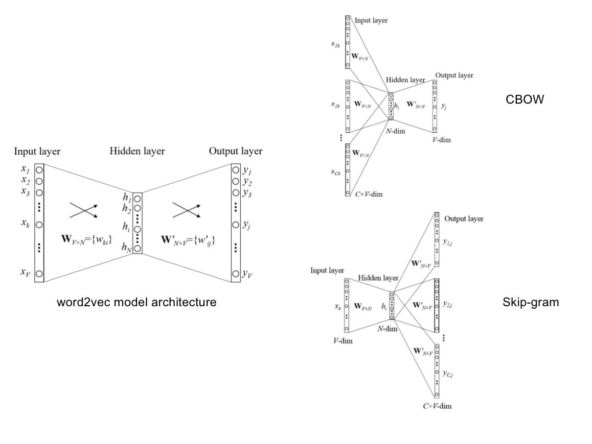
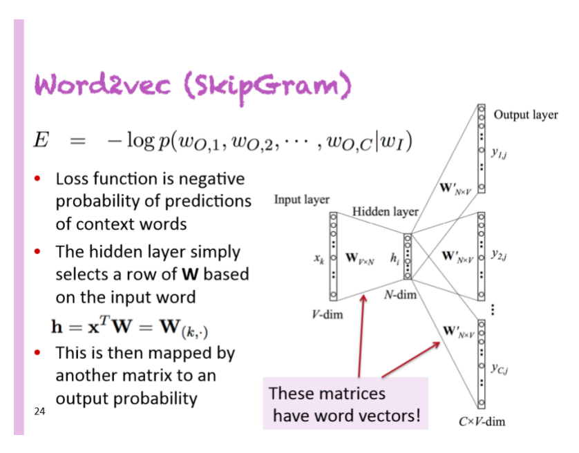

## Word Embedding

### One-hot Representation

**Problem**

* Dot product is zero. 

  Our query and document vectors are orthogonal

  There is no **natural notion** of similarity in a set of one-hot vectors

* High dimension, much space.

**Solve**

Reduce the dimensions (CNN)

### Speech Context

* Method 1: continuous bag-of-word $(CBOW)$​

* Method 2: skip-gram $(SG)$

## Recurent Neural Network
* Mostly refer to slides.
