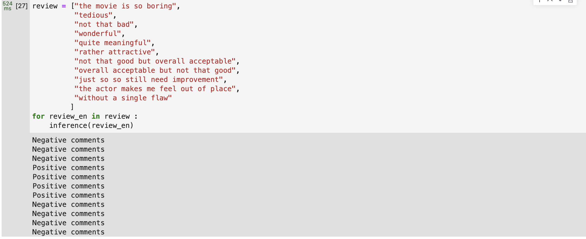

<font face = "Times New Roman">

<center><font size = 8>NLP：lab1</font></center>

<center>

| 序号 |  学号 |  专业班级  |   姓名    | 性别  |
| :--: | :------: | :---------: | :-----------: | :--: |
|  / | 3220102157  |  图灵2201   | 张祎迪 | 女 |

</center>


## 1.Project Introduction
### Development Environment: 
* ModelArts Ascend Notebook ：mindspore1.7.0-cann5.1.0-py3.7-euler2.8.3
  
### 1.1 Word2Vec
Word2Vec, developed by Google in 2013, is a tool for computing word vectors. It efficiently trains word vectors on large-scale datasets and effectively measures the similarity between words.
#### The main steps of the project include:

* **Data Preparation**: Obtaining the Wikipedia corpus as training data and preparing the dataset for training the Word2Vec model.
* **Model Training**: Using the Word2Vec class from the gensim framework to train the word embedding model, selecting suitable parameters and model structures for training.
* **Word Vector Retrieval**: Utilizing the trained Word2Vec model to obtain the vector representation for each word.
* **Similar Word Search and Expansion**: Leveraging the trained word embeddings to implement semantic word search, i.e., given a word, finding other words that are semantically similar, and expanding the search.
  
### 1.2 TextCNN
Sentiment analysis is one of the practical applications of natural language processing, particularly in text classification tasks. It is relatively straightforward and highly applicable. Common platforms such as shopping websites and movie databases often provide access to high-quality datasets, making sentiment analysis a valuable tool for various industries.

In this experiment, we focus on sentiment analysis of movie reviews using convolutional neural networks (CNNs). The goal is to determine the sentiment polarity of the reviews, providing insights into audience reactions towards particular movies.

#### The main steps of the project include:
* **Data Preparation**: Preparing the dataset for training the TextCNN model.
* **Model Training**: Training the TextCNN model on the dataset, selecting suitable parameters and model structures for training.
* **Model Evaluation**: Evaluating the performance of the TextCNN model on the test dataset.

## 2.Technical Details
### 2.1 Word2Vec
#### 2.1.1 Theoretically Elaboration
**Word Embeddings**
This is a word embedding for the word “king” (GloVe vector trained on Wikipedia):
```
[ 0.50451 , 0.68607  , -0.59517 , -0.022801, 0.60046  , -0.13498 ,
 -0.08813 , 0.47377  , -0.61798 , -0.31012 , -0.076666,  1.493   , 
 -0.034189, -0.98173 , 0.68229  , 0.81722  , -0.51874 , -0.31503 , 
 -0.55809 , 0.66421  , 0.1961   , -0.13495 , -0.11476 , -0.30344 , 
 0.41177  , -2.223   , -1.0756  , -1.0783  , -0.34354 , 0.33505  , 
 1.9927   , -0.04234 , -0.64319 , 0.71125  , 0.49159  , 0.16754  ,
 0.34344  , -0.25663 , -0.8523  , 0.1661   , 0.40102  , 1.1685   , 
 -1.0137  , -0.21585 , -0.15155 , 0.78321  , -0.91241 , 
 -1.6106  , -0.64426 , -0.51042 ]
```
Thus , we represent word by using vectors and we can compare the similarity between words by comparing the respective vectors.
* a visual representation of word embeddings
<center></center>

<div style="page-break-after: always;"></div>

**Target**
Next-word prediction is a task that can be addressed by a language model. A language model can take a list of words, and attempt to predict the word that follows them.

<center></center>

**Architecture of Word2Vec**
* Method 1: continuous bag-of-word $(CBOW)$​

* Method 2: skip-gram $(SG)$
  

<div style="page-break-after: always;"></div>

#### 2.1.2 Algorithm Implementation

* This project dose utilize a custom Word2Vec implementation but rather employs the built-in Word2Vec model provided by MindSpore.
```python
Word2Vec(
    sentences=None,
    corpus_file=None,
    vector_size=100,
    alpha=0.025,
    window=5,
    min_count=5,
    max_vocab_size=None,
    sample=0.001,
    seed=1,
    workers=3,
    min_alpha=0.0001,
    sg=0,
    hs=0,
    negative=5,
    ns_exponent=0.75,
    cbow_mean=1,
    epochs=5,
    sorted_vocab=1,
    batch_words=10000,
)
```
* The full model can be stored/loaded via its `save()` / `load()` methods.
* Parameters
    * sentences : iterable of iterables, optional
        * Iterable of tokenized sentences.
    * corpus_file : str, optional
        * Path to a corpus file.
    * **vector_size** : int, optional
        * Dimensionality of the word vectors.
    * **window** : int, optional
        * Maximum distance between the current and predicted word within a sentence.
    * **min_count** : int, optional
        * Ignores all words with total frequency lower than this.
    * workers : int, optional
        * Number of worker threads.
    * **sg** : {0, 1}, optional
        * Training algorithm: 1 for skip-gram; otherwise CBOW.
    * negative : int, optional
        * If > 0, negative sampling will be used.
    * ns_exponent : float, optional
        * Exponent used to shape the negative sampling distribution.
    * **alpha** : float, optional
        * Initial learning rate.
    * **min_alpha** : float, optional
        * Learning rate will linearly drop.
    * max_vocab_size : int, optional
        * Limits the vocabulary size.
    * **epochs** : int, optional
        * Number of iterations over the corpus.
    * sorted_vocab : {0, 1}, optional
        * Whether to sort the vocabulary by descending frequency.
    * batch_words : int, optional
        * Target size for batches of examples passed to worker threads.
* Specifications : refer to https://code.google.com/p/word2vec/.

* We train the model using the following code:
```python
model = Word2Vec(corpus_file=corpus_file, vector_size=100, window=5, min_count=5, workers=cpu_count(),sg=1)
model.wv.save_word2vec_format(out_embedding_file, binary=False)
```
* load the model and the word vectors from the file
  ```python
  word2vec_model = KeyedVectors.load_word2vec_format("embedding.txt")
  ```
* compare the similarity between words by comparing the respective vectors: 
  * Example
```python
testwords = ['金融', '喜欢', "中国", "北京"]
for word in testwords:
    res = word2vec_model.most_similar(word)
    print (word)
    print (res)
```

### 2.2 TextCNN
#### 2.2.1 Theoretically Elaboration
**CNN Architecture for Text Classification**
<center></center>
<center></center>

* **Embedding Layer**: Converts the input text into word embeddings.
* **Convolutional Layer**: Applies convolutional filters to the word embeddings to capture local patterns.
* **Pooling Layer**: Aggregates the output of the convolutional layer to capture global patterns.
* **Fully Connected Layer**: Maps the pooled features to the output classes.
#### 2.2.2 Algorithm Implementation
```python
class TextCNN(nn.Cell):
    def __init__(self, vocab_len, word_len, num_classes, vec_length):
        super(TextCNN, self).__init__()
        self.vec_length = vec_length  # Dimensionality of word embeddings
        self.word_len = word_len  # Maximum length of a sentence
        self.num_classes = num_classes  # Number of classes for classification
        # Initialization operations
        self.unsqueeze = ops.ExpandDims() 
        self.embedding = nn.Embedding(vocab_len, self.vec_length, embedding_table='normal')
        # Convolutional operations
        self.slice = ops.Slice()  # Slice operation
        self.layer1 = self.make_layer(kernel_height=3)  # First convolutional layer
        self.layer2 = self.make_layer(kernel_height=4)  # Second convolutional layer
        self.layer3 = self.make_layer(kernel_height=5)  # Third convolutional layer
        # Pooling operations
        self.concat = ops.Concat(1)  # Concatenate tensors along the channel dimension
        # Fully connected layer and other operations
        self.fc = nn.Dense(96*3, self.num_classes)  # Fully connected layer
        self.drop = nn.Dropout(keep_prob=0.5)  # Dropout layer
        self.print = ops.Print() 
        self.reducemean = ops.ReduceMax(keep_dims=False)  # Pooling operation
    # Create a sequence of convolutional layer, ReLU activation layer, and max pooling layer
    def make_layer(self, kernel_height):
        return nn.SequentialCell(
            [
                make_conv_layer((kernel_height,self.vec_length)), # Conv layer
                nn.ReLU(),  # ReLU activation function
                nn.MaxPool2d(kernel_size=(self.word_len-kernel_height+1,1)),  # Max pooling layer
            ]
        )
    # Forward pass
    def construct(self, x):
        x = self.unsqueeze(x, 1)  # Expand dimensions
        x = self.embedding(x)  # Perform word embedding
        x1 = self.layer1(x)  # First convolutional operation
        x2 = self.layer2(x)  # Second convolutional operation
        x3 = self.layer3(x)  # Third convolutional operation
        # Pooling operation, reduce the dimensionality of feature maps
        x1 = self.reducemean(x1, (2, 3))
        x2 = self.reducemean(x2, (2, 3))
        x3 = self.reducemean(x3, (2, 3))
        # Concatenate feature maps
        x = self.concat((x1, x2, x3))
        x = self.drop(x)  # Dropout operation, prevent overfitting
        x = self.fc(x)  # Fully connected layer, perform classification
        return x
```
The TextCNN architecture is a convolutional neural network model specifically designed for text classification tasks. It consists of convolutional layers followed by max-pooling operations to extract features from input text data. Here's a description of the architecture:
**Embedding Layer**:
The input text data, represented as sequences of words or tokens, is first passed through an embedding layer. This layer converts each word/token into a dense vector representation. 
>In this implementation, the embedding layer is initialized with pre-trained word embeddings.

**Convolutional Layers:**
Three convolutional layers are employed, each with different kernel heights (corresponding to different n-gram sizes). This allows the model to capture local contextual information at different levels.
**Max-Pooling Layers:**
After each convolutional layer, a max-pooling operation is applied. Max-pooling reduces the dimensionality of the feature maps while preserving the most important information. 
**Fully Connected Layer:**
The output feature maps from the convolutional layers are concatenated and flattened into a single feature vector. This vector is then passed through a fully connected (dense) layer, which performs classification based on the extracted features.
>a dropout layer is applied to prevent overfitting by randomly dropping a fraction of the input units during training.

**Output Layer:**
The output layer consists of a dense layer with the number of units equal to the number of classes in the classification task. It produces the final prediction probabilities for each class.

> See part of this architecture :

<center></center>

* Use mindspore's `Model` to train and test the model: Details see implementation.
```python
model = Model(net, loss_fn=loss, optimizer=opt, metrics={'acc': Accuracy()})
#...
model.train(cfg.epoch_size, dataset, callbacks=[time_cb, ckpoint_cb, loss_cb])
#...
```

<div style="page-break-after: always;"></div>

## 3.Experiment Results

### 3.1 Word2Vec
This section well be developed by comparing the different outputs of the Word2Vec model with different parameters.
Everytime we train the model, we will save the model and the word vectors in a file. We will then load the model and the word vectors from the file and compare the similarity between words by comparing the respective vectors.
Examples like below:
* After Traning, vector results are saved in `embedding.txt` file.
  
* see the vector representation of the word "中国" .
  
#### 3.1.1 Experiment 1 （skip-gram）
**Parameters**
```python
model = Word2Vec(corpus_file=corpus_file, vector_size=100, window=5, min_count=5, workers=cpu_count(), sg=1)
```
* Single word
  
* Words similarity
  
#### 3.1.2 Experiment 2 （CBOW）
**Parameters**
```python
model = Word2Vec(corpus_file=corpus_file, vector_size=100, window=5, min_count=5, workers=cpu_count(), sg=0)
```
* Single word
  
* Words similarity
  

#### 3.1.3 Experiment 3 （skip-gram,adjust epcho）
**Parameters** epch = 9
```python
model = Word2Vec(corpus_file=corpus_file, vector_size=100, window=5, min_count=5, workers=cpu_count(), sg=1,epochs=9)
```
* Single word
  
* Words similarity
  
#### 3.1.4 Experiment 4 （CBOW,adjust epcho & window）
```python
model = Word2Vec(corpus_file=corpus_file, vector_size=100, window=10, min_count=5, workers=cpu_count(), sg=0,epochs=20)
```
* Single word
  
* Words similarity
  
  **Change the epchos to 80**
```python
model = Word2Vec(corpus_file=corpus_file, vector_size=100, window=10, min_count=5, workers=cpu_count(), sg=0,epochs=80)
```
* word similarity
  
#### 3.1.5 Experiment 5 （skip-gram,adjust alpha）
**Parameters** 
```python
model = Word2Vec(corpus_file=corpus_file, vector_size=100, window=10, min_count=5, workers=cpu_count(), sg=1,alpha = 0.8)
```
* word similarity
  
* initial learning rate is 0.8, turns out the result is really not good as the training of the model is not stable.
#### Simple Analysis & Comparison
##### Skip-gram vs. CBOW
* CBOW is faster than skip-gram, which can be attributed to the fact that CBOW is trained to predict the current word based on the context, while skip-gram is trained to predict the context based on the current word.[See architecture](#2.1-Algorithm-Implementation)
* Skip-gram is better at representing infrequent words, while CBOW is better at representing frequent words.
  > See experiment 1 and 2.
##### Epochs
* Increasing the number of epochs can improve the quality of the word vectors, but it also increases the training time.
* Also, the model may overfit the training data if the number of epochs is too high.
#### Other Parameters
The result of other parameters may be not so obvious if only basing on small adjustments, therefore, I did not conduct experiments on them but they are also important.
* The window size affects the quality of the word vectors. A larger window size can capture more context information, but it may also introduce noise.
* The vector size determines the dimensionality of the word vectors. A larger vector size can capture more semantic information, but it also increases the computational cost.
* The learning rate (alpha) controls the step size of the optimization algorithm. A smaller learning rate can make the training process more stable, but it may also slow down the convergence speed.
* The batch size parameter controls the number of examples used in each training iteration. A larger batch size can make the training process more stable, but it may also require more memory.
........
All these parameters should be adjusted based on the specific task and dataset.

### 3.2 TextCNN
This section will be developed by comparing the different outputs of the TextCNN model with different parameters.

#### 3.2.1 Data Preparation
**parameters**
```python
rom easydict import EasyDict as edict
cfg = edict({
    'name': 'movie review',
    'pre_trained': False,
    'num_classes': 2,
    'batch_size': 64,
    'epoch_size': 4,
    'weight_decay': 3e-5,
    'data_path': './data/',
    'device_target': 'Ascend',
    'device_id': 0,
    'keep_checkpoint_max': 1,
    'checkpoint_path': './ckpt/train_textcnn-4_149.ckpt',
    'word_len': 51,
    'vec_length': 40
})
```
**Dataset Preparation**


#### 3.2.2 Model Training
**parameters**
```python
learning_rate = []
warm_up = [1e-3 / math.floor(cfg.epoch_size / 5) * (i + 1) for _ in range(batch_num) 
           for i in range(math.floor(cfg.epoch_size / 5))]
shrink = [1e-3 / (16 * (i + 1)) for _ in range(batch_num) 
          for i in range(math.floor(cfg.epoch_size * 3 / 5))]
normal_run = [1e-3 for _ in range(batch_num) for i in 
              range(cfg.epoch_size - math.floor(cfg.epoch_size / 5) 
                    - math.floor(cfg.epoch_size * 2 / 5))]
learning_rate = learning_rate + warm_up + normal_run + shrink
```

**Warm-up Phase:**
During the initial training phase, start with a relatively small learning rate to prevent the model from getting stuck in local minima or encountering gradient vanishing issues.
* In the warm_up phase, the learning rate gradually increases within each mini-batch to progressively raise the learning rate.More, specifiacally: `1e-3 / math.floor(cfg.epoch_size / 5) * (i + 1)`, where cfg.epoch_size represents the total number of epochs, and i denotes the index of the current mini-batch.

**Normal Run Phase:**

In the middle phase of training, a fixed relatively large learning rate is commonly used to accelerate the convergence speed of the model.
* The learning rate remains constant throughout the normal_run phase, set to a fixed value of 1e-3.

**Shrink Phase:**

As the training approaches its end, it may be necessary to further decrease the learning rate to fine-tune the model parameters and approach the optimal solution.
* In the shrink phase, the learning rate gradually decreases within each mini-batch to progressively lower the learning rate.More specifically: `1e^-3 / (16 * (i + 1))`, where i represents the index of the current mini-batch.
> Answer to the reflection question are explained above.

**architecture defination**
* details see [2.2.1](#2.2.1-Algorithm-Implementation)

**training**


<div style="page-break-after: always;"></div>

#### 3.2.3 Model Evaluation
**Load the model and evaluate the performance on the test dataset**

**Evaluation**

* Interestingly the model has displayed vague results, for example : `"not that good but overall acceptable"` is classified as positive,while ` "overall acceptable but not that good"` is classified as negative. This is due to the model's inability to capture the context and semantics of the text effectively.
* Also, `without a single flaw` is classified as negative, which is incorrect. This is due to the model's inability to understand the context and semantics of the text effectively.

This experiment demonstrates the challenges of text classification tasks, particularly in capturing the nuances of human language and understanding the context and sequence of text data.

## References
* https://en.wikipedia.org/wiki/Word2vec
* https://www.mindspore.cn/
* https://arxiv.org/abs/2203.05173

</font>

