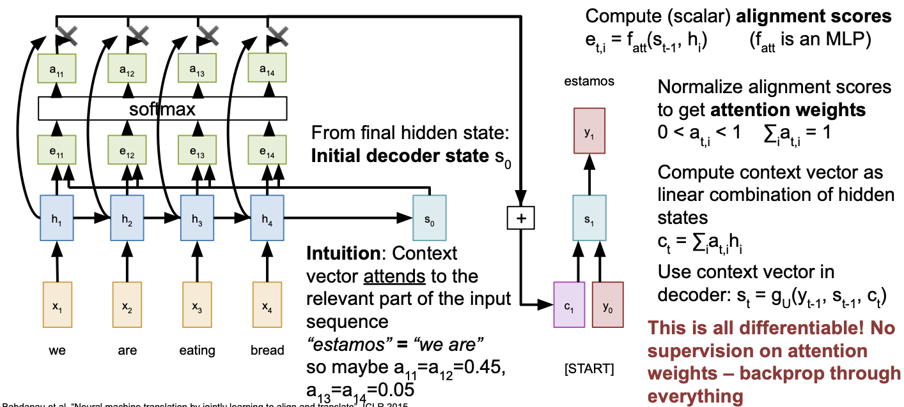
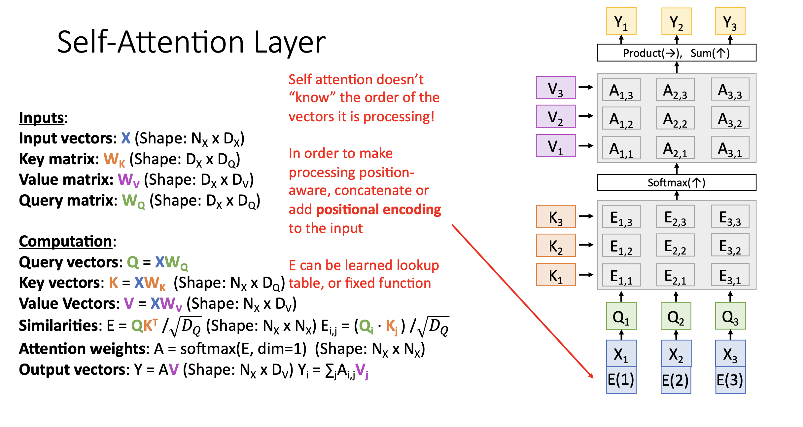
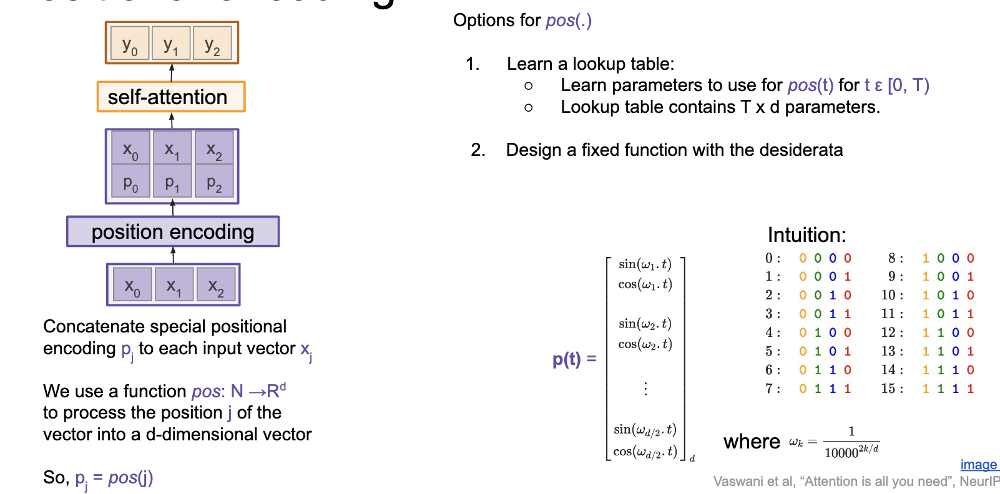
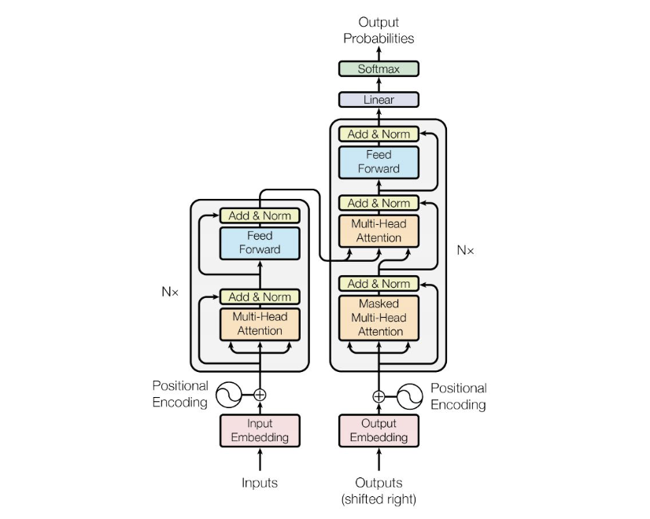
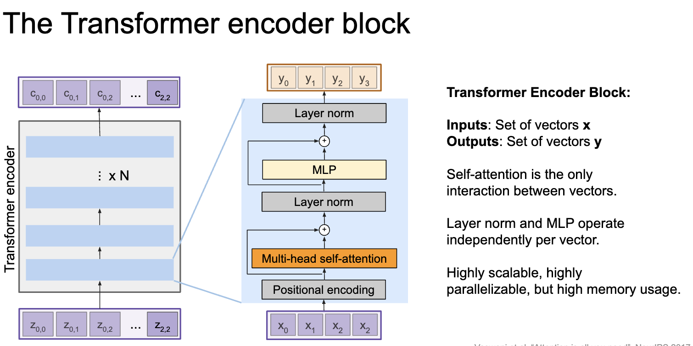
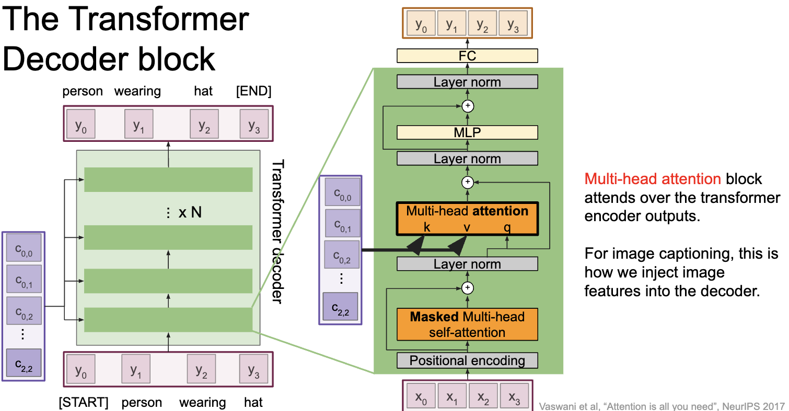
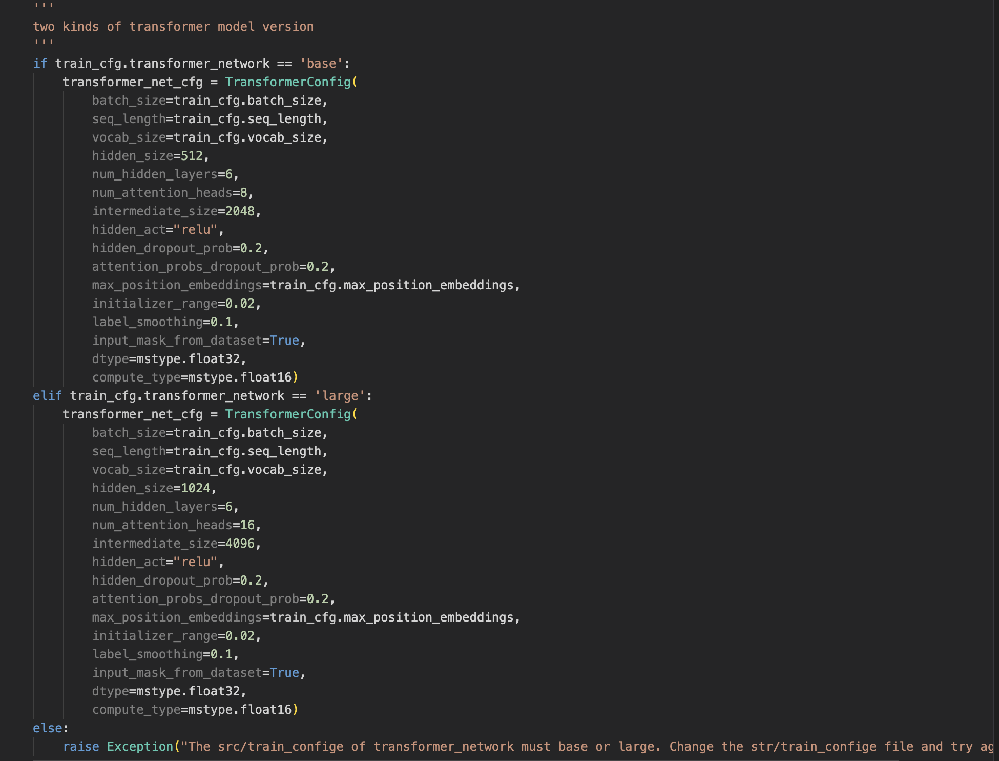
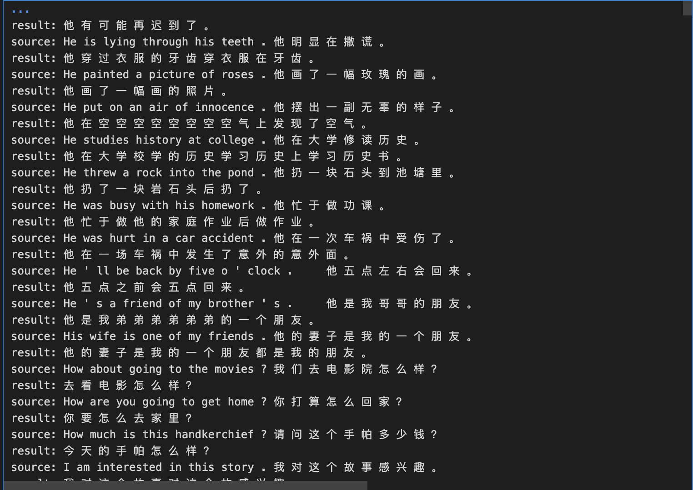

<font face = "Times New Roman">

<center><font size = 8>NLP：lab2</font></center>

<center>

| 序号 |  学号 |  专业班级  |   姓名    | 性别  |
| :--: | :------: | :---------: | :-----------: | :--: |
|  / | 3220102157  |  图灵2201   | 张祎迪 | 女 |

</center>


## 1.Project Introduction
### Development Environment: 
* ModelArts Ascend Notebook ：mindspore1.7.0-cann5.1.0-py3.7-euler2.8.3
  
### SeqtoSeq with Transformers
#### Sequence-to-Sequence (Seq2Seq) Model
* **Seq2Seq Model**: A type of neural network architecture used for sequence prediction tasks, such as machine translation, text summarization, and speech recognition.
* **Encoder-Decoder Architecture**: Consists of an encoder network that processes the input sequence and a decoder network that generates the output sequence.
* **Attention Mechanism**: Allows the model to focus on different parts of the input sequence during the decoding process.

This project aims to implement a Seq2Seq model using the Transformer architecture for machine translation tasks. The Transformer model is a state-of-the-art architecture that has been widely adopted for sequence-to-sequence tasks due to its parallelism and scalability.

#### Steps:
1. **Data Preprocessing**: Prepare the training and validation datasets for the machine translation task.
2. **Model Architecture**: Implement the Transformer model architecture for sequence-to-sequence tasks.
3. **Training**: Train the model on the training dataset and evaluate its performance on the validation dataset.
4. **Inference**: Use the trained model to generate translations for new input sequences.

## 2.Technical Details
### Theoretically Elaboration
**Attention Mechanism**
**Basic Idea**: The attention mechanism allows the model to focus on different parts of the input sequence during the decoding process. It assigns weights to the input elements based on their relevance to the current output element, enabling the model to capture long-range dependencies and improve the quality of the generated sequences.


From the above figure, we can see that each $s_i$ is computed based on the weighted sum of the input elements $h_1, h_2, ..., h_n$, where the weights are determined by the attention scores $a_{ij}$.

**Improved Attention Mechanisms**

* **Self-Attention**: A mechanism that allows the model to focus on different parts of the input sequence during the decoding process.
* **Scaled Dot-Product Attention**: A type of self-attention mechanism that scales the dot-product attention scores by the square root of the dimensionality of the key vectors.



* **Positional Encoding**: A technique used to inject positional information into the input embeddings to capture the sequential order of the input sequence.

* **Multi-Head Attention**: A mechanism that allows the model to jointly attend to information from different representation subspaces.

**The Transformer Architecture**

* **Encoder**: Processes the input sequence and generates a sequence of hidden representations.

* **Decoder**: Generates the output sequence based on the encoder's hidden representations and the previous output elements.


### Algorithm Implementation

I did not implement the algorithm myself in the project, but I used the MindSpore library to build the Transformer model for machine translation tasks. The MindSpore library provides a high-level API for building and training deep learning models, making it easy to implement complex architectures such as the Transformer model.

1. **Data Preprocessing**
```python
sample_num = 23607
eval_idx = np.random.choice(sample_num, int(sample_num*0.2), replace=False)
data_prepare(data_cfg, eval_idx)
```
> Choose 20% of the data as training set

The `data_prepare` function preprocesses input data, tokenizes it, filters instances based on length constraints, and writes the preprocessed data to separate files for training and evaluation in a format suitable for training a transformer-based model.

2. **Training**
* **Main part of the parameters** (in the `train_cfg` dictionary):


>   * batch_size: The number of instances in each batch.
>  * seq_length: The maximum sequence length for input and output sequences.
> * vocab_size: The size of the vocabulary used for tokenization.
> * hidden_size: The size of the hidden layers in the Transformer model.
> * num_hidden_layers: The number of hidden layers in the Transformer model.
> * num_attention_heads: The number of attention heads in the Transformer model.
> * hidden_act: The activation function used in the hidden layers.
> * hidden_dropout_prob: The dropout probability for the hidden layers.
> * attention_probs_dropout_prob: The dropout probability for the attention probabilities.
> * max_position_embeddings: The maximum number of positions for positional embeddings.
> * initializer_range: The range for random weight initialization.
> * label_smoothing: The label smoothing factor for the loss function.
> * input_mask_from_dataset: Whether to use input masks from the dataset.
```python
train(train_cfg)
```
The `train()` function trains the model. It first loads the dataset and initializes the Transformer network, loss function, learning rate, and optimization method. If pre-trained model parameters exist, it loads the parameters from the specified cfg.checkpoint_path path into the network. If model saving is enabled in the configuration, it also adds a ModelCheckpoint callback function to save the model. Additionally, it adjusts the optimizer based on whether enable_lossscale is enabled. Finally, it wraps everything into a model using the Model class, sets it to training mode, and calls the `train()` method to start training.

3. **Evaluation**
```python
evaluate(eval_cfg)
```
* Specific parameters in the `eval_cfg` dictionary
* More details can be found in the `mt_transformer_mindspore.ipynb` file.


<div style="page-break-after: always;"></div>

## 3.Experiment Results
* All test results can be found in the `mt_transformer_mindspore.ipynb` file.

* Some typical results are shown below:
> Lack in learning slang
```
source: He is lying through his teeth .	他 明 显 在 撒 谎 。	
result: 他 穿 过 衣 服 的 牙 齿 穿 衣 服 在 牙 齿 。

source: He put on an air of innocence .	他 摆 出 一 副 无 辜 的 样 子 。	
result: 他 在 空 空 空 空 空 空 空 空 气 上 发 现 了 空 气 。
```
> Lack in caputure features of different languages.
   For example, Chinese tends to use less words to express the same meaning than English, but the model tends to generate the same length of sentences, so there is many repeated words in the generated sentences.
```
source: He ' s a friend of my brother ' s .	他 是 我 哥 哥 的 朋 友 。	
result: 他 是 我 弟 弟 弟 弟 弟 弟 的 一 个 朋 友 。
```

> Redundant words : Hard time finding end signal
```
source: You may injure yourself if you don ' t follow safety procedures .	如 果 你 不 按 照 安 全 手 续 来 的 话 ， 你 可 能 会 受 伤 的 。	
result: 如 果 你 分 之 前 ， 你 不 能 为 止 止 止 止 止 止 止 止 止 止 止 止 止 止 止 止 止 止 止 止 止 止 止 止 止 不 能 不 能

source: This plane flies between Osaka and Hakodate .	这 架 飞 机 往 返 于 大 阪 和 函 馆 之 间 。	
result: 这 架 飞 机 和 大 之 间 之 间 之 间 之 间 之 间 之 间 飞 机 之 间 之 间 之 间 之 前 坐 飞 机 之 间 之 间 之 间 之 间 之
```
## References
* https://www.mindspore.cn/

</font>

