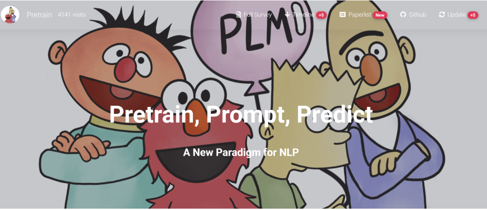
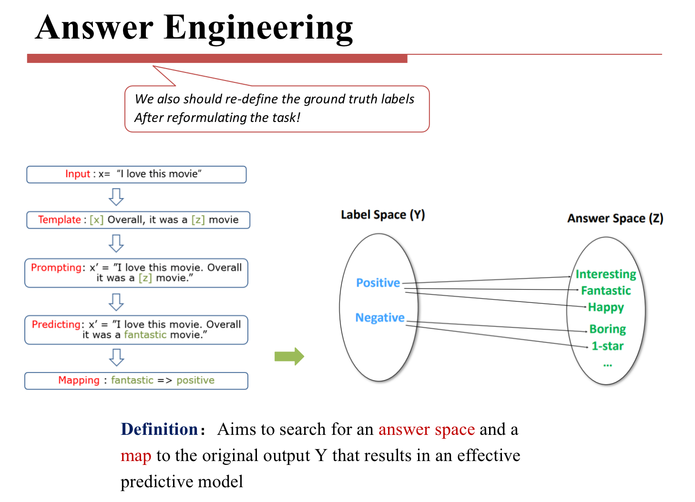
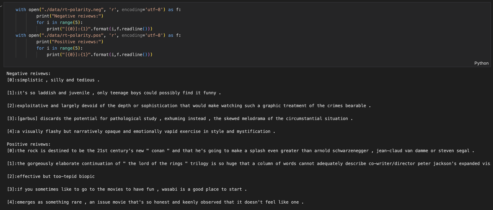
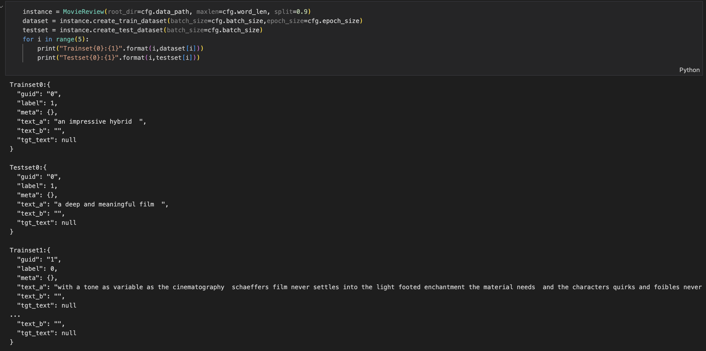
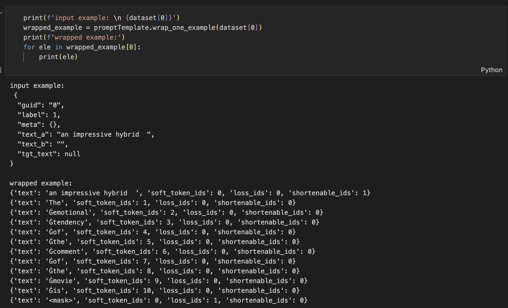
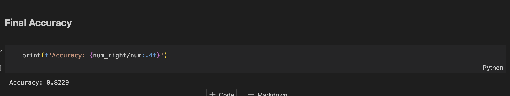

<font face = "Times New Roman"> 
<center><font size = 6>  NLP:lab3</font> </center>

<center>

| 序号 |  学号 |  专业班级  |   姓名    | 性别  |
| :--: | :------: | :---------: | :-----------: | :--: |
|  / | 3220102157  |  图灵2201   | 张祎迪 | 女 |

</center>

## 1.Project Introduction

### 1.1 Development Environment
  * Python 3.11
  * MacOS Sonoma 14.4.1

### 1.2 Prompt Tuning
Prompt Tuning is a simple and effective method for adapting pretrained language models to new tasks. It works by adding a small number of trainable parameters to the prompt of a language model, which are optimized for the downstream task. Prompt Tuning is more data-efficient than fine-tuning, and can be used to adapt a single model to multiple tasks without catastrophic forgetting.

**The main step of the project include:**

* **Data Preparation**: Preparing the dataset for training the TextCNN model.
* **Import pre-trained model**: Importing the pre-trained model and adding a prompt to it.
* **Prompt Tuning**: Training the model with the prompt tuning method.
* **Evaluation**: Evaluating the model on the test set.

## 2. Technical details
### 2.1 Theoretically Elaboration
Prompt-tuning is an efficient, low-cost way of adapting an AI foundation model to new downstream tasks without retraining the model and **updating** its weights.

**The General Workflow of Prompting :**
* Prompt Addition (design a prompt template)
* Answer Prediction (perform a language modeling)
* Answer-Label Mapping (predict by a verbalizer)

<center></center>

#### 2.1.1 Prompt Addition
The prompt is a template that is added to the input of the model. The prompt is a set of parameters that are optimized for the downstream task. The prompt is added to the input of the model, and the model is trained to predict the output of the downstream task.
**Textual Template**
A simple template for binary sentiment classification, the sentence denotes the original input and the mask is the target position,
`{"meta": "sentence"}. It is {"mask"}.`
Here is a basic template for news topic classification, where one example contains two parts – a title and a description,
`A {"mask"} news : {"meta": "title"} {"meta": "description"}`

**Soft & Mix Template**
Enough for the textual template, let’s try some soft tokens, if you use `{'soft'}`, the token will be randomly initialized. If you add some textual tokens at the value position, the soft token(s) will be **initialized** by these tokens. 
`{"meta": "premise"} {"meta": "hypothesis"} {"soft": "Does the first sentence entails the second?"} {"mask"} {"soft"}.`
<center></center>

### 2.2 Algorithm Implementation
#### 2.2.1 Data Preparation
* The dataset used in this project provides positive and negative movie reviews. The following shows some examples.
  


* Preprocess the data using techniques implemented in `lab1` and split it into training and test sets.(Will be in the following format)
  



#### 2.2.2 Prompting 

##### Step 1. Define a task
The first step is to determine the current NLP task. The essence of this step is to determine the classses and the InputExample of the task. 
```python
classes = [ # There are two classes in Sentiment Analysis, one for negative and one for positive
    "negative",
    "positive"
]
```
##### Step 2. Obtain a PLM

Choose a PLM to support your task. Different models have different attributes, we encourge you to use OpenPrompt to explore the potential of various PLMs. OpenPrompt is compatible with models on huggingface, the following models have been tested:

* Masked Language Models (MLM): BERT, RoBERTa, ALBERT
* Autoregressive Language Models (LM): GPT, GPT2
* Sequence-to-Sequence Models (Seq2Seq): T5

Here I choose the `gpt2` model.
```python
plm, tokenizer, model_config, WrapperClass = load_plm("gpt2", "gpt2")
```
##### Step 3. Define a Prompt Template
```python
promptTemplate = MixedTemplate(
    model=plm,
    text='{"placeholder": "text_a"}{"soft":"The emotional tendency of the comment of the movie is"}{"mask"}',
    tokenizer=tokenizer,
)
```
* Here, the `MixedTemplate` is used to define a prompt template. The `text` parameter is the template string, which contains the placeholder, soft tokens, and mask token. The `tokenizer` parameter is the tokenizer of the PLM model.

##### Step 4. Define a Verbalizer

A Verbalizer is another important (but not necessary such as in generation) in prompt-learning,which projects the original labels (we have defined them as classes, remember?) to a set of label words. 

Here is an example that we project the negative class to the word bad project the positive class to the words good, wonderful, great.
```python
promptVerbalizer = ManualVerbalizer(
    classes = classes,
    num_classes = len(classes),
    label_words = {
        "negative": ["bad", ],
        "positive": ["good", "wonderful", "great"]
    },
    tokenizer = tokenizer,
)
```
* Example:


##### Step 5. Construct a Prompt Model
```python
promptModel = PromptForClassification(
    template = promptTemplate,
    plm = plm,
    verbalizer = promptVerbalizer,
)
```
##### Step 6. Define a Dataloader
```python
train_data_loader = PromptDataLoader(
    dataset= dataset, 
    template=promptTemplate, 
    tokenizer=tokenizer,
    tokenizer_wrapper_class=WrapperClass, 
    batch_size=cfg.batch_size,
    shuffle=True, 
    )
```
#### 2.2.3 Train and Inference
I use pytorch to train the model and I accelete the process by moving some computations on GPU.
* The process is actually quite simple as below.
```python
device = torch.device("mps:0")
#device = torch.device("cpu")
loss_fn = torch.nn.CrossEntropyLoss()
loss_fn.to(device)
optimizer = Adam(promptModel.parameters(), lr=1e-5, weight_decay=cfg.weight_decay)
optimizer.zero_grad()
epoch_size = cfg.epoch_size
num_train = 20
it = 0

for epoch in range(epoch_size):
    for batch_idx, data in enumerate(train_data_loader):
        it += 1
        if it > num_train:
            break
        labels = data["label"]
        logits = promptModel(data)

        logits.to(device)
        labels.to(device)
        loss = loss_fn(logits, labels)
        print(f'Epoch [{epoch+1}/{epoch_size}], Batch [{batch_idx+1}/{len(train_data_loader)}], Loss: {loss:.4f}')
        loss.to(device)
        # Backward pass
        loss.backward(retain_graph=True)
        # Update weights
        optimizer.step()
        optimizer.zero_grad()
        
        logits.to(torch.device('cpu'))
        labels.to(torch.device('cpu'))
```
Note: Due to the incapability of the current environment(I do this lab on my laptop(MacBook Air)):
* I can only use a small dataset to train the model(otherwise the traning time would be really long)
* I use a small batch size to train the model otherwise my kernel would die.
* (The accuracy is already quite promising. )
* I train with batch size of 24 and 20 batches

## 3.Experimental results

Use the test set(`1067it`) to test the reuslts,and I've got an accuracy of `82.29%` and due to the imcompleteness of training , the result is quite promising and I'm sure on the equipped machine by training the model for more batches and epochs , the result will be really good.
```python
promptModel.eval()
# making zero-shot inference using pretrained MLM with prompt
num = 0
num_right = 0
with torch.no_grad():
    for batch in test_data_loader:
        num+=1
        logits = promptModel(batch)
        right_class = batch['label']
        preds = torch.argmax(logits, dim = -1)
        print(classes[preds])
        if preds == right_class:
            num_right += 1
        print ("Accuracy: ", num_right/num)
```


> I also tried to run on google colab and mindspore but the environment seems to have conflicts with `openprompt` so I just run it on my laptop.

With better hardware ,longer training time and more data, the model can achieve better performance.

## 4.References
* https://thunlp.github.io/OpenPrompt/index.html

</font>