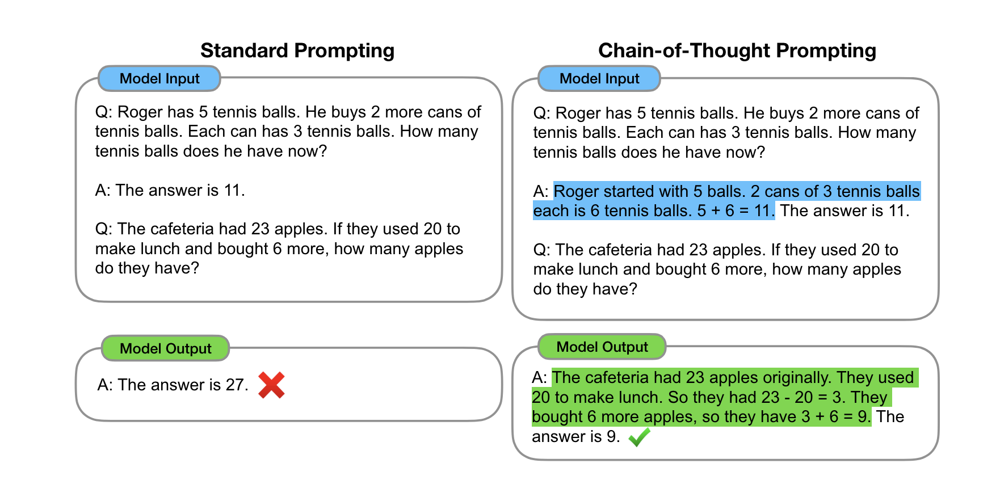
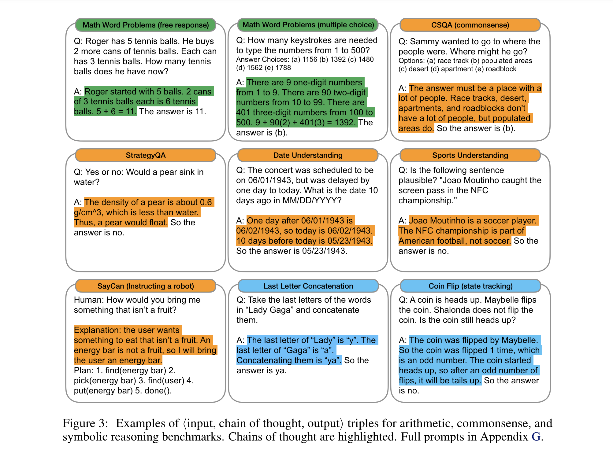
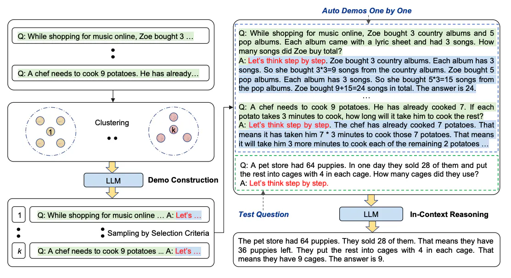
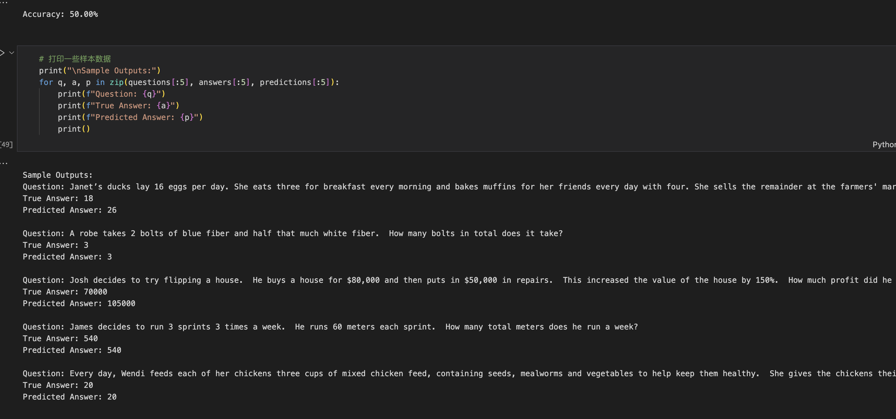
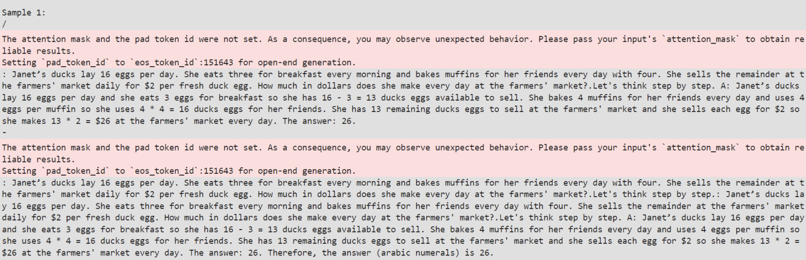
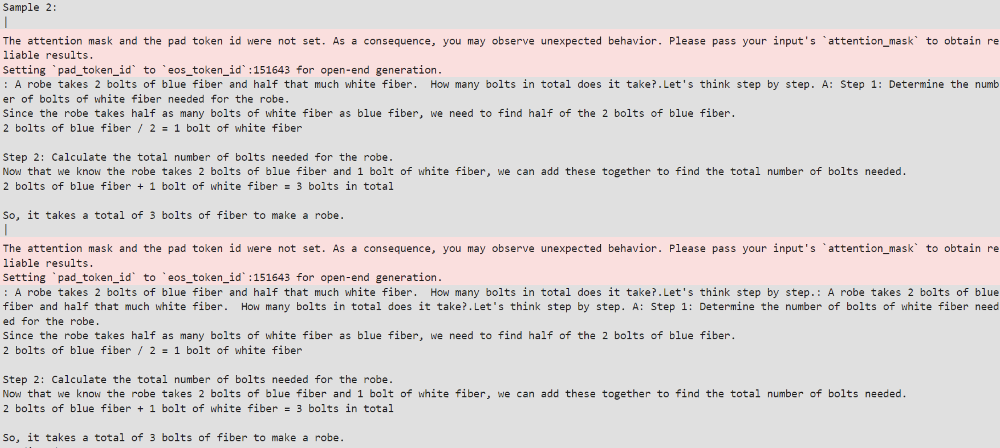
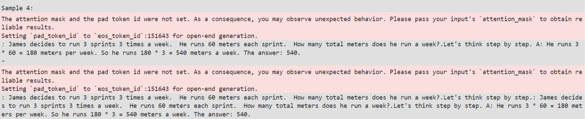
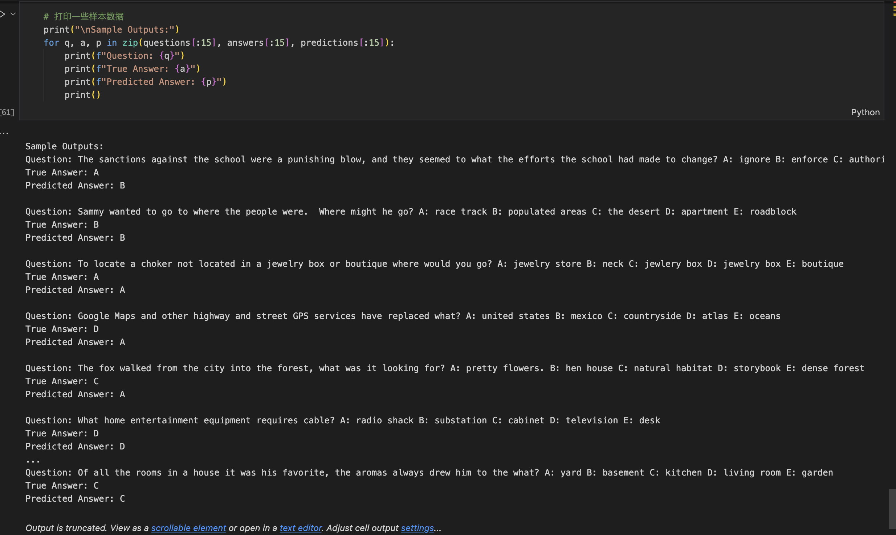
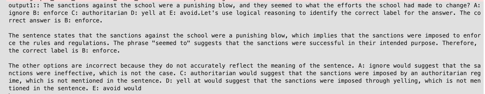

<font face = "Times New Roman"> 
<center><font size = 6>  NLP:lab4.Chain Of Thought</font> </center>

<center>

| 序号  |  学号 |  专业班级  |   姓名    | 性别  |
| :-----: | :------: | :---------: | :-----------: | :--: |
|  / |   3220102157  |  图灵2201   | 张祎迪 | 女 |

</center>

## 1.Project Introduction
### 1.1 Development Environment
  * Python3.9、MindSpore2.2
  * ModelArts Ascend Notebook
### 1.2 Chain Of Thought
Chain of Thought is a way of inference in NLP. The model generates a series of intermediate steps or "thought chains" to solve complex problems or tasks. In traditional NLP tasks, the model is usually required to give the answer directly, while in COT inference, the model needs to show how it infers the answer step by step. This experiment requires the application of COT inference to arithmetic problems and common sense questions, examines the accuracy of model inference under given templates, and tries different templates and trigger sentences to select the best COT by accuracy.
### 1.3 Main step of the project 
**1.Data Preparation**: Preparing the dataset for GSM8K and CommonsenseQA.
**2.Import pre-trained model**: Importing the pre-trained model and adding a prompt to it.
**3.COT Inference**: Inference the model with the COT method.
**4.Evaluation**: Evaluating the model performance on the test set and try with different templates and trigger sentences.
## 2. Technical details
### 2.1 Theoretically Elaboration

The Chain-of-Thought (CoT) methodology represents the cognitive reasoning process during language understanding. In LLMs, CoT utilizes logical inference and concept associations to comprehend and generate text. By constructing a chain of thought, LLMs can more accurately understand and answer questions, as they are able to connect various components of the question into a coherent reasoning process.

CoT can be classified into two types: Few-shot CoT based on manually annotated examples, and Zero-shot CoT without manually annotated examples. Few-shot CoT uses human-annotated examples to construct chains of thought, while Zero-shot CoT attempts to generate chains of thought autonomously. The introduction of chains of thought enables large-scale language models to excel in handling complex language tasks such as arithmetic reasoning, common-sense reasoning, and symbolic reasoning.


#### Reasoning Process:

1. **Initial Prompt ($X_0$):** This step involves formulating an initial prompt using a predefined template structure. By separating the question and answer segments, the template ensures clarity and guides the subsequent reasoning process. The trigger sentence within the prompt sets the tone for how the reasoning will unfold, emphasizing a step-by-step approach.

2. **Generating Subsequent Sentences ($Z$):** After presenting the initial prompt to the LLM, subsequent sentences $Z$ are generated. These sentences provide additional context, reasoning steps, or elaborations based on the question posed. By generating multiple sentences, the LLM has the opportunity to explore various lines of thought and provide a comprehensive rationale.

3. **Subsequent Prompt:** The subsequent sentences $Z$ are integrated with the initial prompt $X_0$ to create a new prompt. This combined prompt serves as the basis for further interaction with the LLM, guiding it towards generating a coherent answer. By incorporating the additional context provided by $Z$, the subsequent prompt enriches the overall reasoning process.

4. **Final Result:** With the completed prompt in hand, the LLM generates the predicted answer sentence $ŷ$. This sentence represents the culmination of the reasoning process, encapsulating the LLM's understanding and interpretation of the given question and context.

5. **Accuracy Calculation:** Depending on the nature of the task (e.g., arithmetic problems or common-sense question answering), the accuracy of the predicted answer is calculated. This step involves extracting relevant information from the predicted sentence $ŷ$ and comparing it to the ground truth to evaluate the model's performance.

#### Auto-CoT Framework:

1. **Question Clustering (Stage 1):** In this stage, questions from a dataset are grouped into clusters based on their semantic similarity or other relevant features. By partitioning the questions, the framework aims to identify distinct categories or types of questions, facilitating targeted reasoning chain generation.

2. **Demonstration Sampling (Stage 2):** Once the questions are clustered, representative questions from each cluster are selected for demonstration sampling. These representative questions serve as inputs for generating reasoning chains using Zero-Shot-CoT, a technique that prompts the LLM to produce coherent explanations step by step. Additionally, simple heuristics are employed to ensure the generated demonstrations are concise and accurate.

By combining these stages, Auto-CoT automates the process of generating diverse and informative reasoning chains for demonstrations, leveraging the capabilities of LLMs like GPT-3.5. This framework streamlines the generation of explanations for various types of questions, enhancing the efficiency and effectiveness of the reasoning process.
### 2.2 Algorithm Implementation
#### 2.2.1 Arithmetic Problems
**Data Preparation**: The dataset used in this project provides arithmetic problems in the form of text. Each problem consists of a question and an answer. The following shows some examples.
```python
file_path = 'gsm8k_test.parquet'
# 使用 load_dataset 函数加载 Parquet 文件
dataset = load_dataset('parquet', data_files=file_path)
# 获取测试集
test = dataset['train']  # 由于我们只加载一个文件，数据集会自动命名为 'train'
test = dataset['train'][:50]
# 提取数据集中的问题和答案
questions = test['question']
print(test['answer'][0])
answers = [int(re.findall(r'#### (\d+)', ans)[0]) for ans in test['answer']]
print(questions[0],questions[1])
print(answers[0],answers[1])
predictions = []
```
> Output:
```
Janet sells 16 - 3 - 4 = <<16-3-4=9>>9 duck eggs a day.
She makes 9 * 2 = $<<9*2=18>>18 every day at the farmer’s market.
#### 18
Janet’s ducks lay 16 eggs per day. She eats three for breakfast every morning and bakes muffins for her friends every day with four. She sells the remainder at the farmers' market daily for $2 per fresh duck egg. How much in dollars does she make every day at the farmers' market? A robe takes 2 bolts of blue fiber and half that much white fiber.  
How many bolts in total does it take?
18 3
```
**Prompting**: 
1. Define a function to decode the model outputs and process the decoded text.
```python
def decode(outputs, tokenizer, raw_text_len):
    """
    Decodes the model outputs using the provided tokenizer and processes the decoded text.
    Args:
        outputs (torch.Tensor): The model outputs.
        tokenizer (Tokenizer): The tokenizer object used for decoding.
        raw_text_len (int): Length of the raw text.
    Returns:
        str: Processed decoded text.
    """
    # Decode the model outputs using the tokenizer
    decoded_text = tokenizer.decode(outputs[0][raw_text_len:])
    # Process the decoded text
    res = decoded_text.split("")[0]           
    res = res.split("\n\n\n")[0]             
    res = res.split("Q:")[0]                 
    return res

def inference(model, tokenizer, question, max_new_tokens):
    """
    Generates text based on a given question using the provided model and tokenizer.
    Args:
        model (PreTrainedModel): The pre-trained model for inference.
        tokenizer (Tokenizer): The tokenizer object used for tokenization.
        question (str): The input question for inference.
        max_new_tokens (int): Maximum number of tokens to generate.
    Returns:
        str: Generated text based on the input question.
    """
    # Tokenize the input question
    input_ids = tokenizer.encode(question, return_tensors="pt")
    # Generate text based on the input question
    outputs = model.generate(input_ids, max_new_tokens=max_new_tokens)
    # Decode and process the generated text
    generated_text = decode(outputs, tokenizer, len(input_ids))
    return generated_text
```
1. Define a prompt template for arithmetic problems.
```python
prompt_1 = "Let's think step by step."
prompt_2 = "Therefore, the answer (arabic numerals) is "
```
1. Inference the model with the COT method.
```python
# Loop through each question and its corresponding index
for i, question in enumerate(questions):
    print(f"\nSample {i + 1}:") 
    input_1 = f"Q: {question}.{prompt_1}"
    # Generate text based on the first prompt with a maximum of 150 new tokens
    output_1 = inference(model, tokenizer, input_1, 150)
    print(output_1)  
    # Update the second prompt by combining the first prompt, its generated output, and the existing second prompt
    prompt_2 = f"{input_1}{output_1}{prompt_2}"
    # Generate text based on the updated second prompt with a maximum of 20 new tokens
    output_2 = inference(model, tokenizer, prompt_2, 20)
    print(output_2) 
    # Extract the last number found in the generated output (if any) as the predicted answer
    prediction = re.findall(r'\d+', output_2)[-1]
    # Check if a prediction is found
    if prediction:
        predictions.append(int(prediction[0]))  # 
        print(f"Predicted Answer: {int(prediction[0])}")  
    else:
        predictions.append(None) 
        print("Predicted Answer: None")  

```
#### 2.2.2 Common Sense Questions

**Data Preparation**: The dataset used in this project provides common sense questions in the form of text. Each question consists of a context and a question. The following shows some examples.
```python
file_path = 'train-00000-of-00001.parquet'
dataset2 = load_dataset('parquet', data_files=file_path)
# 获取测试集
dataset2 = dataset2['train'][:50]  # 由于我们只加载一个文件，数据集会自动命名为 'train'
questions = dataset2['question']
choices = dataset2['choices']
# 将问题和选择合并成一个字符串列表
combined_questions = []
for i in range(len(questions)):
    combined_question = questions[i]
    for j in range(len(choices[i]['label'])):
        combined_question += f" {choices[i]['label'][j]}: {choices[i]['text'][j]}"
    combined_questions.append(combined_question)
questions = combined_questions
# 提取答案
answers = dataset2['answerKey']
print(questions[0],answers[0])
```
> Output:
```
The sanctions against the school were a punishing blow, and they seemed to what the efforts the school had made to change? A: ignore B: enforce C: authoritarian D: yell at E: avoid A
```
**Prompting**:
1.Define a function to decode the model outputs and process the decoded text.(Same as the arithmetic problems)
2.Define a prompt template for common sense questions.
```python
prompt_1 = "Let's think step by step."
prompt_2 = "Therefore, among A through E, the answer is "
```
3.Inference the model with the COT method.
* Almost the same as the arithmetic problems,only different in abstracting the answer:Here we abstract the answer from the output_2 and choose the last uppercase letter as the answer.
```python
prediction = re.findall(r'\b[A-E]\b', output_2)[-1]
```
## 3. Experimental Results
### 3.1 Arithmetic Problems
* The Accuracy of the model on the GSM8K test set is 50% (with 50 samples).
* See a few samples:

* Incorrect Predictions:

* Correct Predictions:


### 3.2 Common Sense Questions
* The Accuracy of the model on the CommonsenseQA test set is 68% (with 50 samples).
* See a few samples:

```
Sample 1:
\
The attention mask and the pad token id were not set. As a consequence, you may observe unexpected behavior. Please pass your input's `attention_mask` to obtain reliable results.
Setting `pad_token_id` to `eos_token_id`:151643 for open-end generation.
output1:: The sanctions against the school were a punishing blow, and they seemed to what the efforts the school had made to change? A: ignore B: enforce C: authoritarian D: yell at E: avoid.Let's think step by step. B: enforce. The sanctions against the school were a punishing blow, and they seemed to enforce the efforts the school had made to change.
|
The attention mask and the pad token id were not set. As a consequence, you may observe unexpected behavior. Please pass your input's `attention_mask` to obtain reliable results.
Setting `pad_token_id` to `eos_token_id`:151643 for open-end generation.
output2:: The sanctions against the school were a punishing blow, and they seemed to what the efforts the school had made to change? A: ignore B: enforce C: authoritarian D: yell at E: avoid.Let's think step by step.: The sanctions against the school were a punishing blow, and they seemed to what the efforts the school had made to change? A: ignore B: enforce C: authoritarian D: yell at E: avoid.Let's think step by step. B: enforce. The sanctions against the school were a punishing blow, and they seemed to enforce the efforts the school had made to change.Therefore, among A through E, the answer is  B: enforce.
Predicted Answer: B

Sample 3:
\
The attention mask and the pad token id were not set. As a consequence, you may observe unexpected behavior. Please pass your input's `attention_mask` to obtain reliable results.
Setting `pad_token_id` to `eos_token_id`:151643 for open-end generation.
output1:: To locate a choker not located in a jewelry box or boutique where would you go? A: jewelry store B: neck C: jewlery box D: jewelry box E: boutique.Let's think step by step. A choker can be found in a jewelry store as they sell a variety of necklaces and jewelry items.
-
The attention mask and the pad token id were not set. As a consequence, you may observe unexpected behavior. Please pass your input's `attention_mask` to obtain reliable results.
Setting `pad_token_id` to `eos_token_id`:151643 for open-end generation.
output2:: To locate a choker not located in a jewelry box or boutique where would you go? A: jewelry store B: neck C: jewlery box D: jewelry box E: boutique.Let's think step by step.: To locate a choker not located in a jewelry box or boutique where would you go? A: jewelry store B: neck C: jewlery box D: jewelry box E: boutique.Let's think step by step. A choker can be found in a jewelry store as they sell a variety of necklaces and jewelry items.
Predicted Answer: A

Sample 4:
\
The attention mask and the pad token id were not set. As a consequence, you may observe unexpected behavior. Please pass your input's `attention_mask` to obtain reliable results.
Setting `pad_token_id` to `eos_token_id`:151643 for open-end generation.
output1:: Google Maps and other highway and street GPS services have replaced what? A: united states B: mexico C: countryside D: atlas E: oceans.Let's think step by step. Google Maps and other highway and street GPS services have replaced atlases. An atlas is a collection of maps, while GPS services provide real-time location and navigation using a smartphone or GPS device. So, the answer is A: atlas.
/
The attention mask and the pad token id were not set. As a consequence, you may observe unexpected behavior. Please pass your input's `attention_mask` to obtain reliable results.
Setting `pad_token_id` to `eos_token_id`:151643 for open-end generation.
output2:: Google Maps and other highway and street GPS services have replaced what? A: united states B: mexico C: countryside D: atlas E: oceans.Let's think step by step.: Google Maps and other highway and street GPS services have replaced what? A: united states B: mexico C: countryside D: atlas E: oceans.Let's think step by step. Google Maps and other highway and street GPS services have replaced atlases. An atlas is a collection of maps, while GPS services provide real-time location and navigation using a smartphone or GPS device. So, the answer is A: atlas.
Predicted Answer: A
```
* Note: In Sample 4, the model incorrectly predicted the answer as "A: atlas" instead of "D: atlas". This means that the model correctly identified the answer as "atlas" but failed to select the correct choice letter.
  
Mislabeling by large language models (LLMs) can occur due to several factors inherent in their architecture and training process. Even when these models correctly identify the answer's content, they might incorrectly label it due to:

**Training Data Inconsistencies**: The LLMs are trained on vast and diverse datasets, which may contain inconsistent or noisy data. For example, the training data might have instances where the labeling does not follow a consistent pattern, leading the model to learn incorrect associations between labels and answers.
**Prompt Ambiguity**: The way prompts are structured can significantly influence the model's output. If the prompt or the context around the expected answer is not clear enough, the model might generate the correct content but associate it with an incorrect label.
**Language Model Bias**: During training, the model learns statistical associations between words and phrases. If, in the training data, the phrase "So, the answer is A: atlas" appears more frequently than "So, the answer is D: atlas" (regardless of the actual correctness), the model might favor the former.
**Output Format Complexity**: The complexity of generating both the answer and its label correctly might lead to errors. The model could focus more on generating a coherent and contextually correct answer and less on ensuring that the label matches the expected format.
### 3.3 Testing with Different Templates and Trigger Sentences
### Arithmetic Problems

In our experiments with different trigger phrases for arithmetic problems, we observed that the changes had varying degrees of impact on the model's performance. 

1. **Original Trigger Phrase**: 
   - **Phrase**: "Let's think step by step."
   - **Accuracy**: 50%

2. **Modified Trigger Phrase 1**:
   - **Phrase**: "Use logical reasoning to calculate this."
   - **Accuracy**: 54%
   - **Observation**: This trigger shows no significant improvement or decline,while improving the accuracy slightly.

3. **Modified Trigger Phrase 2**:
   - **Phrase**: "Let's explore each component of the problem."
   - **Accuracy**: 46%
   - **Observation**: This phrase resulted in a lower accuracy compared to the original, indicating that it was less effective for arithmetic problems.

Additionally, we experimented with changing the template format from `Q: {question} A: {trigger}` to `{question} {trigger}`. The results showed no significant differences, suggesting that the template format itself had not significantly impacted the model's performance for arithmetic problems.

### Common-Sense Question Answering

For common-sense questions, the impact of different trigger phrases was more pronounced. 

1. **Original Trigger Phrase**:
   - **Phrase**: "Let's think step by step."
   - **Accuracy**: 68%

2. **Modified Trigger Phrase 1**:
   - **Phrase**: "Use logical reasoning to choose the correct label."
   - **Accuracy**: 76%
   - **Observation**: This trigger phrase significantly improved the model's performance, achieving the highest accuracy among the tested phrases. It suggests that emphasizing logical reasoning is particularly effective for common-sense questions.
  

> We can see that the output focus more on analyzing each label and reasoning through the question, which may have contributed to the improved accuracy.
1. **Modified Trigger Phrase 2**:
   - **Phrase**: "Let's explore each component of the problem."
   - **Accuracy**: 66%
   - **Observation**: This phrase resulted in similar accuracy to the original, indicating no significant improvement or decline.

Similarly, changing the template format from `Q: {question} A: {trigger}` to `{question} {trigger}` did not significantly affect the model's performance for common-sense questions.

## 4.References
* https://www.promptingguide.ai/techniques/cot
* https://arxiv.org/abs/2205.11916
* https://arxiv.org/abs/2201.11903
</font>