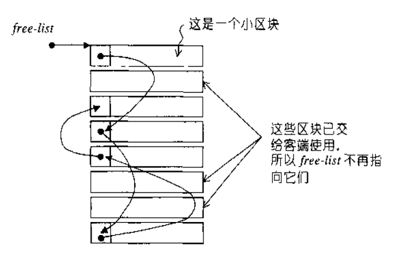
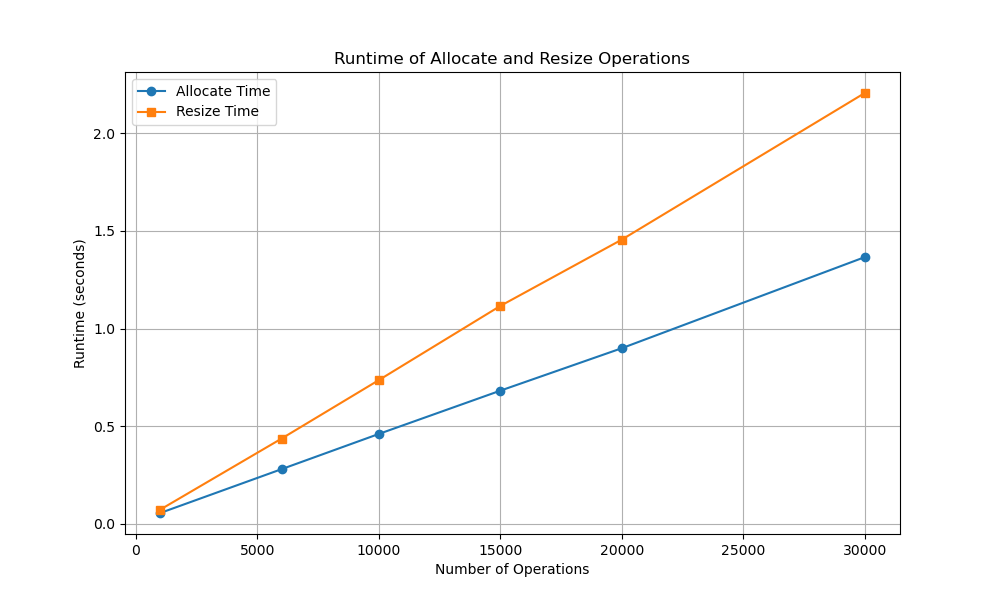

<font face = "Times New Roman" > 
<br><br><br><br><br><br>

<br>

<br><br><br><br><br><br><center><font size = 6>Lab7 : STL allocator + memory pool</font></center>


<center><font size = 6>  3220102157 张祎迪</font></center> 

<br>

<div STYLE="page-break-after: always;"></div>

## 1.Introduction
### 1.1 STL Allocator Interface
An allocator is used by standard library containers as a template parameter :
```cpp
template < class T, class Alloc = allocator<T> > class vector;
template < class T, class Alloc = allocator<T> > class list;
```
STL allocator is a class template that encapsulates memory allocation and deallocation. It is used by standard library containers to manage memory allocation. The default allocator is std::allocator, which is a class template that uses new and delete for memory allocation and deallocation.
### 1.2 Memory Pool
Memory pool is a memory management technique that is used to manage memory in a more efficient way than the standard malloc and free functions. 
### 1.3 Lab Purpose
In this lab, we are going to implement a memory pool allocator for STL containers. 


* The allocator should optimize the memory allocation speed using memory pool.
* The allocator should support arbitrary memory size allocation request.
## 2.Code Implementation
### 2.1 Memory Pool 
* I implemented a memory pool class named `MemoryPool` which is a template class.
* Details can be found in `/code/src/MemoryPool.h` 
> Note:Some Details like `Node` class are omitted here. 
> See the source code for more details.
```cpp
template <class T>
class MemoryPool {
public:
    /**
     * @brief The free list for memory blocks.
     * This is a static array of Node pointers, where each Node points to a linked list of free memory blocks.
     */
    static Node* free_list[FREELIST_SIZE];
    /**
     * @brief Request memory from the pool.
     *
     * @param size The size of memory to allocate.
     * @param index The index in the free list to use.
     * @return A pointer to the allocated memory.
     */

    char* MemAlloc(size_t size, int index) {
        /**< Temporary pointer for traversing the free list. */
        Node* temp = nullptr; 
        size_t all = SEG_SIZE-1;
        /**< Find the nearest multiple of 8. >*/
        size_t align_to_eight = ((size + all) & ~all);
        // Allocate memory block
        /*               分配的内存块示意图                   */
        /* Suppose CHUNK_NUM = 8, align_to_eight = 16
        * buffer ->  [               16 bytes              ]
        *            [               16 bytes              ]
        *            [               16 bytes              ]
        *            [               16 bytes              ]
        *            ...
        */
        char* buffer = new char[CHUNK_NUM * align_to_eight];
        // Record the start of the allocated memory
        char* record = buffer + align_to_eight;
        // Link nodes one by one
        /***** 链接节点的示意图 *****/
        /*
        * (i == 0):
        * free_list[index] -> [Node] -> NULL
        *                      ^
        *                      |
        *                    temp
        * record -> [               16 bytes              ]
        * (i == 1):
        * free_list[index] -> [Node] -> [Node] -> NULL
        *                               ^
        *                               |
        *                             temp
        * record -> [               16 bytes              ]
        * 
        * CHUNK_NUM - 1:
        * free_list[index] -> [Node] -> [Node] -> [Node] -> ... -> [Node] -> NULL
        */
        for (int i = 0; i < CHUNK_NUM - 1; i++) {
            if (i == 0) {
                free_list[index] = reinterpret_cast<Node*>(record);
                temp = reinterpret_cast<Node*>(record);
                temp->next = nullptr;
                record += align_to_eight;
            } else {
                temp->next = reinterpret_cast<Node*>(record);
                temp = temp->next;
                temp->next = nullptr;
                record += align_to_eight;
            }
        }
        return buffer;
    }

};
/**
 * @brief Definition and initialization of the static member free_list.
 * This static member array holds the heads of the free lists for different block sizes.
 */
template <class T>
Node* MemoryPool<T>::free_list[FREELIST_SIZE] = {nullptr};
```
* The `MemoryPool` class has a static member `free_list` which is an array of `Node*` pointers. Each `Node` points to a linked list of free memory blocks.
> Note : static member `free_list` have to be initialized outside the class definition.
* The `MemAlloc` function is used to allocate memory from the memory pool. It takes two parameters: `size` and `index`. The `size` parameter is the size of memory to allocate, and the `index` parameter is the index in the free list to use.
* The `MemAlloc` function first finds the nearest multiple of 8 for the `size` parameter. Then it allocates memory blocks and links them one by one.
* Process of allocation is elaborated in the comments of the code(see above).
### 2.2 Allocator
* I implemented a custom allocator class named `MyAllocator` which is a template class.
* Details can be found in `/code/src/MyAllocator.h`

#### 2.2.1 value definition and typedef
```cpp
        typedef void _Not_user_specialized;
        typedef _Ty value_type;
        typedef value_type* pointer;
        typedef const value_type* const_pointer;
        typedef value_type& reference;
        typedef const value_type& const_reference;
        typedef std::size_t size_type;
        typedef std::ptrdiff_t difference_type;
        typedef std::true_type propagate_on_container_move_assignment;
        template<class T>
        struct rebind { typedef MyAllocator<T> other; };
        typedef std::true_type is_always_equal;
```
* The `MyAllocator` class has some typedefs like `value_type`, `pointer`, `const_pointer`, `reference`, `const_reference`, `size_type`, `difference_type`, `propagate_on_container_move_assignment`, `rebind`, and `is_always_equal`.
* These typedefs are used to define the types of the elements to be allocated, the pointer to the elements, the reference to the elements, the size of the elements, the difference between two pointers, and the type of the allocator to be used.
```cpp
private:
    MemoryPool<_Ty> MP; // Memory pool for allocating memory
```
* The `MyAllocator` class has a private member `MP` of type `MemoryPool<_Ty>`. This member is used to allocate memory from the memory pool.
#### 2.2.2 Constructor and Destructor
```cpp
        MyAllocator() = default;
        template<class T>
        explicit MyAllocator(const MyAllocator<T>& a) {}
        ~MyAllocator() = default;
```
* The `MyAllocator` class has a default constructor, a copy constructor, and a destructor.
* The default constructor initializes the allocator with default values.
* The copy constructor initializes the allocator with the values of another allocator.
* The destructor destroys the allocator.

#### 2.2.3 Member Functions
* `max_size` function returns the maximum number of elements that can be allocated.
```cpp
inline size_type max_size() const _NOEXCEPT{
    return size_type(UINT_MAX / sizeof(value_type));
}
```
* `address` function returns the address of a reference.
```cpp
inline pointer address(reference Val) const _NOEXCEPT {
    return std::addressof(Val);
}
```
* `address` function returns the address of a constant reference.
```cpp
inline const_pointer address(const_reference Val)const {
    return std::addressof(Val);
}
```
* `deallocate` function deallocates a block of memory.
* If the block size is larger than the maximum size handled by the pool, it frees the memory directly.
* Otherwise, it returns the memory block to the memory pool.
```cpp
/**
 * @brief Deallocates a block of memory.
 *
 * This function returns the memory block pointed to by `ptr` back to the memory pool,or frees it if the block is larger than the maximum size handled by the pool.
 *
 * @tparam Ty The type of the elements to be allocated.
 * @param ptr Pointer to the block of memory to be deallocated.
 * @param count The number of elements in the block.
 */
void deallocate(pointer ptr, size_type count) {
    size_t size_sum = count * sizeof(value_type); /**< Calculate the size of the block to deallocate. */
    if (size_sum > MAX_SIZE) { /**< If size is bigger than the max size, free directly. */
        std::free(ptr);
    } else { 
        /**< Put the free list's head to this block. */
        reinterpret_cast<Node*>(ptr)->next = MP.free_list[INDEX_SEG(size_sum)];
        MP.free_list[INDEX_SEG(size_sum)] = reinterpret_cast<Node*>(ptr);
    }
}
```
* `allocate` function allocates a block of memory.
* If the requested block size exceeds the maximum size handled by the memory pool, it allocates the memory directly.
* Otherwise, it returns the memory block from the memory pool.
* If the free list is null, it calls the `MemAlloc` function to allocate memory.
```cpp
/**
 * @brief Allocates a block of memory.
 *
 * This function allocates a block of memory large enough to hold `count` elements of type `Ty`.
 * If the requested block size exceeds the maximum size handled by the memory pool, it allocates the memory directly.
 *
 * @tparam Ty The type of the elements to be allocated.
 * @param count The number of elements to allocate.
 * @return Pointer to the allocated block of memory.
 */
pointer allocate(size_type count) {
    size_t size_sum = count * sizeof(value_type); /**< Calculate the size of the block. */
    if (size_sum > MAX_SIZE) { /**< If size is bigger than the max size, allocate directly. */
        char* buf = new char[size_sum]; /**< Use a buffer to store the block. */
        return reinterpret_cast<pointer>(buf); /**< Return the address of the buffer. */
    }
    Node* des = MP.free_list[INDEX_SEG(size_sum)];
    if (!des) { /**< Free list is null, call for memory. */
        return reinterpret_cast<pointer>(MP.MemAlloc(size_sum, INDEX_SEG(size_sum)));
    }
    MP.free_list[INDEX_SEG(size_sum)] = MP.free_list[INDEX_SEG(size_sum)]->next; /**< Update the free list. */
    return reinterpret_cast<pointer>(des);
}
```
* `destroy` and `construct` functions are used to destroy and construct objects.
```cpp
template<class Ut>
static inline void destroy(Ut* p) {
    p->~Ut();
}

template<class Ut, class Pt>
static inline void construct(Ut* p, Pt argv) {
    new(p) Ut(argv);
}
```

## 3.Experiment and Result
### 3.1 Test on PTA
* I tested the code with the test illustration on PTA.
* See `/code/PTA_Test.cpp` for more details.
* The code passed all the test cases.
* Also I add test of time consumed
> RESULTS
```
runtime of 10000 vector resize: 0.256086s
runtime of 10000 vector resize: 0.325985s
runtime of 1000 vector resize: 0.09073s
correct assignment in vecints: 3350
correct assignment in vecpts: 6220
```
### 3.2 Test with code provided by the professor
* I tested the code with the test illustration provided by the professor.
* See `/code/testallocator.cpp` for more details.
* The code passed all the test cases.
> According to the professor, the code should print `incorrect assignment in vector 9999 for object (13,20)`
* Also I add test of time consumed

> RESULTS
```
runtime of 9996 vector creation: 0.013572s
runtime of 100 vector resize: 0.0038s
incorrect assignment in vector 9999 for object (13,20)
```
### 3.3 Test on My Own
* I tested the code with some test cases of my own.
* I generated random numbers of resize and allocate operations to test the code.More specifically, I tested the code with 1000, 3000,6000,10000, 15000, 20000, 30000 resize and allocate operations.
> See `/code/Test` and `/code/TestWithFile` for more details.
* RESULTS
```
The runtime of 1000 allocate operations is 0.046425 s
The runtime of 1000 resize operations is 0.072075 s
delete OK!
The runtime of delete operations is 3.2e-05 s
```
```
The runtime of 3000 allocate operations is 0.134171 s
The runtime of 3000 resize operations is 0.219883 s
delete OK!
The runtime of delete operations is 8e-05 s
```
```
The runtime of 6000 allocate operations is 0.275031 s
The runtime of 6000 resize operations is 0.435614 s
delete OK!
The runtime of delete operations is 2.8e-05 s
```
```
The runtime of 10000 allocate operations is 0.450449 s
The runtime of 10000 resize operations is 0.731524 s
delete OK!
The runtime of delete operations is 3.4e-05 s
```
```
The runtime of 15000 allocate operations is 0.670402 s
The runtime of 15000 resize operations is 1.10666 s
delete OK!
The runtime of delete operations is 0.000146 s
```
```
The runtime of 18000 allocate operations is 0.808451 s
The runtime of 18000 resize operations is 1.32736 s
delete OK!
The runtime of delete operations is 0.000101 s
```
```
The runtime of 20000 allocate operations is 0.894021 s
The runtime of 20000 resize operations is 1.4721 s
delete OK!
The runtime of delete operations is 0.000323 s
```
```
The runtime of 30000 allocate operations is 1.35547 s
The runtime of 30000 resize operations is 2.20253 s
delete OK!
The runtime of delete operations is 8.4e-05 s
```

* I draw a graph to show the time consumed with different numbers of resize and allocate operations.
<center></cenrer>

## 4.Conclusion
I implemented a memory pool allocator for STL containers. The allocator optimizes the memory allocation speed using a memory pool. The allocator supports arbitrary memory size allocation requests. The code passed all the test cases and the time consumed is acceptable. The memory pool allocator is efficient and can be used in real-world applications.
</font>