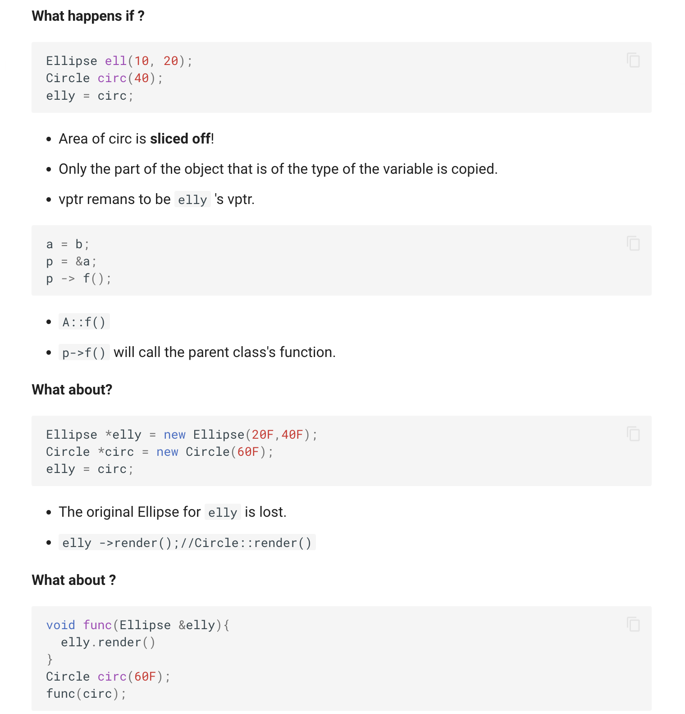
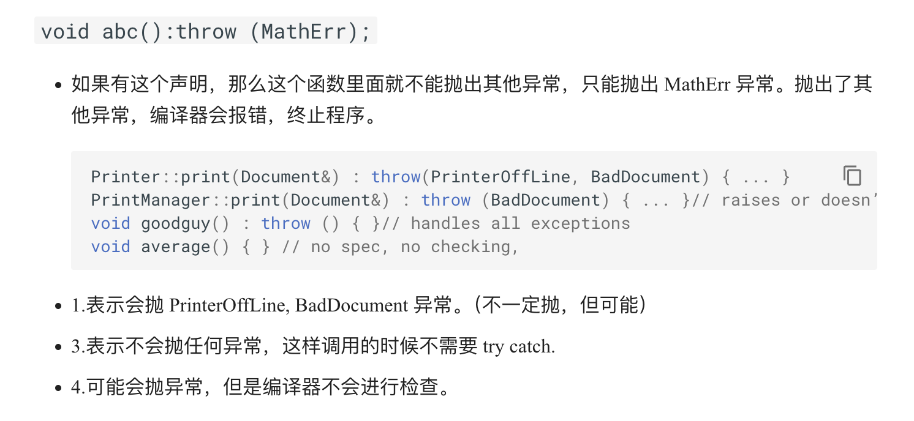
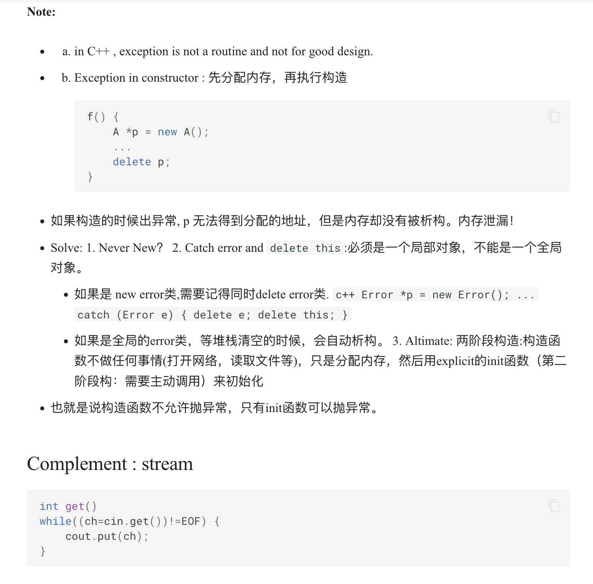

* No references to references.
* No pointers to references. (References to pointer is OK)
* No arrays of references.

```c++
vector<int> v;
vector<int>::iterator it = v.begin();
```

* Default arguments Cannot write in the def part, but the 函数声明！ part.

```c++
string p1("Fred");
const string* p = &p1; // p1 cannot be changed through p.
string const* p = &p1; // like the first one.
p = &p2; // p can be changed to point to p2.
string *const p = &p1; // p cannot be changed.only point to p1.
```

* 静态成员函数没有 this, 不能调用非静态成员变量，也不能访问非静态函数
* 可以在没有创建类的对象的时候就能调用静态成员函数
* 一个静态的全局变量，必须在头文件对应的.cpp中定义和初始化静态成员变量(此时不能再加static)：```int Sales_data::cnt = 0;```

```c++
void render(Shape* p) {
    p->render(); // calls correct render function
} // for given Shape! void func() {
Ellipse ell(10, 20);
ell.render(); // static -- Ellipse::render();
Circle circ(40);
circ.render(); // static -- Circle::render();
render(&ell); // dynamic -- Ellipse::render();
render(&circ); // dynamic -- Circle::render()
```



* 一个类中有一个或多个纯虚函数，这个类就是抽象类

```c++
virtual void render() = 0;
```
```cpp
class class_c{
public:
    int max;
    int min;
    int middle;
    class c(int my_max){
        max = my_max>0?my_max:10;
    }
    class_c(int my_max, int my_min):class_c(my_max){
        min = my_min>0&&my_min<max?my_min:1;
    }
    class_c(int my_max, int my_min, int my_middle):class_c(my_max, my_min){
        middle = my_middle>min&&my_middle<max?my_middle:(min+max)/2;
    }
};
int main(){
    class_c c(10, 5, 7);
}
```

### Overloading
#### + - * / % ^ & | ~ 
```cpp
const T operator+(const T& left, const T& right);
```

#### ! && || == != < > <= >= :
```cpp
bool operator==(const T& left, const T& right);
```

#### ++ and -- (prefix and postfix)
```cpp
const T& operator++(); // prefix
const T operator++(int); // postfix
```

#### stream extractor/inserter
```cpp
ostream& operator<<(ostream& os, const T& t);
istream& operator>>(istream& is, T& t);
```
```cpp
ostream& operator <<(ostream & os, const A &a)
{
    cout << a.size() << endl;
    return os;
}
```

#### Assignment
```cpp
MyClass& operator=(const MyClass& other) {
    if (this != &other) { // 检查是否自赋值
        delete data; // 释放原有内存
        data = new int(*other.data); // 深拷贝数据
    }
    return *this; // 返回引用
    }
```
```cpp
template<class T>
T& vector<T>::operator[](int i){ //Note this <T>!!!
    return m_elements[i];
}
```

* 模板的所有东西都需要在头文件中定义，因为编译器需要看到模板的定义才能生成对应的函数。




```cpp
class Error {};

class MyClass {
public:
    MyClass() {
        // 在构造函数中可能会创建 Error 对象
        try {
            Error* p = new Error(); // 这将会抛出异常
        }
        catch (const Error& e) { // 通过引用捕获异常
            // 处理异常
            std::cout << "Caught Error exception" << std::endl;
            delete this; // 删除当前对象
        }
    }
};
```